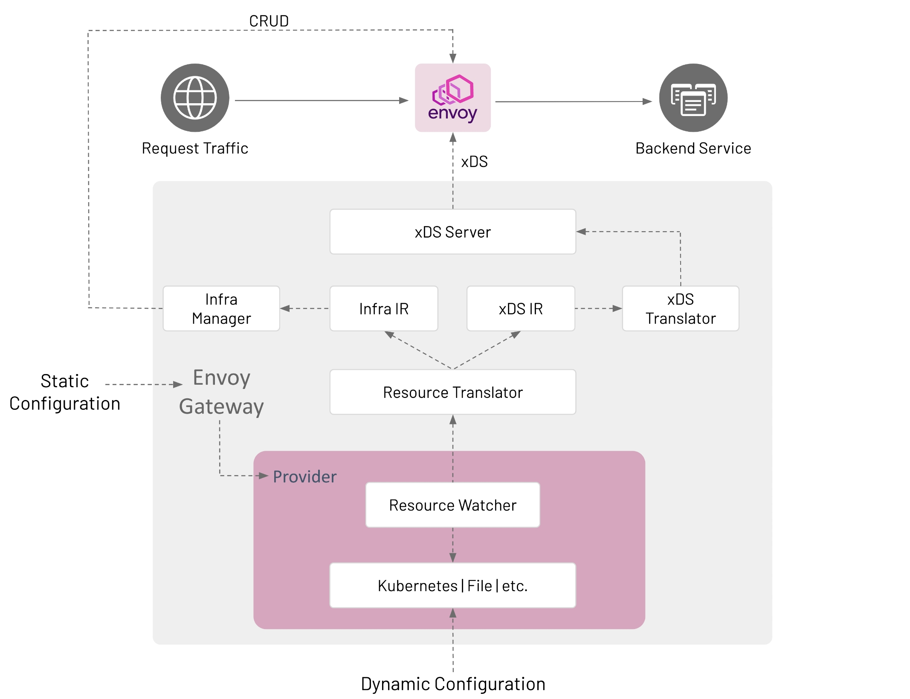
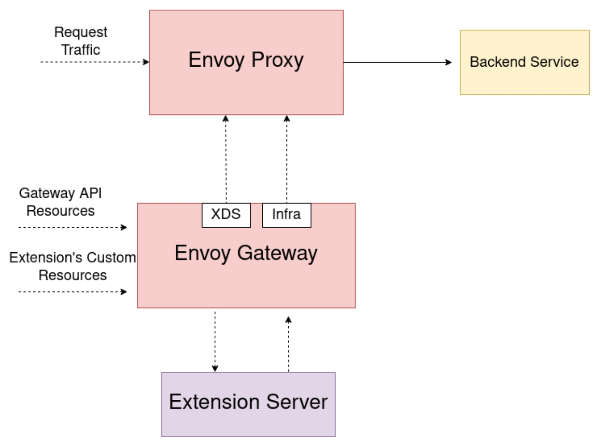

## Envoy Gateway概览

### 项目目标

通过富有表现力的、可扩展的以及面向角色的API提供ingress以及L7/L4的路由功能，降低使用门槛，从而吸引更多人使用Envoy，**提供一个公共的底座，允许各个厂商在此之上构建增值服务，而不用在基础功能上重复造轮子**。

#### Expressive API

Kubernetes Gateway API （支持程度Beta） + 基于Envoy特定的扩展（Extension Server，BackendTrafficPolicy，ClientTrafficPolicy, SecurityPolicy, EnvoyPatchPolicy，充分利用xds能力）

#### Batteries included

Envoy Gateway会简化Envoy的部署和管理，允许应用开发者更专注业务。它能处理Envoy相关的基础设施（例如，Kubernetes Service，Deployment等等），***甚至相关sidecar服务的基础设施管理？***，同时包含合理的默认配置并且允许覆盖，最后通过status API以及Kubernetes status sub-resources提升运维效率

#### All environments

原生支持Kubernetes环境，一开始也会主要关注Kubernetes环境，**希望能成为支持Gateway API的Kubernetes ingress的事实标准**。目标支持多集群以及各种运行时环境。**当前仅支持在Kubernetes环境运行，通过Custom类型的Provider可以从文件加载配置并且通过Envoy Gateway直接生成Envoy Proxy子进程**

### 架构



#### Static Configuration

Static Configuration用于在启动时配置Envoy Gateway，例如改变GatewayClass的controllerName，配置Provider等等。

#### Dynamic Configuration

主要是基于Kubernetes资源对象，对以下两类内容进行配置：

1. Infrastructure Management：管理基于Envoy的数据面，主要通过GatewayClass和Gateway这两个资源对象，可以通过`gatewayclass.spec.parametersRef`引用Envoy Gateway自定义的CRD `EnvoyProxy`来改变数据面Envoy的默认参数，例如通过ClusterIP类型的Service而不是LoadBalancer类型的Service来暴露Envoy Network Endpoints

2. Traffic Routing：定义应用级别的请求如何路由到后端的services，主要是HTTPRoute以及TLSRoute等Gateway API对象。***尽管后端可以是任意合法的Kubernetes Group/Kind资源，但是Envoy Gateway当前仅支持对于原生Service的引用***

Envoy Gateway通过将配置的controller name和GatewayClass的`spec.controllerName`匹配GatewayClass，Envoy Gateway管理对应的GatewayClass的Gateway，一个Gateway资源导致Envoy Gateway创建对应的数据面。

### 扩展能力

### 1. Envoy Gateway自定义API用于扩展Gateway API

#### BackendTrafficPolicy

允许用户配置Envoy Proxy和upstream backend services/endpoints之间的行为。作为对Gateway API的扩展，它的作用对象可以是一个Gateway，或者是一个xRoute（HTTPRoute/GRPCRoute等等）。如果作用对象是一个Gateway，它会作用到这个Gateway的所有xRoute。如果xRoute自身的BackendTrafficPolicy和关联Gateway的冲突，则xRoute自己的BackendTrafficPolicy优先。

BackendTrafficPolicy支持的部分特性列表：

1. Protocol configuration
2. Circuit breaking
3. Retries
4. Keep alive probes
5. Health checking
6. Load balancing
7. Rate limit

#### ClientTrafficPolicy

允许用户配置Envoy Proxy和downstream clients之间的行为。作为对Gateway API的扩展，它只能关联到一个Gateway。

ClientTrafficPolicy特性列表：

1. Downstream ProxyProtocol
2. Downstream Keep Alives
3. IP Blocking
4. Downstream HTTP3

#### SecurityPolicy

用于配置进入gateway的流量的认证以及授权策略。

SecurityPolicy特性列表：

1. JWT based authentication
2. OIDC Authentication
3. External Authorization
4. Basic Auth
5. API Key Auth
6. CORS

### 2. EnvoyPatchPolicy

EnvoyPatchPolicy允许用户在Envoy Gateway生成xDS配置之后，但是在发送给Envoy Proxy之前对xDS进行修改。类似于Istio中的EnvoyFilter，但是它不会提供Envoy的所有能力。之所以提供这个API是因为一些需要的功能的API还未定义，另外Envoy Gateway也不能支持如此广泛的功能列表。

### 3. Envoy Gateway Extension Server

Envoy Gateway主要关注Gateway的核心功能以及对于Kubernetes Gateway API的一致性，增值特性交由各个厂商自行扩展。但是简单地对xDS资源进行patch或者依赖已有的Gateway API以及Envoy Gateway的扩展对于大型特性的添加是不够的。通过Extension Server，可以实现以下目标：

1. 提供扩展Envoy Gateway控制面的基础
2. 允许厂商引入自己的自定义资源，通过`ExtensionRefs`，`policyAttachments`（future）以及backendRefs（future）扩展Gateway API
3. 厂商引入的扩展无需fork Envoy Gateway并且可以独立于Envoy Gateway的发布周期迭代
...



Extension Server以Deployment或者Sidecar的方式以独立进程部署。通过配置EnvoyGateway对象进行注册：

```yaml
apiVersion: gateway.envoyproxy.io/v1alpha1
kind: EnvoyGateway
extensionManager:
  resources:
  - group: example.myextension.io
    version: v2
    kind: OAuth2Filter    // 需要watch的资源对象
  hooks:
    xdsTranslator:
      post:
      - Route         // 需要执行的hook，按需？
      - VirtualHost
      - HTTPListener
      - Translation
  service:
    host: my-extension.example  // extension server的访问方式
    port: 443
    tls:
      certificateRef:
        name: my-secret
        namespace: default
```

当前可扩展的xDS内容：

```yaml
service EnvoyGatewayExtension {
    rpc PostRouteModify (PostRouteModifyRequest) returns (PostRouteModifyResponse) {};
    rpc PostVirtualHostModify(PostVirtualHostModifyRequest) returns (PostVirtualHostModifyResponse) {};
    rpc PostHTTPListenerModify(PostHTTPListenerModifyRequest) returns (PostHTTPListenerModifyResponse) {};
    rpc PostTranslateModify(PostTranslateModifyRequest) returns (PostTranslateModifyResponse) {};
}
```

Gateway API对于扩展的引用：

```yaml
apiVersion: example.myextension.io/v1alpha1
kind: OAuth2Filter   // 扩展CRD
metadata:
  name: oauth2-filter
spec:
  ...

---
apiVersion: gateway.networking.k8s.io/v1
kind: HTTPRoute
metadata:
  name: example
spec:
  parentRefs:
  - name: eg
  hostnames:
  - www.example.com
  rules:
  - clientSelectors:
    - path:
        type: PathPrefix
        value: /
    filters:
    - type: ExtensionRef
      extensionRef:    // 对于自定义对象的引用
        group: example.myextension.io
        kind: OAuth2Filter
        name: oauth2-filter
    backendRefs:
    - name: backend
      port: 3000
```

扩展配置当前仅支持在Envoy Gateway启动时注册，尚未支持运行时动态注册。Envoy Gateway会持续追踪注册的扩展以及它扩展的CRD，当在处理Gateway API资源时。初始的设计包含了对"pre xDS"和"post xDS"，但是当前仅实现了"post xDS"，后面可能也会有infra manager hook，用来动态修改、创删Envoy Proxy（例如认证鉴权的Extension希望在Envoy旁边部署一个Authorization Server作为sidecar）。另外，当前不支持多个Extensions，因为多个Extensions对xDS配置修改造成的冲突难以解决。

### 部署模式

* 默认模式为Envoy Gateway监听所有Namespaces内的Service & HTTPRoute资源，在Envoy Gateway所在的Namespace创建数据面资源，例如Envoy Proxy的Deployment。
* Envoy Gateway也支持Namespaced部署模式，只监听`EnvoyGateway.provider.kubernetes.watch.namespaces`的资源并且在Envoy Gateway运行的Namespace创建数据面资源。---> 用于实现多租户，每个租户有自己的Namespace，在该Namespace部署自己的Envoy Gateway Controller，Envoy Proxy，只监听该Namaspace内的Gateway，HTTPRoute等资源

### 社区

|Star|Fork|Contributor|Issue|PR|Release|语言|备注|
|  ----  | ----  | ---- | ---- | ---- | ---- | ---- | ---- |
|1.2k|222 |77|900+|1500+|13|Golang|Envoy社区官方项目|
