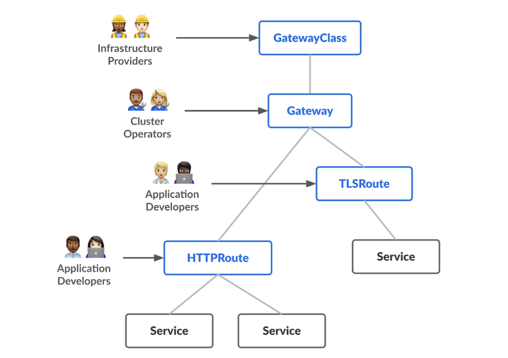
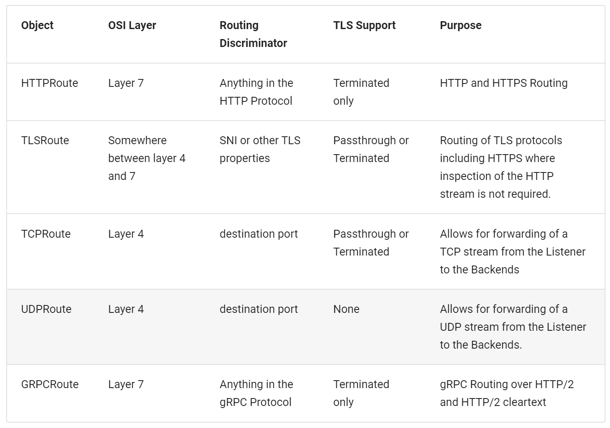
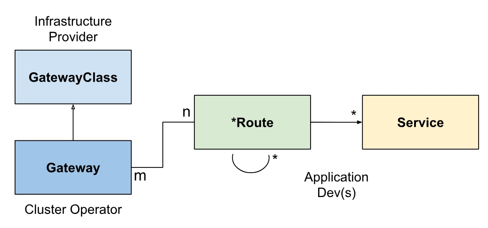
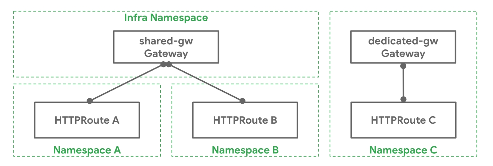

## Gateway API概览

### 设计理念

Gateway API用于处理Kubernetes中的L4以及L7路由。它能够统一Kubernetes中的南北向（Ingress）和东西向（网格）的流量治理，它的API本身也被设计为通用、强表达能力以及面向角色的。主要架构如下：



设计目标如下：

1. 面向角色：按照关注点分离的原则，组织中的各类角色只需要关注与自己职责相关的API，降低学习成本的同时也减小了错误发生的概率
2. 可移植性：与Ingress API类似，Gateway API也会有各种实现，与Ingress API在各种实现之间难以移植相比，Gateway API通过将各类通用必要功能进行详细完整的定义，确保了在各种实现之间的可移植性
3. 强表达能力：Gateway API除了支持基于header的路由，按权重分配流量等核心功能外，还支持许多在Ingress API中需要通过Annotation实现的功能
4. 扩展性：Gateway API允许在API的各个层级挂载自定义资源，保证了充足的扩展性

### API定义

整体可以分为三类API：

1. GatewayClass：定义了一系列具有共同配置和行为的Gateway。每个GatewayClass都会被一个Controller处理，虽然一个Controller可以处理多个GatewayClass。每个GatewayClass代表了Gateway API的一种具体实现，例如Istio，Envoy Gateway等等，对应的角色是基础设施工程师，他们负责Gateway API相关的运行时组件，例如对应的Controller以及Proxy正常运行

2. Gateway：定义了集群流量入口，接收来自集群外的流量，通过关联GatewayClass，指定实现类型；通过关联的一个或者多个Route，将流量导向目标Services

3. Route：Route定义针对不同的协议，如何将请求从Gateway导向目标Service。当前仅支持`HTTPRoute`，`TLSRoute`，`TCPRoute`，`UDPRoute`以及`GRPCRoute`等协议类型的路由。对于其他协议，鼓励添加实现特定的CR。新的路由类型也可能在后续加入API。当前支持的路由类型列表如下：



 每个Gateway可以关联多个Route，同时**每个Route也可以关联多个Gateway，从而能在不同的IP，LB以及Network上暴露**

 三个API的关联关系如下：

 


 ### 示例

跨NS共享Gateway以及专属Gateway：



共享Gateway时确保Route不冲突，Gateway需要确保设置相应的权限，确保其他NS的Route能进行关联

Route attachment的例子：

```yaml
apiVersion: gateway.networking.k8s.io/v1beta1
kind: HTTPRoute
metadata:
  name: my-route
  namespace: gateway-api-example-ns2
spec:
  parentRefs:
  - kind: Gateway
    name: foo-gateway   # 关联gateway-api-example-ns1命名空间内名为foo-gateway的Gateway
    namespace: gateway-api-example-ns1
  rules:
  - backendRefs:
    - name: foo-svc
      port: 8080
```

```yaml
apiVersion: gateway.networking.k8s.io/v1beta1
kind: Gateway
metadata:
  name: foo-gateway
  namespace: gateway-api-example-ns1
spec:
  gatewayClassName: foo-lb
  listeners:
  - name: prod-web
    port: 80
    protocol: HTTP
    allowedRoutes:
      kinds:
      - kind: HTTPRoute
      namespaces:
        from: Selector # 允许匹配selector的HTTPRoute进行Attach
        selector:
          matchLabels:
            # This label is added automatically as of K8s 1.22
            # to all namespaces
            kubernetes.io/metadata.name: gateway-api-example-ns2
```

### 扩展点

API中提供了一系列的扩展点，从而提供更多的灵活性，解决大量不能被通用API覆盖的场景：

1. **BackendRefs**：扩展点用于将流量转发至除了Kubernetes Service以外的network endpoints，包括S3 bucket，Lambda function等等
2. **HTTPRouteFilter**：HTTPRoute的这个API提供了一种方法用于在一个HTTP请求的request/response生命周期内插入Hook
3. **Custom Route**：如果上面两个扩展点都不能满足需求，Gateway API的实现者可以为API中还没有实现的协议创建自定义资源对象，但是自定义的Route类型必须和核心的Route类型共享相同的字段，例如CommonRouteSpec和RouteStatus
4. **自定义资源对象**：类似于Envoy Gateway中的`BackendTrafficPolicy`，`ClientTrafficPolicy`以及`SecurityPolicy`这样的CR，通过`targetRef`关联Gateway或者Route
