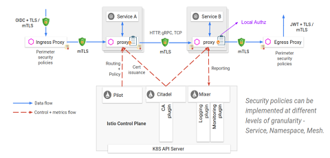
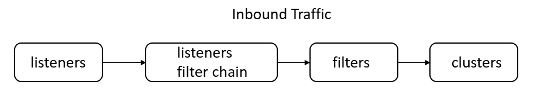
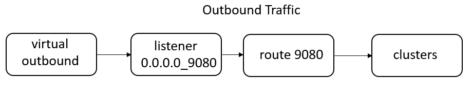

## Istio安全框架解析

### 1. Istio安全概述

作为服务网格的事实标准，极大地降低微服务架构下流量管理的复杂度往往是Istio最为引入注目的特性，但事实上，随着越来越多的服务从单体架构向微服务架构演进，模块间由最初的函数调用转变为进程间通信，微服务间通信的安全性，服务的访问策略控制以及如何降低大规模场景下安全配置的复杂度等问题同样亟待解决。

当然，Istio给出了一套完整的框架用于解决这些问题，与对流量管理的处理类似，这套框架不要求对应用做任何侵入式修改，并且提供了灵活的服务访问策略以及简易的配置方式，以近乎零成本的方式解决了上述问题，有效地降低了开发运维人员的心智负担。


### 2. Istio安全架构

需要注意的是，本文主要以Istio 1.3版本作为分析对象，虽然随着Istio版本的演进，服务架构以及上层API都发生了一些变化，但是无论如何，底层原理都是类似的，因此相信这些变化并不会造成太大的困扰。Istio的架构如下所示：



从安全的角度来看，各个组件的作用如下：

* **Citadel**：密钥以及证书管理
* **Mixer**：鉴权以及审计
* **Proxy**：一般就是Envoy，接收Pilot下发的安全配置并且应用于其拦截代理的流量
* **Pilot**：API转换层，将Istio提供的上层的安全相关的Kubernetes资源对象转换为底层数据面Proxy对应的安全配置


### 3. Istio安全概念、实例以及实现

#### 3.1 Istio identity

在展开Istio安全框架中的各种概念、实例以及实现方法之前，有必要首先了解Istio identity这个概念。简单地说Istio identity就是一种身份标识，在服务间通信的开始阶段，通信双方需要交换包含各自身份标识的证书，这样一来，客户端就能通过校验证书中的身份标识来确认这的确是它要访问的目标服务，而服务端则在认证客户端身份的同时，还能对该用户进行授权、审计等等更为复杂的操作。本文以Kubernetes平台作为主要的讨论背景，而在Kubernetes下，Istio identity一般与Service Account对应，通信双方会以绑定的Service Account作为各自的身份标识。

#### 3.2 Authentication概念、实例及实现

对于认证，Istio提供两种方式：**Transport authentication**以及**Origin authentication**。后者基于JWT进行认证，本文不详细展开。而Transport authentication允许在不对应用源码做侵入式修改的情况下，提供服务间的双向安全认证，同时密钥以及证书的创建、分发、轮转都由系统自动完成，对用户透明，从而大大降低了安全配置管理的复杂度。

那么如何配置认证策略呢？对此，Istio提供了名为*Policy*的Kubernetes CRD。如下所示的yaml文件的内容展示了，如何开启对default这个ns下的名为details和reviews的service的认证，且要求对于reviews的认证仅限于9080端口：

```yaml
apiVersion: "authentication.istio.io/v1alpha1"
kind: "Policy"
metadata:
  name: "details-and-reviews"
spec:
targets:
 - name: details
 - name: reviews
   ports:
   - number: 9000
  peers:
  - mtls: {}
```

另外，Istio也支持Mesh范围以及Namespace范围的全局策略配置，在此不再赘述。

当上述配置生效之后，在没有开启双向认证（mTLS）的情况下，其他服务将无法直接访问details以及reviews服务。那么该如何开启mTLS呢？Istio在*DestinationRule*这个CRD中实现了该功能。

```yaml
apiVersion: networking.istio.io/v1alpha3
kind: DestinationRule
metadata:
  name: details
spec:
  host: details
  trafficPolicy:
    tls:
      mode: ISTIO_MUTUAL
```

通过配置`DestinationRule`中的`spec.trafficPolicy.tls.mode`为`ISTIO_MUTUAL`，其他服务在与details这个服务通信时将开启mTLS。

最终上述Istio提供的安全相关的抽象接口将由控制面组件Pilot转换为控制面代理Envoy的具体配置，Envoy再基于这些配置对代理的流量进行安全认证。为了更好地理解在Envoy层面是如何基于安全配置进行认证的，首先有必要了解Envoy的整体架构以及流量在其中的处理过程。对于这个问题，官方发布的文章[《Life of a Request》](https://www.envoyproxy.io/docs/envoy/latest/intro/life_of_a_request)已经做了非常好的解释，这里将只选取与本文相关的部分进行重点说明。



对于输入流量（inbound traffic）的处理较为简单，仅有一个监听端口15006的`virtualInbound` listener用于处理输入流量。通过目的地址和端口则可以找到对应的filter chain，默认情况下只filter chain中只包含处理HTTP请求的HCM（HTTP connection manager），HCM中还会包含一条HTTP filter chain。对于输入流量， HCM会将HTTP filter chain处理后的流量直接转发到对应的Inbound Cluster，从而完成整个处理过程。

当用户配置了上述Policy之后，对于details以及reviews服务对应pod的envoy sidecar中会增加如下配置用于安全处理：

```json
{
 "filter_chain_match": {
  "prefix_ranges": [
   {
    "address_prefix": "172.16.234.118",
    "prefix_len": 32
   }
  ],
  "destination_port": 9080,
  "application_protocols": [
   "istio"
  ]
 },
 "tls_context": {
  "common_tls_context": {
   "tls_certificates": [
    {
     "certificate_chain": {
      "filename": "/etc/certs/cert-chain.pem"
     },
     "private_key": {
      "filename": "/etc/certs/key.pem"
     }
    }
   ],
   "validation_context": {
    "trusted_ca": {
     "filename": "/etc/certs/root-cert.pem"
    }
   },
   "alpn_protocols": [
    "h2",
    "http/1.1"
   ]
  },
  "require_client_certificate": true
 },
 "filters": [
 ....
```

可见filter chain中增加了tls_context的相关配置，其中包含了作为服务端认证所需的证书，私钥以及CA的路径。HTTP connection manager也会额外增加一个名为`istio_authn`的额外的http filter，表明输入的流量需要进行TLS认证：

```json
"http_filters": [
 {
  "name": "istio_authn",
  "typed_config": {
   "@type": "type.googleapis.com/istio.envoy.config.filter.http.authn.v2alpha1.FilterConfig",
   "policy": {
    "peers": [
     {
      "mtls": {
       "mode": "PERMISSIVE"
      }
     }
    ]
   }
  }
 },
 {
  "name": "mixer",
  ....
```

对于输出流量的处理过程则稍显复杂，如下所示：



输出流量首先通过监听端口15001进入`virtualOubound` listener，这个listener仅仅作为统一的接入点接收所有的输出流量，后续根据流量的目标端口进入相应的listener。例如目标端口为9080的所有流量都会进入名为`0.0.0.0_9080`的listener。在该listener中除了目标地址为本Pod IP的所有流量都会进入默认的filter chain。这个filter chain的HTTP connection manager则会将直接将流量转发至名为"9080"的路由表。该路由表会基于域名等条件进行匹配，得到目标Outbound Cluster，最终将流量发送至该cluster，完成整个处理流程。

当对目标cluster配置了上文所示的`DestinationRule`，要求与目标cluster进行双向认证，则与Inbound类似，在Outbound Traffic的处理流程中同样需要加载证书、私钥以及CA等一系列配置。与Inbound不同的是，Outbound对于这部分内容的配置下沉到了具体的cluster配置中。这其实很好理解，因为只有`DestinationRule`配置了TLS的cluster才需要进行双向认证，其他cluster默认是不需要的。配置示例如下：

```json
{
 "version_info": "2020-11-23T11:34:19Z/47",
 "cluster": {
  "name": "outbound|9080||details.default.svc.cluster.local",
  "type": "EDS",
  "eds_cluster_config": {
   "eds_config": {
    "ads": {},
    "initial_fetch_timeout": "0s"
   },
   "service_name": "outbound|9080||details.default.svc.cluster.local"
  },
  "connect_timeout": "10s",
  "lb_policy": "RANDOM",
  "circuit_breakers": {
   "thresholds": [
    {
     "max_retries": 1024
    }
   ]
  },
  "tls_context": {
   "common_tls_context": {
    "tls_certificates": [
     {
      "certificate_chain": {
       "filename": "/etc/certs/cert-chain.pem"
      },
      "private_key": {
       "filename": "/etc/certs/key.pem"
      }
     }
    ],
    "validation_context": {
     "trusted_ca": {
      "filename": "/etc/certs/root-cert.pem"
     },
     "verify_subject_alt_name": [
      "spiffe://cluster.local/ns/default/sa/bookinfo-details"
     ]
    },
    "alpn_protocols": [
     "istio"
    ]
   },
   "sni": "outbound_.9080_._.details.default.svc.cluster.local"
  },
 ...
```

如上，cluster中扩展了`tls_context`字段，配置了与目标cluster进行双向认证时所需的证书、私钥以及CA等内容。

当需要访问目标cluster时，请求发起端的pod会加载Outbound Cluster中的证书、私钥以及CA并作为客户端，而请求接收端的pod则会加载Inbound Filter Chain中的证书、私钥以及CA作为服务端，两者完成双向认证。

在Istio 1.3中，Citadel默认会为每个Service Account签发证书并创建相应的secret用于保存，当有Pod引用该Service Account时，则将对应的包含该SA的证书、私钥以及CA的secret挂载到`/etc/certs`目录下，Pod在需要进行双向认证时则引用`/etc/certs`下的内容。通过上文的分析可以看到，对于同一个Pod，无论是作为客户端（Outbound Cluster中的配置）还是作为服务端（Inbound Filter Chain中的配置）事实上引用的都是同一套证书。

不过将证书存放在secret中并以目录挂载的形式供Pod使用并不是一种安全的方式，后续的Istio对证书的签发以及获取机制进行了反复的迭代，关于这部分内容后文将有独立的章节进行详细叙述。

#### 3.3 Authorization概念、实例及实现

关于鉴权，与Kubernetes类似，Istio也支持基于RBAC的鉴权方式，实现了mesh、namespace、service以及方法级别的访问控制。首先，抽象了一个网格级别的CRD资源对象`CluterRbacConfig`用于启动鉴权。事实上，`ClusterRbacConfig`只能有一个名为'default'的实例，例如：

```yaml
apiVersion: "rbac.istio.io/v1alpha1"
kind: ClusterRbacConfig
metadata:
  name: default
spec:
  mode: 'ON_WITH_INCLUSION'
  inclusion:
    namespaces: ["default"]
```

上述配置表示只对default这个namespace开启鉴权，即default内的所有服务默认不可访问，关于`ClusterRbacConfig`更复杂的配置参见官网。

类比于Kubernetes中的RBAC，若要放开对于某些服务的访问权限，需要配置相应的`ServiceRole`和`ServiceRoleBinding`，不难理解，`ServiceRole`用于定义一系列的权限而`ServiceRoleBinding`则将`ServiceRole`表示的权限授予特定的对象，两者的示例如下：

```yaml
apiVersion: "rbac.istio.io/v1alpha1"
kind: ServiceRole
metadata:
  name: products-viewer
  namespace: default
spec:
  rules:
  - services: ["products.default.svc.cluster.local"]
    methods: ["GET"]
```

上述`ServiceRole`表示能够用'GET'方法访问default namespace下的products service

```yaml
apiVersion: "rbac.istio.io/v1alpha1"
kind: ServiceRoleBinding
metadata:
  name: binding-products-allusers
  namespace: default
spec:
  subjects:
  - user: "*"
  roleRef:
    kind: ServiceRole
    name: "products-viewer"
```

上述`ServiceRoleBinding`则表示将'product-views'代表的权限授予任何用户，包括已认证的和非认证的。

同样，控制面组件Pilot会将上述`ServiceRole`等鉴权相关的上层抽象资源转换为控制面代理Envoy的配置。每个Envoy中都内置了一个authorization engine用于在运行时对请求进行处理，决定允许或者拒绝对对应服务的访问。最终，Envoy用Inbound listener filter chain中一个额外的名为"envoy.filters.http.rbac"的HTTP filter来承载上文鉴权相关的配置：

```
{
 "name": "envoy.filters.http.rbac",
 "typed_config": {
  "@type": "type.googleapis.com/envoy.config.filter.http.rbac.v2.RBAC",
  "rules": {
   "policies": {
    "productpage-viewer": {
     "permissions": [
      {
       "and_rules": {
        "rules": [
         {
          "or_rules": {
           "rules": [
            {
             "header": {
              "name": ":method",
              "exact_match": "GET"
             }
            }
           ]
          }
         }
        ]
       }
      }
     ],
     "principals": [
      {
       "and_ids": {
        "ids": [
         {
          "any": true
         }
...
```

需要注意的是，如果目标服务所在的namespace没有开启鉴权的，上面的RBAC HTTP filter是不会存在的（因为无所有服务默认都可以访问），而在开启鉴权的情况下，如果没有创建对应的`ServiceRole`以及`ServiceRoleBinding`，则RBAC HTTP filter的规则列表为空，也就表示该Envoy代理的输入流量的目标服务完全不允许访问：

```json
{
 "name": "envoy.filters.http.rbac",
 "typed_config": {
  "@type": "type.googleapis.com/envoy.config.filter.http.rbac.v2.RBAC",
  "rules": {}
 }
}
```

总的来说，Istio提供了细粒度的权限访问控制并且配置方法也较为简单，对于更为复杂的授权策略可以参加官网的说明。


### 4. 证书获取机制及其演进过程

已知在Kubernetes环境下，Istio将Pod绑定的Service Account作为其标识。默认情况下，Citadel会监听集群中Service Account并为其生成对应的私钥以及证书并创建类型为`istio.io/key-and-cert`的secret用于保存：

```bash
[root@physical-56 yzz]# kubectl  get sa 
NAME                   SECRETS   AGE
bookinfo-details       1         26h
bookinfo-productpage   1         26h
default                1         5d4h
[root@physical-56 yzz]# kubectl  get secret 
NAME                                           TYPE                                  DATA   AGE
bookinfo-details-token-njnts                   kubernetes.io/service-account-token   3      26h
bookinfo-productpage-token-6pwnk               kubernetes.io/service-account-token   3      26h
default-token-mfwwk                            kubernetes.io/service-account-token   3      5d4h
istio.bookinfo-details                         istio.io/key-and-cert                 3      26h
istio.bookinfo-productpage                     istio.io/key-and-cert                 3      26h
istio.default                                  istio.io/key-and-cert                 3      28h
```

当创建Pod并将其加入网格，在注入sidecar的同时，Istio会将该Pod绑定的Service Account对应的secret挂载至Pod中：

```bash
[root@physical-56 yzz]# kubectl  describe pods productpage-v1-59984c8fb5-27lp7
Name:         productpage-v1-59984c8fb5-27lp7
Namespace:    default
Priority:     0
Node:         192.168.132.14/192.168.132.14
Start Time:   Mon, 23 Nov 2020 17:23:41 +0800
Labels:       app=productpage
              pod-template-hash=59984c8fb5
              version=v1
...
  istio-proxy:
    Port:          15090/TCP
    Host Port:     0/TCP
    Args:
      proxy
      sidecar
      --domain
...
    Mounts:
      /etc/certs/ from istio-certs (ro)
      /etc/istio/proxy from istio-envoy (rw)
      /var/run/secrets/kubernetes.io/serviceaccount from bookinfo-productpage-token-6pwnk (ro)
Volumes:
  istio-certs:
    Type:        Secret (a volume populated by a Secret)
    SecretName:  istio.bookinfo-productpage
    Optional:    true
...

```


### 5. 总结

