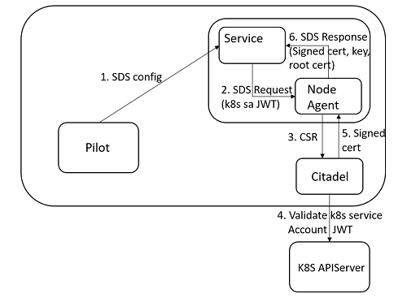
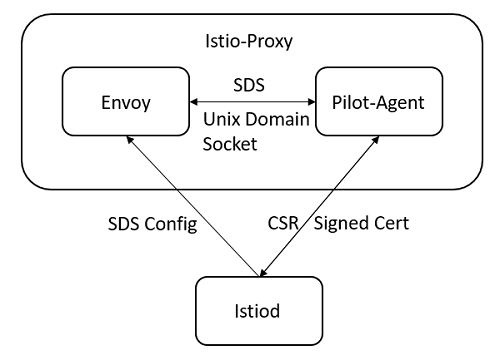

## Istio安全框架解析

### 1. Istio安全概述

作为服务网格的事实标准，极大地降低微服务架构下流量管理的复杂度往往是Istio最为引入注目的特性，但事实上，随着越来越多的服务从单体架构向微服务架构演进，模块间由最初的函数调用转变为进程间通信，微服务间通信的安全性，服务的访问策略控制以及如何降低大规模场景下安全配置的复杂度等问题同样亟待解决。

当然，Istio给出了一套完整的框架用于解决这些问题，与对流量管理的处理类似，这套框架不要求对应用做任何侵入式修改，并且提供了灵活的服务访问策略以及简易的配置方式，以近乎零成本的方式完美地解决了上述问题。


### 2. Istio安全架构

需要注意的是，本文以Istio 1.3版本作为主要分析对象，虽然随着Istio版本的演进，服务架构以及上层API都发生了一些变化，不过底层原理都是类似的，因此相信这些变化并不会造成太大的困扰。Istio的架构如下所示：


从安全的角度来看，各个组件的作用如下：

* **Citadel**：密钥以及证书管理
* **Mixer**：鉴权以及审计
* **Proxy**：一般就是Envoy，接收Pilot下发的安全配置并且应用于其拦截代理的流量
* **Pilot**：API转换层，将Istio上层安全相关的Kubernetes CRD转换为底层数据面Proxy对应的安全配置


### 3. Istio安全概念、实例以及实现

#### 3.1 Istio identity

在展开Istio安全框架中的各种概念、实例以及实现方法之前，有必要首先了解Istio identity这个概念。简单地说Istio identity就是一种身份标识，在服务间通信的开始阶段，通信双方需要交换包含各自身份标识的证书，这样一来，客户端就能通过校验证书中的身份标识来确认这的确是它要访问的目标服务，而服务端则在认证客户端身份的同时，还能对该用户进行授权、审计等等更为复杂的操作。本文以Kubernetes平台作为主要的讨论背景，而在Kubernetes下，Istio identity一般与Service Account对应，通信双方会以各自绑定的Service Account作为身份标识。

#### 3.2 Authentication概念、实例及实现

对于认证，Istio提供两种方式：**Transport authentication**以及**Origin authentication**，后者基于JWT进行认证，本文不详细展开。而Transport authentication允许在不对应用源码做侵入式修改的情况下，提供服务间的双向安全认证，同时密钥以及证书的创建、分发、轮转也都由系统自动完成，对用户透明，从而大大降低了安全配置管理的复杂度。

那么如何配置认证策略呢？对此，Istio提供了名为*Policy*的Kubernetes CRD。如下所示的yaml文件展示了如何开启对default这个namespace下名为details和reviews的service的认证，且要求对于reviews的认证仅限于9080端口：

```yaml
apiVersion: "authentication.istio.io/v1alpha1"
kind: "Policy"
metadata:
  name: "details-and-reviews"
spec:
targets:
 - name: details
 - name: reviews
   ports:
   - number: 9000
  peers:
  - mtls: {}
```

当上述配置生效之后，在没有开启双向认证（mTLS）的情况下，其他服务将无法直接访问details以及reviews服务。那么该如何开启mTLS呢？Istio在*DestinationRule*这个CRD中实现了该功能：

```yaml
apiVersion: networking.istio.io/v1alpha3
kind: DestinationRule
metadata:
  name: details
spec:
  host: details
  trafficPolicy:
    tls:
      mode: ISTIO_MUTUAL
```

通过指定`DestinationRule`中的`spec.trafficPolicy.tls.mode`为`ISTIO_MUTUAL`，其他服务在与details服务通信时将自动开启mTLS。

最终上述Istio提供的安全相关的抽象接口将由控制面组件Pilot转换为控制面代理Envoy的具体配置，Envoy再基于这些配置对代理的流量进行认证操作。为了更好地理解在Envoy层面是如何基于安全配置进行认证的，首先有必要了解Envoy的整体架构以及流量在其中的处理过程。对于这个问题，Envoy官方发布的文章[《Life of a Request》](https://www.envoyproxy.io/docs/envoy/latest/intro/life_of_a_request)已经做了非常好的解释，这里将只选取与本文相关的部分进行重点说明。


例如，当details服务相关的Pods作为服务端接收访问时，代理这些Pods的Envoy首先需要对输入流量进行处理。对于输入流量（Inbound Traffic）的操作较为简单，Envoy中仅有一个监听端口为15006的`virtualInbound` listener用于接收处理。一个listener中往往包含多条filter chain，请求需要通过目的地址和端口找到匹配的filter chain并遍历其中的filter进行处理，默认情况下filter chain中只包含处理HTTP请求的HCM（HTTP connection manager，一般作为最后一个filter），HCM内部还会包含一条HTTP filter chain用于对请求的进一步处理。对于输入流量， HCM会将HTTP filter chain处理后的流量直接转发到Inbound Cluster完成整个处理过程。

当用户配置了上述Policy之后，details服务对应pods的Envoy代理中会增加如下内容用于安全处理：

```json
{
 "filter_chain_match": {
  "prefix_ranges": [
   {
    "address_prefix": "172.16.234.118",
    "prefix_len": 32
   }
  ],
  "destination_port": 9080,
  "application_protocols": [
   "istio"
  ]
 },
 "tls_context": {
  "common_tls_context": {
   "tls_certificates": [
    {
     "certificate_chain": {
      "filename": "/etc/certs/cert-chain.pem"
     },
     "private_key": {
      "filename": "/etc/certs/key.pem"
     }
    }
   ],
   "validation_context": {
    "trusted_ca": {
     "filename": "/etc/certs/root-cert.pem"
    }
   },
   "alpn_protocols": [
    "h2",
    "http/1.1"
   ]
  },
  "require_client_certificate": true
 },
 "filters": [
 ....
```

filter chain中增加了`tls_context`字段的内容，其中包含了作为服务端认证所需的证书，私钥以及CA的路径。HTTP connection manager也会额外增加一个名为`istio_authn`的额外的http filter，表明输入的访问流量首先需要经过双向认证：

```json
"http_filters": [
 {
  "name": "istio_authn",
  "typed_config": {
   "@type": "type.googleapis.com/istio.envoy.config.filter.http.authn.v2alpha1.FilterConfig",
   "policy": {
    "peers": [
     {
      "mtls": {
      }
     }
    ]
   }
  }
 },
 {
  "name": "mixer",
  ....
```

对于输出流量的处理过程则稍显复杂，如下所示：


当有Pod需要访问details服务时，该Pod的代理Envoy则需要对输出流量进行处理。输出流量首先通过监听端口15001进入`virtualOubound` listener，这个listener仅仅作为统一的接入点接收所有的输出流量，后续根据流量的目标端口进入相应的listener。例如目标端口为9080的所有流量都会进入名为`0.0.0.0_9080`的listener。在该listener中除了目标地址为本Pod IP的所有流量都会进入默认的filter chain。这个filter chain的HTTP connection manager则会将直接将流量转发至名为"9080"的路由表。该路由表基于域名等条件进行匹配，得到目标Outbound Cluster，最终将输出流量发送至该Cluster，完成整个处理流程。

如果目标Cluster配置了上文所示的`DestinationRule`，即要求与目标Cluster进行双向认证，则与Inbound类似，在Outbound Traffic的处理流程中同样需要加载证书、私钥以及CA等一系列配置。与Inbound不同的是，Outbound对于这部分内容的配置下沉到了具体的Cluster配置中，而不是位于filter chain中为后续的Cluster共享。因为只有`DestinationRule`配置了TLS的Cluster才需要进行双向认证，其他Cluster默认是不需要的。配置示例如下：

```json
{
 "version_info": "2020-11-23T11:34:19Z/47",
 "cluster": {
  "name": "outbound|9080||details.default.svc.cluster.local",
  "type": "EDS",
  "eds_cluster_config": {
   "eds_config": {
    "ads": {},
    "initial_fetch_timeout": "0s"
   },
   "service_name": "outbound|9080||details.default.svc.cluster.local"
  },
  "connect_timeout": "10s",
  "lb_policy": "RANDOM",
  "circuit_breakers": {
   "thresholds": [
    {
     "max_retries": 1024
    }
   ]
  },
  "tls_context": {
   "common_tls_context": {
    "tls_certificates": [
     {
      "certificate_chain": {
       "filename": "/etc/certs/cert-chain.pem"
      },
      "private_key": {
       "filename": "/etc/certs/key.pem"
      }
     }
    ],
    "validation_context": {
     "trusted_ca": {
      "filename": "/etc/certs/root-cert.pem"
     },
     "verify_subject_alt_name": [
      "spiffe://cluster.local/ns/default/sa/bookinfo-details"
     ]
    },
    "alpn_protocols": [
     "istio"
    ]
   },
   "sni": "outbound_.9080_._.details.default.svc.cluster.local"
  },
 ...
```

如上，Cluster中扩展了`tls_context`字段，配置了与目标Cluster进行双向认证时所需的证书、私钥以及CA等内容。

当需要访问目标Cluster时，请求发起端的Pod会加载Outbound Cluster中的证书、私钥以及CA并作为客户端，而请求接收端的Pod则会加载Inbound Filter Chain中的证书、私钥以及CA作为服务端，两者完成双向认证。

在Istio 1.3中，Citadel默认会为每个Service Account签发证书并创建相应的Secret用于保存，Istio在注入Sidecar的同时会将包含相关SA（被注入Sidecar的Pod绑定的Service Account）的证书、私钥以及CA的Secret挂载到Sidecar的`/etc/certs`目录下，Pod在需要进行双向认证时则引用`/etc/certs`下的内容。事实上，对于同一个Pod，无论是作为客户端（Outbound Cluster中的配置）还是作为服务端（Inbound Filter Chain中的配置）引用的都是同一套证书。

不过将证书存放在Secret中并以目录的形式挂载供Pod使用并不是一种好的方式，后续Istio对证书的签发以及获取机制进行了反复的迭代，关于这部分内容，后文将有独立的章节进行详细叙述。

#### 3.3 Authorization概念、实例及实现

关于鉴权，与Kubernetes类似，Istio也支持基于RBAC的鉴权方式，实现了mesh、namespace、service以及方法级别的访问控制。首先，抽象了一个网格级别的CRD资源对象`CluterRbacConfig`用于启动鉴权。需要注意的是`ClusterRbacConfig`只能存在一个实例且名字需要为'default'，例如：

```yaml
apiVersion: "rbac.istio.io/v1alpha1"
kind: ClusterRbacConfig
metadata:
  name: default
spec:
  mode: 'ON_WITH_INCLUSION'
  inclusion:
    namespaces: ["default"]
```

上述配置表示只对default这个namespace开启鉴权，即default内的所有服务默认不可访问。

类比于Kubernetes中的RBAC，若要放开对于某些服务的访问权限，需要配置相应的`ServiceRole`和`ServiceRoleBinding`。不难理解，`ServiceRole`用于定义一系列的访问权限而`ServiceRoleBinding`则将`ServiceRole`表示的权限授予特定的对象，两者的示例如下：

```yaml
apiVersion: "rbac.istio.io/v1alpha1"
kind: ServiceRole
metadata:
  name: products-viewer
  namespace: default
spec:
  rules:
  - services: ["products.default.svc.cluster.local"]
    methods: ["GET"]
```

上述`ServiceRole`表示允许用'GET'方法访问default namespace下的products service

```yaml
apiVersion: "rbac.istio.io/v1alpha1"
kind: ServiceRoleBinding
metadata:
  name: binding-products-allusers
  namespace: default
spec:
  subjects:
  - user: "*"
  roleRef:
    kind: ServiceRole
    name: "products-viewer"
```

上述`ServiceRoleBinding`则表示将'product-views'代表的权限授予任何用户，包括已认证的和非认证的。

同样，控制面组件Pilot会将上述`ServiceRole`等鉴权相关的上层抽象资源转换为控制面代理Envoy的配置。每个Envoy中都内置了一个Authorization Engine用于在运行时对请求进行鉴权处理，决定允许或者拒绝对相关服务的访问。最终，Envoy用Inbound listener filter chain中一个额外的名为"envoy.filters.http.rbac"的HTTP filter来承载上文鉴权相关的配置：

```
{
 "name": "envoy.filters.http.rbac",
 "typed_config": {
  "@type": "type.googleapis.com/envoy.config.filter.http.rbac.v2.RBAC",
  "rules": {
   "policies": {
    "productpage-viewer": {
     "permissions": [
      {
       "and_rules": {
        "rules": [
         {
          "or_rules": {
           "rules": [
            {
             "header": {
              "name": ":method",
              "exact_match": "GET"
             }
            }
           ]
          }
         }
        ]
       }
      }
     ],
     "principals": [
      {
       "and_ids": {
        "ids": [
         {
          "any": true
         }
...
```

需要注意的是，如果目标服务所在的namespace没有开启鉴权的，上面的RBAC HTTP filter是不会存在的（因为所有服务默认都可以访问）；而在开启鉴权的情况下，如果没有创建对应的`ServiceRole`以及`ServiceRoleBinding`，则RBAC HTTP filter的规则列表为空，即该Envoy代理的输入流量的目标服务完全不允许访问：

```json
{
 "name": "envoy.filters.http.rbac",
 "typed_config": {
  "@type": "type.googleapis.com/envoy.config.filter.http.rbac.v2.RBAC",
  "rules": {}
 }
}
```

总的来说，Istio提供了多层级、细粒度的权限访问控制并且配置方法也较为简单，对于更为复杂的授权策略可以参见官网。


### 4. 证书获取机制及其演进过程

已知在Kubernetes环境下，Istio将Pod绑定的Service Account作为其标识。默认情况下，Citadel会监听集群中Service Account，为其生成对应的私钥以及证书并创建类型为`istio.io/key-and-cert`的Secret用于保存：

```bash
[root@physical-56 yzz]# kubectl  get sa 
NAME                   SECRETS   AGE
bookinfo-details       1         26h
bookinfo-productpage   1         26h
default                1         5d4h
[root@physical-56 yzz]# kubectl  get secret 
NAME                                           TYPE                                  DATA   AGE
bookinfo-details-token-njnts                   kubernetes.io/service-account-token   3      26h
bookinfo-productpage-token-6pwnk               kubernetes.io/service-account-token   3      26h
default-token-mfwwk                            kubernetes.io/service-account-token   3      5d4h
istio.bookinfo-details                         istio.io/key-and-cert                 3      26h
istio.bookinfo-productpage                     istio.io/key-and-cert                 3      26h
istio.default                                  istio.io/key-and-cert                 3      28h
```

当创建Pod并将其加入网格，在注入Sidecar的同时，Istio会将该Pod绑定的Service Account对应的Secret挂载至Sidecar中：

```bash
[root@physical-56 yzz]# kubectl  describe pods productpage-v1-59984c8fb5-27lp7
Name:         productpage-v1-59984c8fb5-27lp7
Namespace:    default
Priority:     0
Node:         192.168.132.14/192.168.132.14
Start Time:   Mon, 23 Nov 2020 17:23:41 +0800
Labels:       app=productpage
              pod-template-hash=59984c8fb5
              version=v1
...
  istio-proxy:
    Port:          15090/TCP
    Host Port:     0/TCP
    Args:
      proxy
      sidecar
      --domain
...
    Mounts:
      /etc/certs/ from istio-certs (ro)
      /etc/istio/proxy from istio-envoy (rw)
      /var/run/secrets/kubernetes.io/serviceaccount from bookinfo-productpage-token-6pwnk (ro)
Volumes:
  istio-certs:
    Type:        Secret (a volume populated by a Secret)
    SecretName:  istio.bookinfo-productpage
    Optional:    true
...
[root@physical-56 yzz]# kubectl  exec productpage-v1-59984c8fb5-27lp7 -c istio-proxy -- ls /etc/certs
cert-chain.pem    key.pem    root-cert.pem
```

Citadel会对证书的生命周期进行管理并且能够通过重写Secret的方式对证书进行轮转，但是显而易见，这种证书签发管理方式存在如下问题：

* 私钥存放在Secret中，几乎等同于明文存储，存在[安全隐患](https://kubernetes.io/docs/concepts/configuration/secret/#risks)
* 证书轮转时需要热重启Envoy，影响性能

针对上述问题，Istio在1.1版本之后引入了一种新的基于SDS的证书签发方式：



已知Envoy基于XDS API进行资源的动态发现，而SDS则是其中一种Envoy用于从远程SDS Server动态获取证书密钥的API。在新的方案中，每个节点都会部署一个Node Agent作为SDS Server，用于处理该节点所有Envoy的SDS请求。Pilot依然会对上层认证相关的API进行转换并下发至Envoy，但是此时`tls_context`中将不再包含对`/etc/certs`目录下的证书的直接引用，而是包含了与SDS Server交互的配置：

```json
"tls_context": {
 "common_tls_context": {
  ...
  "tls_certificate_sds_secret_configs": [
   {
    "name": "default",
    "sds_config": {
     "api_config_source": {
      "api_type": "GRPC",
      "grpc_services": [
       {
        "google_grpc": {
         "target_uri": "unix:/var/run/sds/uds_path",
         ...
         "call_credentials": [
          {
           "from_plugin": {
            "name": "envoy.grpc_credentials.file_based_metadata",
            "typed_config": {
             "@type": "type.googleapis.com/envoy.config.grpc_credential.v2alpha.FileBasedMetadataConfig",
             "secret_data": {
              "filename": "/var/run/secrets/kubernetes.io/serviceaccount/token"
             },
             ...
  ],
  "combined_validation_context": {
   "default_validation_context": {},
   "validation_context_sds_secret_config": {
    "name": "ROOTCA",
    "sds_config": {
     "api_config_source": {
      "api_type": "GRPC",
      "grpc_services": [
       {
        "google_grpc": {
         "target_uri": "unix:/var/run/sds/uds_path",
         ...
         "call_credentials": [
          {
           "from_plugin": {
            "name": "envoy.grpc_credentials.file_based_metadata",
            "typed_config": {
             "@type": "type.googleapis.com/envoy.config.grpc_credential.v2alpha.FileBasedMetadataConfig",
             "secret_data": {
              "filename": "/var/run/secrets/kubernetes.io/serviceaccount/token"
             },
             ...
```

在上面的`tls_context`中包含了两段SDS配置，命名为"default"的SDS配置用于请求证书以及私钥，而命名为"ROOTCA"的SDS配置则用于请求root ca。在每段SDS配置中，重点关注`target_uri`和`filename`字段，前者表明与SDS Server的交互地址，一般是一个Unix Domain Socket，Node Agent和应用Pod的Sidecar都会以HostPath的形式对该socket所在的目录进行挂载。后者为Pod关联的Service Account的JWT的所在路径。

在这种模式下，证书的分发过程如下：

* Envoy基于SDS配置发送SDS请求，请求中包含资源名"default"或者"ROOTCA"以及其所在Pod绑定的Servcie Account的JWT，Citadel利用JWT可以获取对应Service Account的信息并且将其包含在证书中，用于标识。
* Node Agent构建私钥并且基于SDS请求中的JWT向Citadel发起CSR（Certificate Signing Requests）
* Citadel接收到CSR之后，首先向Kubernetes APIServer验证Service Account的JWT，确认后，签发证书并返回至Node Agent
* Node Agent将签发后的证书、私钥以及root ca以SDS Response的形式返回至Envoy，完成整个证书的签发流程，Envoy则会将获取的证书缓存如下：

```json
{
 "@type": "type.googleapis.com/envoy.admin.v2alpha.SecretsConfigDump",
 "dynamic_active_secrets": [
  {
   "name": "spiffe://cluster.local/ns/istio-system/sa/istio-pilot-service-account",
   "version_info": "2020-11-25 00:54:08.854459604 +0000 UTC m=+495600.689938099",
   "last_updated": "2020-11-25T00:54:10.058Z",
   "secret": {
    "name": "default",
    "tls_certificate": {
     "certificate_chain": {
      "inline_bytes": "LS0tLS1CRUdJ....."
     },
     "private_key": {
      "inline_string": "[redacted]"
     }
    }
   }
  },
  {
   "name": "ROOTCA",
   "version_info": "2020-11-24 01:47:08.6870616 +0000 UTC m=+412380.522540112",
   "last_updated": "2020-11-24T01:47:08.858Z",
   "secret": {
    "name": "ROOTCA",
    "validation_context": {
     "trusted_ca": {
      "inline_bytes": "LS0tLS1CRUdJTiBDRVJUSUZJ......"
     }
    }
   }
  }
...
```

可以看到与基于Secret的证书签发方式相比，新的方案具有的优点如下：

* Envoy能够利用SDS API动态刷新证书和密钥而无须重启，不再影响性能
* 无须依赖Kubernetes Secret，从而避免Secret机制中已知的安全问题
* 私钥不再离开其生成节点：私钥由Node Agent创建并且只会在SDS Response中传递给Envoy，而且只在两者的内存中存在

但是在这种模式下，因为运行在同一个节点的所有Pods都会共享一个Node Agent以及Unix Domain Socket，一方面Node Agent会存在可用性问题，另一方面为了防止对于共享的Unix Domain Socket的恶意篡改从而窃取该节点其他Pods的认证信息，需要配置复杂的PSP规则，限制只有Node Agent所在的Pod能够修改共享的Unix Domain Socket，而其他都Pod都只享有只读权限。

针对这些问题，Istio社区对这个方案进行了进一步的演化，去除了每个节点的Node Agent，并且将SDS Server内嵌到每个Sidecar的Pilot-Agent进程中：



Istio为应用注入的Sidecar容器事实上不止一个Envoy进程，还有另一个名为Pilot-Agent的进程用于Envoy的生命周期管理，而现在它又承担起了作为SDS Server的责任。虽然从架构来看，两个方案之间似乎存在着巨大的差异，但是真正的差异只有以下两点：

* Envoy与SDS Server（此处即为Pilot-Agent）交互的Unix Domain Socket为每个Sidecar私有，无需再配置复杂的PSP机制防止恶意篡改。SDS Server创建的私钥的传输范围也进一步缩小，甚至都不会离开Sidecar容器。
* 之前共享SDS Server时，Envoy发送的SDS Request需要携带相应的Service Account JWT用于标识身份，在新的方案下就不再需要了，因为每个SDS Server都是每个Pod独享的，直接从相应的挂载目录`/var/run/secrets/kubernetes.io/serviceaccount/token`读取JWT即可。

经过这三个方案的演进，Istio的证书签发管理机制已经变得非常安全优雅。

### 5. 总结

本文对Istio安全的整体框架做了较为深入的介绍，从上层API到底层实现以及证书签发管理机制的完整迭代过程。不管是安全还是流量治理，Istio最大的价值在于能够以无侵入的方式，让用户以极低的心智成本迅速完成业务的迁移并享受技术的红利，同时Istio对上层API的简化抽象，则极大地降低了用户的使用维护负担，可以更多地关注业务，而无须再过多地关注安全等复杂繁琐但又与业务无关的底层技术细节。


### 参考文献

* [Life of a Request](https://www.envoyproxy.io/docs/envoy/latest/intro/life_of_a_request)
* [Istio 1.3 doc: Policies and Security](https://istio.io/v1.3/docs/concepts/security/)
* [Provisioning Identity through SDS](https://istio.io/v1.1/docs/tasks/security/auth-sds/)
* [Istio 1.3源码](https://github.com/istio/istio/tree/1.3.0)
* [一文带你彻底厘清 Isito 中的证书工作机制](https://zhaohuabing.com/post/2020-05-25-istio-certificate/)