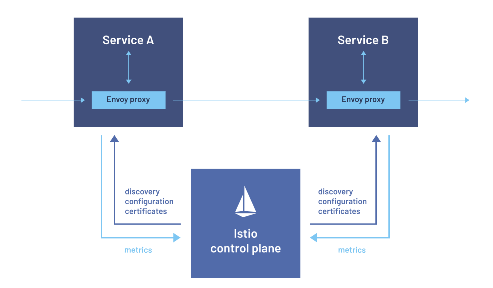
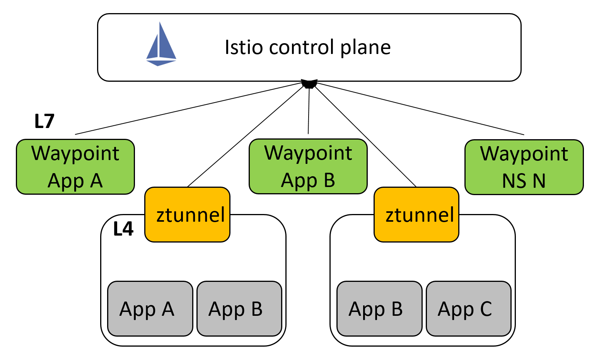
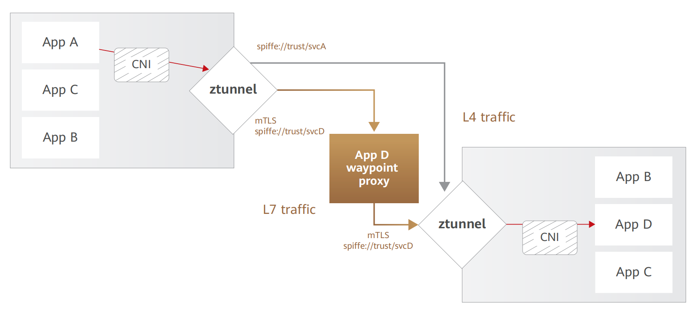

## **Istio数据面新模式 --- Ambient Mesh**

如果说在以Kubernetes为基础构建起的云原生世界里，哪种设计模式最为经典，Sidecar模式无疑是其中最有力的竞争者。当需要为应用提供与自身逻辑无关的辅助功能时，在应用Pod内注入对应功能的Sidecar显然是最Kubernetes Native的方式，而Istio则是这种模式的代表。

Istio项目的愿景是以尽量透明的方式，解决微服务场景下，服务间的连接、安全以及可观测性问题。主要实现手段则是通过在应用旁部署一个Proxy，在Kubernetes场景下则为应用Pod注入Sidecar，拦截应用流量至Sidecar。Sidecar根据从Istio控制面获取的用户配置对应用流量进行处理，以一种对应用代码几乎无侵入的方式实现了服务治理。

虽然Istio并不局限于仅支持Kubernetes平台，但是Istio的设计理念与Kubernetes的Sidecar模式有着天然的亲和性。基于Sidecar模式，Istio能够实现在Kubernetes平台上的快速开发、部署、验证。同时，在功能层面，Isito将服务治理功能从应用代码中剥离，作为基础设施下沉至Sidecar，抽象出了事实上的云原生应用网络层，极大地减轻了应用开发者的心智负担，这部分能力刚好也是Kubernetes生态一直以来缺失的。基于Istio对于Kubernetes生态的完美补充，随着Kubernetes的大规模普及，Istio也实现了对用户心智以及市场的快速抢占。

虽然以Sidecar模式部署Istio数据面似乎是一个理所应当，让人无法拒绝的选择，但是需要强调的是，Istio完整功能的实现并不与Sidecar模式强绑定，我们还有各种各样其他的选择。另外，随着对于Istio使用程度不断加深，落地规模不断扩大，可以发现以Sidecar模式部署Istio数据面诸多挑战：

1. **侵入性：** Istio基本实现了对应用代码的零侵入，但是由于Sidecar的注入需要更改Pod Spec并且对应用流量进行重定向，因此应用接入网格时需要重启Pod，而应用容器与Sidecar容器的启动顺序不确定造成的冲突也可能导致应用中断；

2. **生命周期绑定：** Sidecar本质上是基础设施，它和应用的生命周期往往不一致，因此升级Sidecar时也需要对应用Pod进行重启，同样可能导致应用中断，而对于Job类应用，Sidecar的存在则会导致Pod无法被及时清理；

3. **资源利用率低：** Sidecar为单个应用Pod独占，应用的流量存在波峰波谷，而一般情况下Sidecar的内存占用与集群规模（Service数目，Pod数目）强相关，因此需要按照极端情况预留资源，导致集群整体的资源利用率低。同时由于需要为每个Pod注入Sidecar，随着集群规模的不断扩大，Sidecar占用的资源总量也会线性上涨。

针对Sidecar部署模式的缺陷，Google和Solo.io联合推出了一种新的Sidecar-less部署模式 --- Ambient Mesh。

Ambient Mesh架构如上图所示，从设计的角度来看，它主要有以下两个特点：

1. **Sidecar-less：** 为了避免上述Sidecar模式的种种缺陷，Ambient Mesh不再为任何Pod注入Sidecar，将网格功能的实现进一步下沉到Istio自有组件中；

2. **L4/L7处理分层：** Ambient Mesh引入了ztunnel和waypoint两个组件用于代替原来的Sidecar实现相关功能，与Sidecar既能处理L4，又能处理L7流量的实现方式不同，Ambient Mesh对两者进行了区分，ztunnel只负责L4流量的处理，L7的流量则按需交由waypoint处理。

Ambient Mesh的控制面与原先Sidecar模式的Istio相比基本没有变化，数据面的组件构成以及各个组件的作用如下：

1. **istio-cni：** 必装组件，以DaemonSet的形式部署。其实istio-cni并不是Ambient Mesh的新增组件，在原先的Sidecar模式中就已经存在，当时主要用于替代istio-init这个Init Container配置流量拦截规则，同时规避istio-init引发的安全问题。Ambient Mesh对它进行了扩展，以必装组件的形式部署，负责配置流量转发规则，劫持本节点中已加入Ambient Mesh的Pods的应用流量，转发至本节点的ztunnel；

2. **ztunnel:** 必装组件，以DaemonSet的形式部署。ztunnel对所在节点Pods的流量进行代理，主要负责L4流量的处理、L4的遥测以及服务间mTLS（双向认证）的管理。最初ztunnel基于Envoy实现，但是考虑到对ztunnel功能的有意约束以及对安全性、资源占用率的要求，社区已经用rust从零构建该组件；

3. **waypoint：** 按需配置，以Deployment的形式部署。waypoint负责处理HTTP，故障注入等L7功能。以负载或者Namespace粒度进行部署，在Kubernetes中，即一个Service Account或者一个Namespace对应生成一个waypoint的Deployment，用于处理发往对应负载的七层流量，同时waypoint实例数可以根据流量动态伸缩。

下面以Ambient Mesh数据面实际的处理过程来展示上述各个组件在其中扮演的具体角色：

1. 与Sidecar模式类似，Ambient Mesh也能以网格、Namespace以及Pod的粒度将服务加入网格；不同的是，新加入的Pod无需重启，更不需要注入Sidecar；

2. istio-cni监听本节点内Pods的增删以及进出网格的情况，动态调整转发规则，网格内Pods发出的流量会被透明地转发至本节点的ztunnel，直接跳过kube-proxy的处理；

3. ztunnel同样需要对本节点Pods的增删以及进出网格的情况进行监听，从控制面获取位于本节点且被网格接管的Pods的证书并进行管理；

4. 源端ztunnel对拦截的流量进行处理，根据流量的源IP找到对应Pod的证书，由此和对端建立mTLS；

5. 如果要访问的目标服务没有配置waypoint或者没有配置L7相关的处理策略，则源端ztunnel直接和目的端ztunnel建立连接（如上图黄线标注），对端的ztunnel终止mTLS，执行L4安全策略，将流量转发到目标Pod；

6. 如果目标服务配置了waypoint（利用特殊配置的Gateway对象）以及L7的处理策略，则源端ztunnel会和对应的waypoint建立mTLS，waypoint终止mTLS后，进行L7的逻辑处理，之后再与目标Pod所在节点的ztunnel建立mTLS，最终同样由目的端的ztunnel终止mTLS并将流量发往目标Pod。

 

### 价值分析

虽然从底层实现来看，Ambient Mesh和原有的Sidecar模式的差别巨大，但是从用户面看，两者在核心Istio API（VirtualService, DestinationRules等）的使用方式、实现效果都是一致的，能够确保基本相同的用户体验。Ambient Mesh是Istio社区除Sidecar模式外，支持的第二种数据面模式，所以网格技术本身能为用户带来的价值，Ambient Mesh与先前的Sidecar模式并不二致。因此这里只对Ambient Mesh相对于原生Sidecar模式的价值进行分析，对于网格本身的价值不再赘述。

Ambient Mesh主要是针对Istio的数据面架构进行调整，用于克服既有Sidecar模式的不足，因此它的价值产生必然是基于其架构特点。前文已经提到过Ambient Mesh的架构特点主要有“Sidecar-less”和“L4/L7处理分层”这两点，下面就从这两点出发进行价值分析：

1. Sidecar-less的优势，其实可以看作Sidecar模式缺陷的对立面：

   a)    **透明：** 网格功能下沉至基础设施，不仅对应用代码零侵入，和应用的生命周期也完全解耦，做到真正对应用透明，允许应用与网格独立演进；

   b)    **优化资源占用：** 数据面占用的CPU、内存等资源不再随着实例数线性增长，随着数据面的实例数减少，与控制面的连接数也相应减少，极大地减轻控制面的资源与处理压力。

2. 对于为什么要对L4/L7进行分层处理，首先要区分两者之间的区别。与L4相比，L7的处理更为复杂，需要占用更多的CPU/内存等资源，不同类型的操作之间资源占用也存在较大差别；同时操作越复杂暴露的攻击面越大。另外Envoy当前并不支持对不同租户的流量进行强隔离，“Noisy Neighbor”的问题不可避免。因此Ambient Mesh分层处理架构的优势如下：

   a)    **资源利用率高：** ztunnel仅负责L4的处理，L4处理较为简单且资源占用较为固定，所以更易对ztunnel进行资源规划，无需过量预留资源，能够将更多的节点资源供用户使用；waypoint更可以根据L7负载动态扩缩容，充分利用集群中的资源碎片；

   b)    **租户隔离：** 处理复杂、安全风险高的L7处理由租户（Service Account）各自的waypoint处理，既避免了租户间的资源抢占，又限制了安全问题的爆炸半径；

   c)    **平滑落地：** 允许用户逐步接入网格，当仅需网格的L4处理能力时，完全无需考虑L7的资源占用以及可能造成的潜在负面影响（例如：因为错误配置导致进入L7处理而应用并未完全遵守L7协议，导致服务中断），之后在适当时刻按需开启相关功能即可。

当然Ambient Mesh作为Istio全新的数据面架构，在社区中依然以实验特性的形式存在，仍然有许多问题亟待解决，例如：

1. **性能：** 尤其是针对L7的处理，Ambient Mesh需要经过两个ztunnel以及一个waypoint，肉眼可见地又额外增加了一跳，因此完整的L7处理需要额外经过三跳。虽然社区声称这对性能的影响很小，但是仍需待其特性稳定后进一步观察对比；

2. **容器网络适配：** 虽然Ambient Mesh与应用基本实现了完全解耦，但是反过来也增加了网格与底层基础设施的耦合，Sidecar模式仅需在Pod的net ns实现流量的拦截处理，但是Ambient Mesh在主机网络进行流量拦截，显然需要更多考虑与底层容器网络的适配；

3. **配置复杂：** 原本Envoy复杂的配置就被广为诟病而Ambient Mesh更需要实现一个ztunnel对节点所有Pods的代理，配置复杂度更是上升一个数量级，同时配置的复杂意味着处理流程的增加，也会对数据面的排错以及整体性能造成影响；

4. **其他：** ztunnel的高可用？waypoint事实上将原本双端的L7处理变为了单端，对L7监控指标正确性的影响？…

 

### 未来展望

从版本发布的角度，自从2022年9月份发布以来，Ambient Mesh一直作为实验特性存在于独立的分支之中。因此对于Ambient Mesh下一步的计划就是合入主干分支（已于2023年2月实现）并作为Alpha特性发布，最终在2023年底到达Stable，实现生产可用。

从API的角度，最理想的是能在两种架构下共用同一套API。当然这是不现实的，因为已有的一部分Istio API是以Sidecar模式部署为前提条件设计的。最典型的就是Sidecar这个CRD，它用于定制化下发至不同Sidecar的配置，从而减少Sidecar不必要的资源占用。这些Sidecar-Only的API显然在Ambient Mesh下毫无意义。同时，Ambient Mesh自身也引入了ztunnel和waypoint两个独有组件，因此Ambient Mesh也需要创建新的API，用于管理这些独有组件以及实现一些Ambient Mesh Only的功能。最终Ambient Mesh会实现已有的核心Istio API（VirtualService, DestinationRules等）并创建一些其独有的API，重要的是做到三类API（Sidecar模式独有、Ambient Mesh独有、两者共有）统一的使用与交互。

那么Ambient Mesh是否做到了对Sidecar模式使用场景的全覆盖，从而让Sidecar模式彻底退出历史舞台了呢？答案自然是否定的，类似于业界各种独占模式和共享模式之争，Sidecar模式本质上是应用Pod对Proxy的独占。专属的Proxy往往能保证更好的资源可用性，尽量避免其他应用的影响，确保高优先级应用的正常运行。可以预见，最终两种模式的混合部署，应用按需选择代理模式是更为理想的方式。所以构建混合部署模式，保证该模式下两种模式的良好兼容性和统一的体验也将是后续工作的重点。

 

### 总结

Sidecar模式之于Istio就像一场原型验证，以一种最Kubernetes Native的方式快速展示网格技术的价值，抢占用户认知和市场。不过随着Istio的落地逐渐进入深水区，开始在生产环境大规模部署，Sidecar模式就显得力不从心了。此时Ambient Mesh以一种更符合大规模落地要求的形态出现，克服了大多数Sidecar模式的固有缺陷，让用户无需再感知网格相关组件，真正将网格下沉为基础设施。

但是显然Ambient Mesh并不是网格数据面架构演进的终点。当前还没有一种网格数据面方案能在侵入性、性能、资源占用等各个考量维度做到完美。Ambient Mesh基本做到了对应用的零侵入，但是L7的三跳处理引发的性能问题，ztunnel等常驻进程的资源占用令人无法忽视；gRPC等RPC库通过内置实现xDS，直连Istio控制面，将网格杂糅进SDK，确实能实现很好的性能和资源占用表现，只是不可避免地需要付出与应用强耦合、多语言支持复杂度高等固有代价；基于eBPF直接将全套网格数据面功能像TCP/IP协议栈一样下沉到内核貌似是理想的终局方案，只是考虑到内核安全以及与内核交互的复杂性，eBPF的执行环境其实是非常受限的，例如eBPF程序加载到内核前必须经过verifier的校验，执行路径必须完全已知，无法执行任意的循环。因此对于HTTP/2，gRPC等复杂的L7处理，基于eBPF的开发和维护都会比较困难。

考虑到基础设施对性能、资源损耗的极致要求以及过往相关技术的演进规律，例如对于基础网络，绝大多数应用共享使用内核协议栈即可，部分特殊应用利用DPDK，RDMA等专用技术进行加速。同样，对于网格数据面，多种技术结合，分别优化相应场景的解决方案，可能是更具可行性的。可以预见，这类方案基本上是以类Ambient Mesh的节点级代理作为主体，随着网格以及eBPF技术的发展，将尽量多的网格数据面功能下沉至eBPF（Fast Path）实现；少部分高级功能交由用户态的Proxy（Slow Path）实现；那些对性能、隔离性等有较高要求的应用，则为其部署专属的Sidecar。这样一来，就能满足绝大多数场景下，对侵入性、性能、资源占用等各个维度的要求。

综上 ，最终是一套数据面方案一统天下，还是各种方案混合部署，取各家所长，仍有待对相关技术不断探索演进，再用实践检验，最后让时间告诉我们答案。

 

### 参考文献

[1] Istio Ambient Mesh Explained: https://lp.solo.io/istio-ambient-mesh-explained

[2] What to expect for ambient mesh in 2023: https://www.solo.io/blog/ambient-mesh-2023

[3] Introducing Ambient Mesh: https://istio.io/latest/blog/2022/introducing-ambient-mesh

[4] Get Started with Istio Ambient Mesh: https://istio.io/latest/blog/2022/get-started-ambient

 