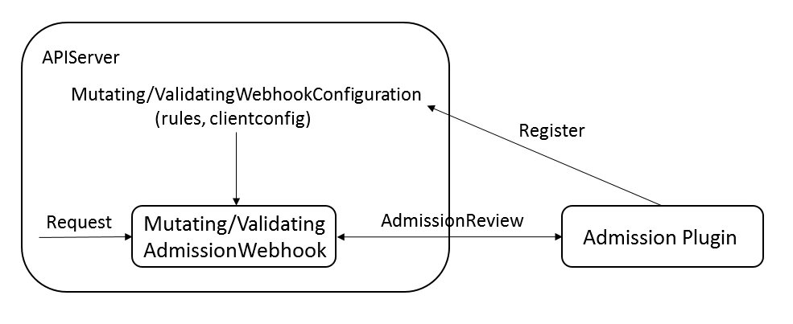
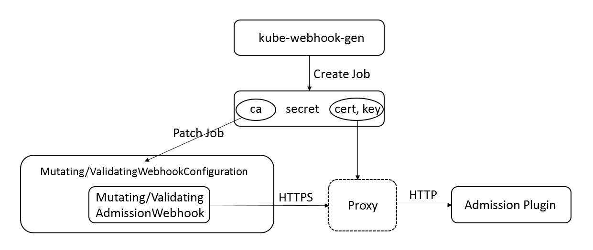

## Kubernetes Admission Controller解析

本文将对Kubernetes中的Admission Controller机制及其原理进行解析并以Prometheus Operator为例说明该机制在具体应用场景下的实现及使用方式。

### 原理概述


简单地说，Admission Controller实现了对于Kubernetes集群的准入控制。如上图所示，Admission Controller以插件的形式内置于Kuberntes APIServer，在APIServer对请求的处理链路中发挥作用。一般RESTful请求进入APIServer之后，会经过认证、审计、流量控制、鉴权等一系列通用处理，接着Admission Controller会对请求进行准入控制，主要包含`Mutating`和`Validation`两类操作，具体的操作都由相应的插件完成。`Mutating`可以对请求中的资源对象进行修改而`Validation`则仅进行校验。`Mutating`和`Validation`之间还有一个名为`Object Schema Validation`的操作，用于进行一些对于资源对象通用的校验，例如Pod中所有容器的名字都要唯一等等。最后完成与etcd之间的交互。

Kubernetes APIServer中内置了一系列准入控制的插件，利用启动参数中的`--enable-admission-plugins`可以指定需要启动的准入控制插件：

```
--enable-admission-plugins=PodNodeSelector,NamespaceLifecycle,PodSecurityPolicy,...,MutatingAdmissionWebhook,ValidatingAdmissionWebhook,...
```

不同的Admission Controller插件用于对不同类型的请求进行准入控制，通过对请求内容的校验甚至修改来实现保证集群以及应用的安全可用和对应用配置的高度可控的目的。

例如，上述配置中的`NamespaceLifecycle`插件用于确保在处于Terminating状态的Namespace内创建新的资源对象的请求会被拒绝，而插件`PodSecurityPolicy`则会根据请求创建的Pod的Security Context以及相关的Pod Security Policy决定是否拒绝该Pod。

但是需要注意的是，类似于`NamespaceLifecycle`的准入控制插件都是以`in-tree`的形式存在于APIServer中的，也就是说如果要使用该插件，不仅需要在APIServer的启动参数中做如上指定，而且需要将该插件编译至APIServer的二进制文件中，而且在运行时中动态加载插件也是不可能的。

显然，这种方式是不具备扩展性的，尤其是在Kubernetes Operator生态不断发展，用户对CRD的使用日益频繁的情况下。事实上，上述配置中`MutatingAdmissionWebhook`和`ValidatingAdmissionWebhook`这两个特殊的插件就是用来解决扩展性问题的。这两个插件往往分别位于`Mutating`和`Validating`的最后，它们并不会对请求进行任何处理而是直接将它们以webhook的形式转发至系统中注册的远程插件，由远程插件执行用户自定义的一些准入控制操作。

### Admission Controller Webhook

既然支持准入控制插件的动态安装，那么首先需要解决的就是插件的服务发现问题，自定义准入控制插件该如何向APIServer注册呢？在Kubernetes体系下，解决这类问题最常规的方法就是定义一个新的资源对象，事实上，Kubernetes也是这么做的。自定义的准入控制插件一般不会独立部署，而是往往以Webhook Server的形式嵌入到CRD的Operator中，例如，本文中作为例子的Prometheus Operator，用来对该Operator定义的资源对象进行校验。Operator以Deployment的形式部署在集群中并且配置相应的Service。如果要将该插件注册至APIServer使其能够在准入控制中的`Validating`阶段生效，则需要定义如下资源对象：

```yaml
apiVersion: admissionregistration.k8s.io/v1beta1
kind: ValidatingWebhookConfiguration
metadata:
  name: prometheus-operator-admission
webhooks:
- name: prometheusrulevalidate.monitoring.coreos.com
  clientConfig:
    caBundle: ${CA_PEM_B64}
    service:
      name: prometheus-operator
      namespace: monitor
      path: /admission-prometheusrules/validate
  failurePolicy: Fail
  rules:
  - apiGroups:
    - monitoring.coreos.com
    apiVersions:
    - '*'
    operations:
    - CREATE
    - UPDATE
    resources:
    - prometheusrules
```

从字面上就非常容易理解上述配置的含义，其中的`rules`字段描述了该自定义插件需要处理的资源对象的筛选条件。例如这个例子表示仅对`monitoring.coreos.com`这个API Group下任意版本的`PrometheusRules`资源对象的创建/更新进行处理。`clientConfig`字段则表示了对于自定义插件的访问方法，利用`service`字段就能方便地拼接出一个URL，APIServer内置的`ValidatingAdmissionWebhook`直接将请求封装并且转发即可。如果要注册在`Mutating`阶段生效的插件，则需要另外创建一个类型为`MutatingWebhookConfiguration`的资源对象，格式内容与`ValidatingWebhookConfiguration`基本一致。一般Operator中内嵌的Admission Webhook Server会包含两个endpoints，用于分别处理`Mutating`和`Validating`类型的请求。例如Prometheus Operator中，`/admission-prometheusrules/mutate`用于处理`Mutating`类型的请求，而 `/admission-prometheusrules/validate`则用于处理`Validating`类型的请求。

APIServer中的`MutatingAdmissionWebhook`和`ValidatingAdmissionWebhook`插件则会分别对`MutatingWebhookConfiguration`和`ValidatingWebhookConfiguration`类型的资源对象进行List-Watch。每当处理一个请求时，它们都需要对该请求的目标资源对象与各个注册插件的`rules`进行匹配。一旦匹配成功则将请求封装至如下结构并利用`services`中的信息转发至对应插件进行处理：

```go
type AdmissionReview struct {
	metav1.TypeMeta
	Request *AdmissionRequest
	Response *AdmissionResponse 
}
```

APIServer与插件交互的Request和Reponse都是利用的上述结构，对于APIServer发往插件的请求，上述结构的`Request`字段不为空，如下所示，其中包含了插件需要的所有信息，`Object`字段更是包含了该RESTful请求对应的资源对象的完整内容：

```go
type AdmissionRequest struct {
    ...
    Kind metav1.GroupVersionKind
    Resource metav1.GroupVersionResource
    Name string
    Namespace string
    Operation Operation
    Object runtime.RawExtension
    ...
}
```

插件会从AdmissionRequest中解析出，其中包含的需要校验的资源对象。例如，Prometheus Operator会首先判断得到的资源对象是否为自己需要校验的类型，即`PrometheusRules`，之后再对其中的内容进行校验，根据结果返回`AdmissionReview`结构并指定其中的`Response`字段，如下：

```go
type AdmissionResponse struct {
    ...
    Allowed bool
    Result *metav1.Status
    Patch []byte
    PatchType *PatchType
    ...
}
```

`Allowed`字段表示校验是否通过，`Result`字段在校验不通过时表明理由。Patch相关的字段仅在`Mutating`阶段使用，用于表示对资源对象的修改，此处最经典的案例莫过于Istio利用`MutatingWebhookConfiguration`自动注入Envoy作为应用的Proxy Sidecar。

上述即为Admission Controller实现原理的全部内容，理解起来并不是十分困难，简而言之，APIServer内置了一堆准入控制插件能够对资源对象的增删改查进行控制甚至修改，从而保证了集群的安全可用以及对于资源对象配置统一灵活的管理，而基于Webhook的远程插件又进一步增加了这种灵活性。至于自定义插件本质上就是一个Webhook Server，分别针对`Mutating`和`Validating`实现相应的处理函数，为了更直观地理解，可以参考[Prometheus Operator](https://github.com/coreos/prometheus-operator/blob/master/pkg/admission/admission.go)中的实现。整个流程的示意图如下：



但是真正要在生产环境中应用Admission Controller这一特性，尤其是为CRD自定义插件，作为在APIServer之外独立运行的程序，APIServer与之交互伴随而来的安全问题是不得不考虑的。

### APIServer与准入控制插件的安全交互

Kubernetes构建了一套复杂的机制保证集群的安全，特别是与APIServer相关的交互，各种权限问题是根本绕不过的。上文为了突出Admission Controller的实现原理，我们有意忽略了安全相关的设置。事实上，APIServer在通过`MutatingWebhookConfiguration`或者`ValidatingWebhookConfiguration`获取相应的Service之后只能通过HTTPS与之进行交互，交互的端口只能为443，而且APIServer不能跳过对于插件的认证。因此，`MutatingWebhookConfiguration`或者`ValidatingWebhookConfiguration`中的`clientConfig.caBundle`字段是必须填写的。

那么现在的问题就变为如何在部署准入控制插件时自签名一套证书供插件使用而根证书能够写入`MutatingWebhookConfiguration`或者`ValidatingWebhookConfiguration`中供APIServer使用。所幸地是，如果以Helm的形式部署应用，Helm允许在应用启动之前或者之后执行一系列Hook操作，这也就为我们提前创建自签名证书提供了可能。整个部署过程总体可以分为以下三个步骤：

1. 利用helm中的PrestartHook，构建前置Job（在annotation中指定`helm.sh/hook: pre-install,pre-upgrade`即可）用于构建自签名证书。此处需要使用一个名为[kube-webhook-certgen](https://github.com/jet/kube-webhook-certgen)的开源组件。该组件主要包含两个子命令，其中子命令`create`生成对应的ca以及cert+key并保存至指定的Secret中，具体配置参见[Prometheus Operator中的相关设置](https://github.com/helm/charts/blob/master/stable/prometheus-operator/templates/prometheus-operator/admission-webhooks/job-patch/job-createSecret.yaml#L33)。
2. 真正执行插件部署，包括插件对应的Deployment，Service以及`MutatingWebhookConfiguration`或者`ValidatingWebhookConfiguration`。需要注意的是要将步骤1中生成的Secret中包含的cert和key挂载到插件对应的Pod中，使其能够构建基于HTTPS的Webhook Server供Kubernetes APIServer访问。当然，如果有的插件，类似于Prometheus Operator，本身并不支持HTTPS，则需要以Sidecar的形式部署一个[Proxy](https://github.com/square/ghostunnel)用作TLS Termination。由该Proxy挂载Secret中的cert和key并与APIServer直接交互，再由它将流量转发至Prometheus Operator真正完成准入控制，具体配置参见[Prometheus Operator中的相关设置](https://github.com/helm/charts/blob/master/stable/prometheus-operator/templates/prometheus-operator/deployment.yaml#L72)。
3. 利用helm中的PoststartHook，构建后置Job。该Job同样利用了`kube-webhook-certgen`，与步骤1不同的是，这次使用的是子命令`patch`用于将指定Secret中的ca加载到`MutatingWebhookConfiguration`或者`ValidatingWebhookConfiguration`中。APIServer监听到配置变更之后就会重新加载`MutatingWebhookConfiguration`/`ValidatingWebhookConfiguration`，后续有符合规则的请求就能够通过HTTPS转发到对应的插件进行处理。该Job的具体配置参见[Prometheus Operator中的相关设置](https://github.com/helm/charts/blob/master/stable/prometheus-operator/templates/prometheus-operator/admission-webhooks/job-patch/job-patchWebhook.yaml#L32)

上述步骤的示意图如下：



### 总结

本文主要对Kubernetes Admission Controller的设计原理进行了分析并结合其在Prometheus Operator中的应用说了该机制在实际使用中可能遇到的问题，尤其是安全方面的问题。Admission Controller也是Kubernetes强大扩展性的一种体现，为进一步增强集群的安全可用，资源配置的统一管理控制提供了可能。以Admission Controller为例，Kubernetes的很多高级特性从设计来看并不十分复杂，但是由于Kubernetes复杂的类型系统以及安全策略方面的考虑，会让这些特性使用起来并不十分友好。


### 参考文献

* [A Guide to Kubernetes Admission Controllers](https://kubernetes.io/blog/2019/03/21/a-guide-to-kubernetes-admission-controllers/)
* [Using Admission Controllers](https://kubernetes.io/docs/reference/access-authn-authz/admission-controllers/)
* [Dynamic Admission Control](https://kubernetes.io/docs/reference/access-authn-authz/extensible-admission-controllers/#admission-webhooks)