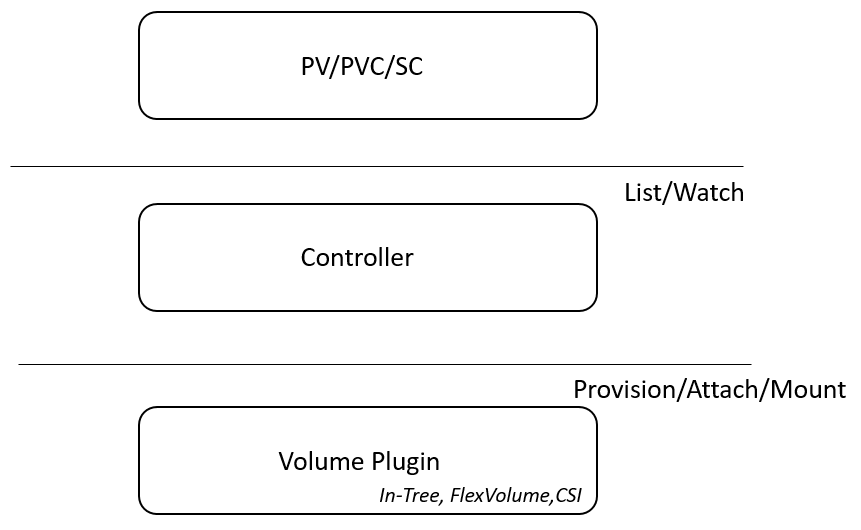
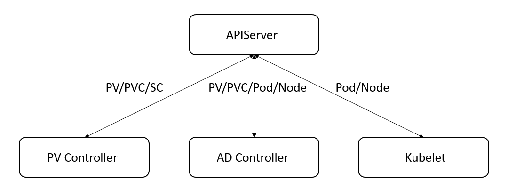
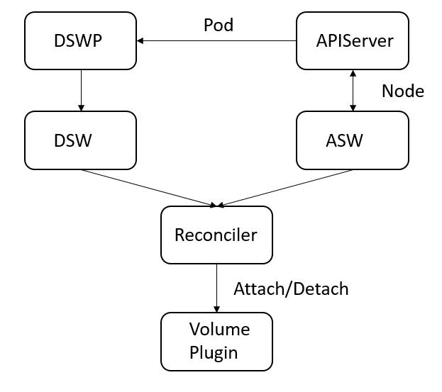

## Kubernetes存储框架解析

针对不同的应用以及不同的场景，我们往往需要不同的存储方案以满足我们的需求，而各类存储方案的实现以及配置方法各异，直接使用通常会造成较大的心智负担。因此，Kubernetes作为容器编排领域的事实标准，设计一套通用的存储框架用以无缝接入尽量多的存储方案并能够供用户方便地使用，就显得尤为重要了。当然，这样一套框架也不是一蹴而就的，对于存储方案的集成方式大致上经历了InTree（与存储方案对接的实现直接硬编码至Kubernetes中），FlexVolume以及CSI三个阶段。本文将对最新的基于CSI的Kubernetes存储框架进行分析，包含的主要内容如下：

* 存储框架设计概述
* 存储拓扑与Pod调度
* CSI协议分析

### 1. 存储框架设计概述

对于存储来说，普通用户最关心的或者只想关心的是我要给应用挂载一个多大的盘，至于如何配置底层存储以满足需求，这对存储的使用者来说往往是一种额外的负担，例如，要学会如何配置Ceph以获取一块存储对任何初学者来说都不是一件容易的事情。因此，这也是Kubernetes设计PV/PVC/SC这一套资源对象的根本原因：

* PersistentVolumeClaim（PVC）：用户对所需存储资源的抽象描述，主要描述了所需存储资源的类型（文件系统或者块设备）、大小以及访问方式等核心诉求
* PersistentVolume（PV）：PVC与PV的关系类似于Go语言中的接口与具体实现的关系。PV不仅包含了PVC中描述的关于存储资源的抽象信息，更包含为了真正获得该资源需要的关于底层存储的配置。例如，对于基于NFS的存储，则需要在PV中配置对应的NFS服务器的IP以及路径。PV中包含了底层存储配置的相关信息，因此通常由系统管理员进行管理，对用户透明。
* StorageClass（SC）：如果用户每创建一个PVC都要由管理员创建相应的PV从而允许两者进行绑定未免太过死板。因此Kubernetes设计了StorageClass这一资源对象将两者进行联结，从而允许Kubernetes能为新创建、没有现成PV可供绑定的PVC动态创建PV并绑定。

在用户声明了PV/PVC/SC之后，Kubernetes又是做了哪些工作将声明转换为真正的存储资源供应用使用呢？同样，我们可以用三个单词进行描述，Provision/Attach/Mount，这三个操作的具体含义如下：

* Provision：调用底层的存储系统创建存储资源，最常见的就是调用底层的云服务创建某种类型的云盘
* Attach：由于使用存储资源的Pod最终会被调度到某个节点，因此对于块设备类型的存储首先需要附着到对应Pod所在的节点
* Mount：最终将存储设备挂载到Pod的数据目录，供其使用

事实上这三个动作正是对底层存储方案的抽象，任何存储方案至多只要实现这三个动作（例如基于NFS的存储就无需实现Provision/Attach）就能接入Kubernetes。至此，我们可以将Kubernetes的存储框架划分为一个三层结构，如下图所示：

我们知道，“资源对象+控制器”是Kubernetes架构体系的基础，对于存储的实现也不例外。存储相关的控制器会持续地对集群中存储相关的资源对象进行List/Watch并根据资源对象的增删改查做出相应的调整，例如，为PVC找到合适的PV进行绑定，根据策略对PV进行回收等等。如果真正需要操纵底层的存储资源，则通过标准的Volume Plugin进行实现。最后，我们对框架的主体，即控制器部分进行说明。

如上图所示，存储相关的控制器主要为：PersistentVolume Controller，AttachDetach Controller，Kubelet，三者通过PV/PVC/SC/Pod/Node这五个资源对象进行交互，最终完成将用户指定的存储资源挂载到指定应用负载的任务。虽然随着整体架构的发展，各个Controller的存在形式（集成到Kube-Controller-Manager中或者以独立的方式运行）或者功能划分（Attach/Detach从Kubelet移动到AD Controller）会有所不同，但是一种存储类型要接入Kubernetes总是需要有相应的组件来完成类似的功能。下面就以上图为例，依次说明各个Controller在框架中所起的作用，一方面能够对整个框架的执行过程有一个宏观的了解，另一方面也能为后续两块内容：存储约束下的容器调度以及CSI奠定基础。

#### PV Controller

PV Controller主要包含两个逻辑处理单元：Claim Worker以及Volume Worker，它们基于标准的Kubernetes Controller模式分别对PVC和PV的Add/Update/Delete进行处理。不过PV/PVC这两个资源对象状态以及字段繁多，更由于两者之间存在绑定关系，因此无论是PV还是PVC的Add/Update/Delete都涉及大量边界条件的处理。所以下面将只对最核心的，即Unbound的PVC如何寻找合适的PV并与之绑定的过程，进行分析，从而能够对PV Controller的整体架构有着提纲挈领式的认识而不至于过度陷入细节而无法自拔（注：暂时不考虑Delay Binding的场景）。

1. Claim Worker会对PVC的Add/Update事件或者定期的全量Resync进行处理。如果PVC的annotation中不包含Key为`pv.kubernetes.io/bind-completed`的键值对，则说明PVC仍未绑定。
2. 遍历匹配所有已经存在的PV，根据AccessMode，VolumeMode，Label Selector，StorageClass以及Size等条件进行筛选，得到符合要求的PV，需要注意的是，在大小或者节点亲和性合适的情况，优先选择已经与该PVC提前绑定（pre-bound）的PV，即`Spec.Claim`字段与目标PVC完全匹配的PV。若不存在pre-bound且匹配的PV，则在剩余匹配的PV中选择Size最小的PV。
3. 若未筛选到合适的现存的PV且PVC中指定了StorageClass，则根据对应StorageClass中指定的Provisioner找到对应的Volume Plugin进行Provision，真正创建存储资源并生成相应的PV对象。其中PV的`Spec.ClaimRef`字段会用PVC对应的内容进行填充，从而保证在下一次同步过程的步骤2中，该PVC和PV能优先绑定。
4. 不论PVC通过静态查找还是动态生成找到了匹配的PV，则在两个资源对象中同时填入对方的信息，添加一些annotations以及将状态转变为`Bound`，表示二者已经绑定。否则，PVC处于`Pending`状态，等待下一次的同步。

总之，PV Controller用于对PV/PVC这两个资源对象的生命周期以及状态进行管理，简答地说，就是努力为PVC绑定最合适的PV。由于PV以及PVC之间的关联异常紧密，因此其中一个资源对象发生变化往往另一个相对的资源也需要做变更从而保持整体的一致性，这也在一定程度上增加了处理逻辑的复杂性，针对某个具体场景或者异常条件下的处理，建议直接分析源码，在此不再赘述。

#### AD Controller

AD Controller，即Attach/Detach Controller，包含如下核心组成部分：

* DesiredStateOfWorld（DSW）：通过字面就能知道DSW是对于Volume附着（Attach）情况的目标状态的描述，保存了关于哪些Volume应该附着到哪些Node并且被哪些Pod使用的信息
* ActualStateOfWorld（ASW）：与DSW相对，ASW描述的是Volume的实际附着情况，即哪些Volume已经附着到哪些Node上了
* DesiredStateOfWorldPopulator（DSWP）：一般Volume应该附着到哪个Node是由引用该Volume的Pod决定的。因此DSWP的作用就是根据当前集群中相关Pod的调度情况填充DSW
* Reconciler：基于DSW和ASW的差异调用相应的Volume Plugin进行Attach或者Detach，使DSW和ASW保持一致，最终让所有的Volume都按照期望附着在相应的Node上

AD Controller的架构如上所示，执行流程如下：

1. 每个Node的`Status.VolumesAttached`字段表明该节点当前附着的Volumes，因此当AD Controller初始化时会遍历集群中所有的Node对象并利用该字段填充ASW。
2. 每一个完成调度的Pod中都包含它运行的节点的信息以及它引用的Volume，因此DSWP会定期基于当前集群中所有Pod的状态对DSW进行更新，更新的过程一般为：1) 去除存在于DSW中但是事实上已经在集群中不存在的Pod，如果从DSW中清除的Pod是引用该节点某个Volume的最后一个Pod，那么该Volume也将失去和该节点的关联关系，表明该Volume不应该再附着到该节点， 2) 遍历当前集群中的所有Pod，将Pod以及Pod关联的Node以及Volume的信息写入DSW中，构成对Volume Attach的期望状态
3. Reconciler对ASW和DSW进行调谐，使得Volume的实际附着情况与期望状态一致。步骤为：1) 遍历ASW中的所有Attached Volume，如果它不存在于DSW中，则调用底层对应的Volume Plugin将该Volume Detach并更新相应节点的`Status.VolumesAttached`字段， 2）遍历DSW中所有应该被附着的Volume，如果它不存在于ASW中则调用底层对应的Volume Plugin将该Volume Attach并更新相应节点的`Status.VolumesAttached`字段

关于AD Controller架构的简要描述如上，简单地说就是分别从Pod中获取期望的Volume的附着状态，从Node中获取初始的、实际的Volume附着状态并不断在两者之间进行调谐。需要注意的是并不是所有的Volume类型都需要Attach/Detach，而且Attach/Detach操作事实上最初是封装在Kubelet中的，但是考虑到需要将Attach/Detach独立于节点的可用性并且在公有云场景下，对云盘的Attach/Detach往往意味着更大的操作权限，将它们下放到每个节点显然是不太合适的，因此最终独立出了AD Controller用于处理此类操作，具体可参加其[设计文档](https://github.com/kubernetes/kubernetes/issues/20262)。

#### Kubelet

Kubelet是Kubernetes中位于每个节点的Agent，负责对调度到该节点的Pod的生命周期进行管理，Kubelet用众多的Manager共同协作来完成这一任务，其中对存储进行管理的是Volume Manager。如果阅读过相关的代码就会发现Volume Manager的处理逻辑与AD Controller非常相似，它同样包含如下几个核心组成部分：

* DesiredStateOfWorld（DSW）：与AD Controller中的DSW不同的是，Volume Manager中的DSW描述的是哪些Volume应该被附着（Attach）并且挂载（Mount）到本节点供运行其上的Pod使用
* ActualStateOfWorld（ASW）：对于本节点Volume挂载情况的实际描述，即Volume Manager相信哪些Volume已经附着到本节点并已被成功挂载到引用它的Pod的相关目录
* DesiredStateOfWorldPopulator（DSWP）：基于调度到当前节点的Pod的情况对DSW进行更新
* Reconciler：基于DSW和ASW的差异调用相应的Volume Plugin进行Mount或者Unmount，使DSW和ASW保持一致，最终让所有的Volume都按照期望挂载到引用该Pod的对应目录（一般为`/var/lib/kubelet/pods/{podID}/volumes/{volume plugin}/{volume name}`）

VolumeManager与AD Controller的执行过程也非常相似：

* DSWP定期执行对DSW进行更新，如果DSW中的Volume对应的Pod已经不存在了，则将该Pod以及Volume的关联关系从DSW中移除，如果有新的Pod被调度到本节点，则将该Pod和它引用的Volume加入DSW中
* Reconciler定期对ASW和DSW进行调谐，使得本节点Volume的挂载情况与期望状态一致。步骤为：1）遍历ASW中所有Mounted Volume（其实是一个二元组，包含Volume以及引用它的Pod，一个Volume可能被一个节点的多个Pod引用），如果它不存在于DSW中，则调用底层的Volume Pluin将该Volume从相应Pod的挂载目录卸载，2）遍历DSW中所有应该被挂载的Volume，如果它不存在于ASW中，且该Volume还没有Attach到本节点并且该Volume对应的存储需要进行Attach操作，则等待直到本节点的`Node.Status.VolumesAttached`字段包含这个Volume，最后调用底层的Volume Plugin，将Volume挂载到对应Pod的挂载目录（对于有的存储类型，可能需要先挂载到一个全局目录再`Bind Mount`到Pod的挂载目录），3）遍历ASW中所有Unmounted Volume（所谓Unmounted Volume是指附着到本节点但是已经没有Pod引用的Volume），如果它是需要先挂载到全局的Volume类型，则先将其从全局目录中卸载，最后将它从ASW中移除

需要注意的是，如上文所述，最初其实是由Kubelet来执行Attach/Detach操作的，而最终是由谁来执行该操作会根据每个节点的Kubelet的配置不同而不同。如果一个节点的Kubelet的启动参数中，`enable-controller-attach-detach`为true，则该节点的Attach/Detach操作由AD Controller执行，否则该节点由Kubelet进行该操作。如果是后者，则Volume Manager的Reconciler在上文的步骤2中，则应该主动执行Attach操作，包括在第三步中进行Detach，而不应该等待本节点的`Node.Status.VolumesAttached`发送变更。

综上即是Kubernetes存储框架的概要描述，简单地说就是PV Controller根据PVC找到或者创建合适的PV进行绑定，AD Controller（或者Kubelet）有必要的话，将相应的Volume附着到引用该Volume的Pod被调度到的节点上，最后该节点的Kubelet将Volume挂载到引用该Pod的相应的目录。不过，接下来我们也将看到根据底层存储的不同，整个框架的执行过程乃至各个组件的作用都会发生一定的变化，尤其是在引入CSI之后，但这也仅仅是对上述框架进行的扩展。有了上面这个“原始”框架的铺垫，后面的内容理解起来应该不至于太过困难。

### 参考链接

* [Kubernetes源码](https://github.com/kubernetes/kubernetes)
* [Kubernetes存储架构及插件使用](https://developer.aliyun.com/article/743613)
* [Detailed Design For Volume Attach/Detach Controller](https://github.com/kubernetes/kubernetes/issues/20262)
* [Detailed Design for Volume Mount/Unmount Redesign](https://github.com/kubernetes/kubernetes/issues/21931)
* [详解 Kubernetes Volume 的实现原理](https://draveness.me/kubernetes-volume/)

