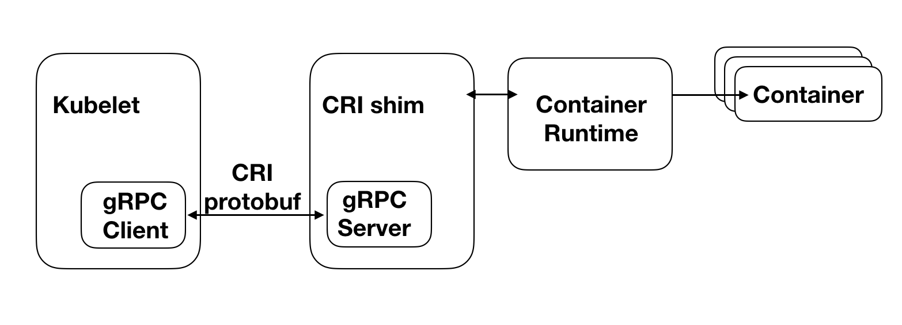
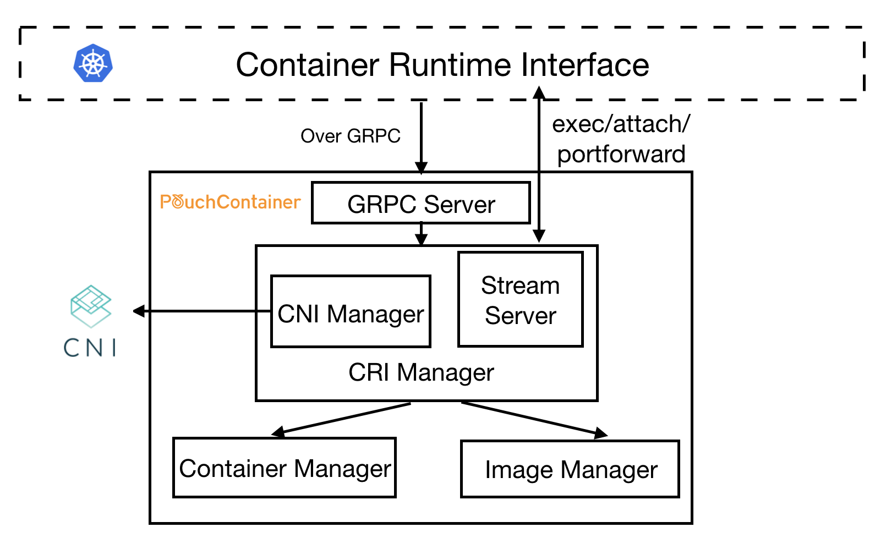
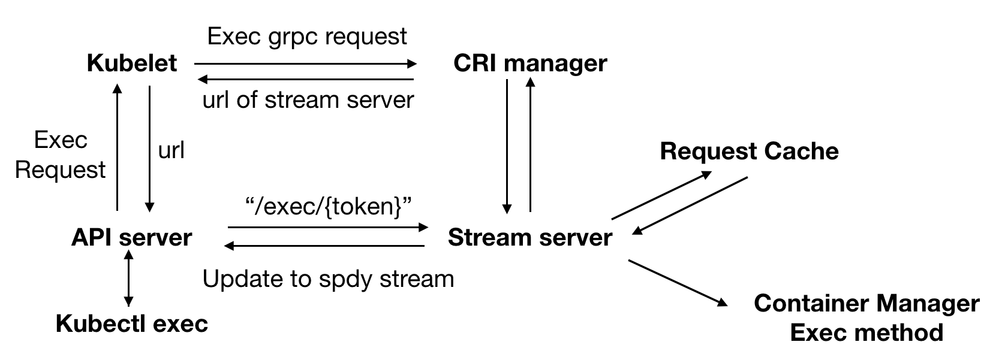

## PouchContainer CRI的设计与实现

### 1. CRI简介

在每个Kubernetes节点的最底层都有一个程序负责具体的容器创建删除工作，Kubernetes会对其接口进行调用，从而完成容器的编排调度。我们将这一层软件称之为容器运行时（Container Runtime），大名鼎鼎的Docker就是其中的代表。

当然，容器运行时并非只有Docker一种，包括CoreOS的rkt，hyper.sh的runV，Google的gvisor，以及本文的主角PouchContainer，都包含了完整的容器操作，能够用来创建特性各异的容器。不同的容器运行时有着各自独特的优点，能够满足不同用户的需求，因此Kubernetes支持多种容器运行时势在必行。

最初，Kubernetes原生内置了对Docker的调用接口，之后社区又在Kubernetes 1.3中集成了rkt的接口，使其成为了Docker以外，另一个可选的容器运行时。不过，此时不论是对于Docker还是对于rkt的调用都是和Kubernetes的核心代码强耦合的，这无疑会带来如下两方面的问题：

1. 新兴的容器运行时，例如PouchContainer这样的后起之秀，加入Kubernetes生态难度颇大。容器运行时的开发者必须对于Kubernetes的代码（至少是Kubelet）有着非常深入的理解，才能顺利完成两者之间的对接。
2. Kubernetes的代码将更加难以维护，这也体现在两方面：（1）将各种容器运行时的调用接口全部硬编码进Kubernetes，会让Kubernetes的核心代码变得臃肿不堪，（2）容器运行时接口细微的改动都会引发Kubernetes核心代码的修改，增加Kubernetes的不稳定性

为了解决这些问题，社区在Kubernetes 1.5引入了CRI（Container Runtime Interface），通过定义一组容器运行时的公共接口将Kubernetes对于各种容器运行时的调用接口屏蔽至核心代码以外，Kubernetes核心代码只对该抽象接口层进行调用。而对于各种容器运行时，只要满足了CRI中定义的各个接口就能顺利接入Kubernetes，成为其中的一个容器运行时选项。方案虽然简单，但是对于Kubernetes社区维护者和容器运行时开发者来说，都是一种解放。

### 2. CRI设计概述



如上图所示，左边的Kubelet是Kubernetes集群的Node Agent，它会对本节点上容器的状态进行监控，保证它们都按照预期状态运行。为了实现这一目标，Kubelet会不断调用相关的CRI接口来对容器进行同步。

CRI shim则可以认为是一个接口转换层，它会将CRI接口，转换成对应底层容器运行时的接口，并调用执行，返回结果。对于有的容器运行时，CRI shim是作为一个独立的进程存在的，例如当选用Docker为Kubernetes的容器运行时，Kubelet初始化时，会附带启动一个Docker shim进程，它就是Docker的CRI shime。而对于PouchContainer，它的CRI shim则是内嵌在Pouchd中的，我们将其称之为CRI manager。关于这一点，我们会在下一节讨论PouchContainer相关架构时再详细叙述。

CRI本质上是一套gRPC接口，Kubelet内置了一个gRPC Client，CRI shim中则内置了一个gRPC Server。Kubelet每一次对CRI接口的调用，都将转换为gRPC请求由gRPC Client发送给CRI shim中的gRPC Server。Server调用底层的容器运行时对请求进行处理并返回结果，由此完成一次CRI接口调用。

CRI定义的gRPC接口可划分两类，ImageService和RuntimeService：其中ImageService负责管理容器的镜像，而RuntimeService则负责对容器生命周期进行管理以及与容器进行交互（exec/attach/port-forward）。

### 3. CRI Manager架构设计



在PouchContainer的整个架构体系中，CRI Manager实现了CRI定义的全部接口，担任了PouchContainer中CRI shim的角色。当Kubelet调用一个CRI接口时，请求就会通过Kubelet的gRPC Client发送到上图的gRPC Server中。Server会对请求进行解析，并调用CRI Manager相应的方法进行处理。

我们先通过一个例子来简单了解一下各个模块的功能。例如，当到达的请求为创建一个Pod，那么CRI Manager会先将获取到的CRI格式的配置转换成符合PouchContainer接口要求的格式，调用Image Manager拉取所需的镜像，再调用Container Manager创建所需的容器，并调用CNI Manager，利用CNI插件对Pod的网络进行配置。最后，Stream Server会对交互类型的CRI请求，例如exec/attach/portforward进行处理。

值得注意的是，CNI Manager和Stream Server是CRI Manager的子模块，而CRI Manager，Container Manager以及Image Manager是三个平等的模块，它们都位于同一个二进制文件Pouchd中，因此它们之间的调用都是最为直接的函数调用，并不存在例如Docker shim与Docker交互时，所需要的远程调用开销。下面，我们将进入CRI Manager内部，对其中重要功能的实现做更为深入的理解。

### 4. Pod模型的实现

在Kubernetes的世界里，Pod是最小的调度部署单元。简单地说，一个Pod就是由一些关联较为紧密的容器构成的容器组。作为一个整体，这些“亲密”的容器之间会共享一些东西，从而让它们之间的交互更为高效。例如，对于网络，同一个Pod中的容器会共享同一个IP地址和端口空间，从而使它们能直接通过localhost互相访问。对于存储，Pod中定义的volume会挂载到其中的每个容器中，从而让每个容器都能对其进行访问。

事实上，只要一组容器之间共享某些Linux Namespace以及挂载相同的volume就能实现上述的所有特性。下面，我们就通过创建一个具体的Pod来分析PouchContainer中的CRI Manager是如何实现Pod模型的：

1. 当Kubelet需要新建一个Pod时，首先会对`RunPodSandbox`这一CRI接口进行调用，而CRI Manager对该接口的实现是创建一个我们称之为"infra container"的特殊容器。从容器实现的角度来看，它并不特殊，无非是调用Container Manager，创建一个镜像为`pause-amd64:3.0`的普通容器。但是从整个Pod容器组的角度来看，它是有着特殊作用的，正是它将自己的Linux Namespace贡献出来，作为上文所说的各容器共享的Linux Namespace，将容器组中的所有容器联结到一起。它更像是一个载体，承载了Pod中所有其他的容器，为它们的运行提供基础设施。而一般我们也用infra container代表一个Pod。
2. 在infra container创建完成之后，Kubelet会对Pod容器组中的其他容器进行创建。每创建一个容器就是连续调用`CreateContainer`和`StartContainer`这两个CRI接口。对于`CreateContainer`，CRI Manager仅仅只是将CRI格式的容器配置转换为PouchContainer格式的容器配置，再将其传递给Container Manager，由其完成具体的容器创建工作。这里我们唯一需要关心的问题是，该容器如何加入上文中提到的infra container的Linux Namespace。其实真正的实现非常简单，在Container Manager的容器配置参数中有`PidMode`, `IpcMode`以及`NetworkMode`三个参数，分别用于配置容器的Pid Namespace，Ipc Namespace和Network Namespace。笼统地说，对于容器的Namespace的配置一般都有两种模式："None"模式，即创建该容器自己独有的Namespace，另一种即为"Container"模式，即加入另一个容器的Namespace。显然，我们只需要将上述三个参数配置为"Container"模式，加入infra container的Namespace即可。具体是如何加入的，CRI Manager并不需要关心。对于`StartContainer`，CRI Manager仅仅只是做了一层转发，从请求中获取容器ID并调用Container Manager的`Start`接口启动容器。
3. 最后，Kubelet会不断调用`ListPodSandbox`和`ListContainers`这两个CRI接口来获取本节点上容器的运行状态。其中`ListPodSandbox`罗列的其实就是各个infra container的状态，而`ListContainer`罗列的是除了infra container以外其他容器的状态。现在问题是，对于Container Manager来说，infra container和其他container并不存在任何区别。那么CRI Manager是如何对这些容器进行区分的呢？事实上，CRI Manager在创建容器时，会在已有容器配置的基础之上，额外增加一个label，标志该容器的类型。从而在实现`ListPodSandbox`和`ListContainers`接口的时候，以该label的值作为条件，就能对不同类型的容器进行过滤。

综上，对于Pod的创建，我们可以概述为先创建infra container，再创建pod中的其他容器，并让它们加入infra container的Linux Namespace。

### 5. Pod网络配置

因为Pod中所有的容器都是共享Network Namespace的，因此我们只需要在创建infra container的时候，对它的Network Namespace进行配置即可。

在Kubernetes生态体系中容器的网络功能都是由CNI实现的。和CRI类似，CNI也是一套标准接口，各种网络方案只要实现了该接口就能无缝接入Kubernetes。CRI Manager中的CNI Manager就是对CNI的简单封装。它在初始化的过程中会加载目录`/etc/cni/net.d`下的配置文件，如下所示：

```sh
$ cat >/etc/cni/net.d/10-mynet.conflist <<EOF
{
        "cniVersion": "0.3.0",
        "name": "mynet",
        "plugins": [
          {
                "type": "bridge",
                "bridge": "cni0",
                "isGateway": true,
                "ipMasq": true,
                "ipam": {
                        "type": "host-local",
                        "subnet": "10.22.0.0/16",
                        "routes": [
                                { "dst": "0.0.0.0/0" }
                        ]
                }
          }
        ]
}
EOF
```

其中指定了配置Pod网络会使用到的CNI插件，例如上文中的`bridge`，以及一些网络配置信息，例如本节点Pod所属的子网范围和路由配置。

下面我们就通过具体的步骤来展示如何将一个Pod加入CNI网络：

1. 当调用container manager创建infra container时，将`NetworkMode`设置为"None"模式，表示创建一个该infra container独有的Network Namespace且不做任何配置。
2. 根据infra container对应的PID，获取其对应的Network Namespace路径`/proc/{pid}/ns/net`。
3. 调用CNI Manager的`SetUpPodNetwork`方法，核心参数为步骤二中获取的Network Namespace路径。该方法做的工作就是调用CNI Manager初始化时指定的CNI插件，例如上文中的bridge，对参数中指定的Network Namespace进行配置，包括创建各种网络设备，进行各种网络配置，将该Network Namespace加入插件对应的CNI网络中。

对于大多数Pod，网络配置都是按照上述步骤操作的，大部分的工作将由CNI以及对应的CNI插件替我们完成。但是对于一些特殊的Pod，它们会将自己的网络模式设置为"Host"，即和宿主机共享Network Namespace。这时，我们只需要在调用Container Manager创建infra container时，将`NetworkMode`设置为"Host"，并且跳过CNI Manager的配置即可。

对于Pod中其他的容器，不论Pod是处于"Host"网络模式，还是拥有独立的Network Namespace，都只需要在调用Container Manager创建容器时，将`NetworkMode`配置为"Container"模式，加入infra container所在的Network Namespace即可。

### 6. IO流处理

Kubernetes提供了例如`kubectl exec/attach/port-forward`这样的功能来实现用户和某个具体的Pod或者容器的直接交互。如下所示：

```sh
aster $ kubectl exec -it shell-demo -- /bin/bash
root@shell-demo:/# ls
bin   dev  home  lib64  mnt  proc  run   srv  tmp  var
boot  etc  lib   media  opt  root  sbin  sys  usr
root@shell-demo:/#
```

可以看到，`exec`一个Pod等效于`ssh`登录到该容器中。下面，我们根据`kubectl exec`的执行流来分析Kubernetes中对于IO请求的处理，以及CRI Manager在其中扮演的角色。



如上图所示，执行一条`kubectl exec`命令的步骤如下：

1. `kubectl exec`命令的本质其实是对Kubernetes集群中某个容器执行exec命令，并将由此产生的IO流转发到用户的手中。所以请求将首先层层转发到达该容器所在节点的Kubelet，Kubelet再根据配置调用CRI中的`Exec`接口。请求的配置参数如下：

   ```go
   type ExecRequest struct {
   	ContainerId string	// 执行exec的目标容器
   	Cmd []string	// 具体执行的exec命令
   	Tty bool	// 是否在一个TTY中执行exec命令
   	Stdin bool	// 是否包含Stdin流
   	Stdout bool	// 是否包含Stdout流
   	Stderr bool	// 是否包含Stderr流
   }
   ```

2. 令人感到意外的是，CRI Manager的`Exec`方法并没有直接调用Container Manager，对目标容器执行exec命令，而是转而调用了其内置的Stream Server的`GetExec`方法。

3. Stream Server的`GetExec`方法所做的工作是将该exec请求的内容保存到了上图所示的Request Cache中，并返回一个token，利用该token，我们可以重新从Request Cache中找回对应的exec请求。最后，将这个token写入一个URL中，并作为执行结果层层返回到ApiServer。

4. ApiServer利用返回的URL直接对目标容器所在节点的Stream Server发起一个http请求，请求的头部包含了"Upgrade"字段，要求将http协议升级为websocket或者SPDY这样的streaming protocol，用于支持多条IO流的处理，本文我们以SPDY为例。

5. Stream Server对ApiServer发送的请求进行处理，首先根据URL中的token，从Request Cache中获取之前保存的exec请求配置。之后，回复该http请求，同意将协议升级为SPDY，并根据exec请求的配置等待ApiServer创建指定数量的stream，分别对应标准输入Stdin，标准输出Stdout，标准错误输出Stderr。

6. 待Stream Server获取指定数量的Stream之后，依次调用Container Manager的`CreateExec`和`startExec`方法，对目标容器执行exec操作并将IO流转发至对应的各个stream中。

7. 最后，ApiServer将各个stream的数据转发至用户，开启用户与目标容器的IO交互。

事实上，在引入CRI之前，Kubernetes对于IO的处理方式和我们的预期是一致的，Kubelet会直接对目标容器执行exec命令，并将IO流转发回ApiServer。但是这样会让Kubelet承载过大的压力，所有的IO流都需要经过它的转发，这显然是不必要的。因此上述的处理虽然初看较为复杂，但是有效地缓解了Kubelet的压力，并且也让IO的处理更为高效。

### 7. 总结

本文从引入CRI的缘由而起，简要描述了CRI的架构，重点叙述了PouchContainer对CRI各个核心功能模块的实现。CRI的存在让PouchContainer容器加入Kubernetes生态变得更为简单快捷。而我们也相信，PouchContainer独有的特性必定会让Kubernetes生态变得更加丰富多彩。

### 参考文献

* [Introducing Container Runtime Interface (CRI) in Kubernetes](https://kubernetes.io/blog/2016/12/container-runtime-interface-cri-in-kubernetes/)

* [CRI Streaming Requests Design Doc](https://docs.google.com/document/d/1OE_QoInPlVCK9rMAx9aybRmgFiVjHpJCHI9LrfdNM_s/edit#)
