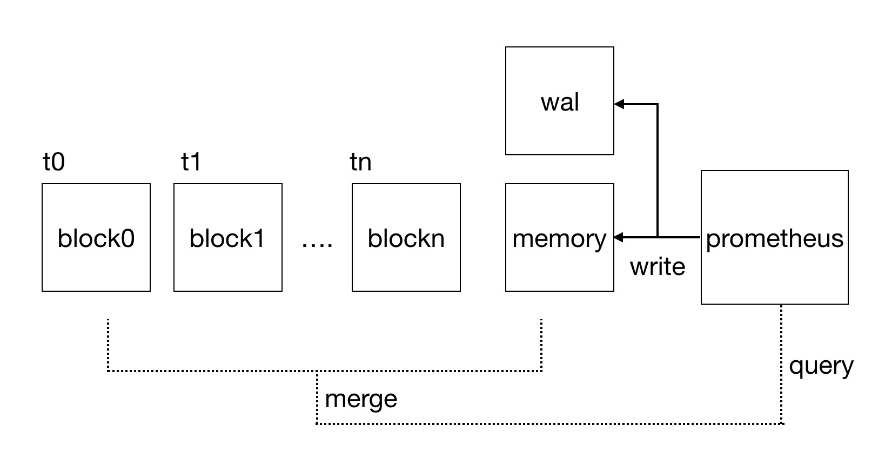
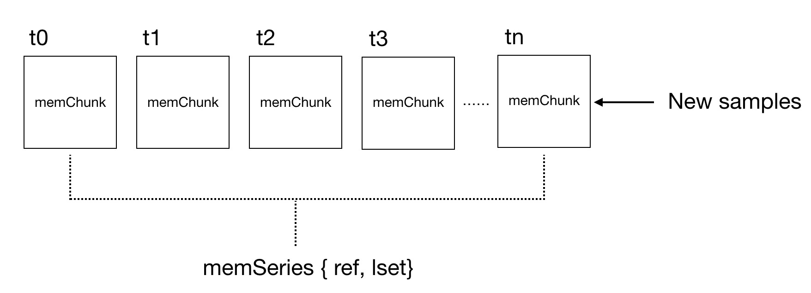

## Prometheus存储模型分析


Prometheus是时下最为流行的开源监控解决方案，我们可以很轻松地以Prometheus为核心快速构建一套包含监控指标的抓取，存储，查询以及告警的完整监控系统。单个的Prometheus实例就能实现每秒上百万的采样，同时支持对于采集数据的快速查询，而对于Kubernetes这类抓取对象变更频繁的环境，Prometheus也是最好的选择。显然，这些优秀特性的实现都离不开一个设计优良的时序数据库的支撑。本文就将对Prometheus内置的时序数据库tsdb的设计与实现进行剖析，从架构设计以及代码层面理解它何以支持Prometheus强大的读写表现。

### 1. 时序数据概述

Prometheus读写的是时序数据，与一般的数据对象相比，时序数据有其特殊性，tsdb对此进行了大量针对性的设计与优化。因此理解时序数据是理解Prometheus存储模型的第一步。通常，它由如下所示的标识和采样数据两部组成：

```
标识 -> {(t0, v0), (t1, v1), (t2, v2), (t3, v3)...}
```

1. 标识用于区分各个不同的监控指标，在Prometheus中通常用指标名+一系列的label唯一地标识一个时间序列。如下为Prometheus抓取的一条时间序列，其中`http_request_total`为指标名，表示HTTP请求的总数，它有`path`和`method`两个label，用于表示各种请求的路径和方法。

```
http_request_total{path="/", method="GET"} -> {(t0, v1), (t1, v1)...}
```
事实上指标名最后也是作为一个特殊的label被存储的，它的key为`__name__`，如下所示。最终Prometheus存储在数据库中的时间序列标识就是一堆label。我们将这堆label称为`series`。

```
{__name__="http_request_total", path="/", method="GET"}
```

2. 采样数据则由诸多的采样点（Prometheus中称为sample）构成，t0, t1, t2...表示样本采集的时间，v0, v1, v2...则表示指标在采集时刻的值。采样时间一般是单调递增的并且相邻sample的时间间隔往往相同，Prometheus中默认为15s。而且一般相邻sample的指标值v并不会相差太多。基于采样数据的上述特性，对它进行高效地压缩存储是完全可能的。Prometheus对于采样数据压缩算法的实现，参考了Facebook的时序数据库[Gorilla](http://www.vldb.org/pvldb/vol8/p1816-teller.pdf)中的做法，通过该算法，16字节的sample平均只需要1.37个字节的存储空间。

### 2. 架构设计

监控数据是一种时效性非常强的数据类型，它被查询的热度会随着时间的流逝而不断降低，而且对于监控指标的访问通常会指定一个时间段，例如，最近十五分钟，最近一小时，最近一天等等。一般来说，最近一个小时采集到的数据被访问地是最为频繁的，过去一天的数据也经常会被访问用来了解某个指标整体的波动情况，而一个月乃至一年之前的数据被访问的意义就不是很大了。

基于监控数据的上述特性，tsdb的设计就非常容易理解了，其整体架构如下：



对于最新采集到的数据，Prometheus会直接将它们存放在内存中，从而加快数据的读写。但是内存的空间是有限的，而且随着时间的推移，内存中较老的那部分数据被访问的概率也逐渐降低。因此，默认情况下，每隔两小时Prometheus就会将部分“老”数据持久化到磁盘，每一次持久化的数据都独立存放在磁盘的一个Block中。例如上图中的block0就存放了[t0, t1]时间段内Prometheus采集的所有监控数据。这样做的好处很明显，如果我们想要访问某个指标在[t0, t2]范围内的数据，那么只需要加载block0和block1中的数据并进行查找即可，这样一来大大缩小了查找的范围，从而提高了查询的速度。

虽然最近采集的数据存放在内存中能够提高读写效率，但是由于内存的易失性，一旦Prometheus崩溃（如果系统内存不足，Prometheus被OOM的概率并不算低）那么这部分数据就彻底丢失了。因此Prometheus在将采集到的数据真正写入内存之前，会首先存入`WAL（Write Ahead Log）`中。因为`WAL`是存放在磁盘中的，相当于对内存中的监控数据做了一个完全的备份，即使Prometheus崩溃这部分的数据也不至于丢失。当Prometheus重启之后，它首先会将`WAL`的内容加载到内存中，从而完美恢复到崩溃之前的状态，接着再开始新数据的抓取。

### 3. 内存存储结构

在Prometheus的内存中使用如下所示的`memSeries`结构存储时间序列，一条时间序列对应一个`memSeries`结构：



可以看到，一个`memSeries`主要由三部分组成：

1. `lset`：用以识别这个`series`的label集合
2. `ref`：每接收到一个新的时间序列（即它的label集合与已有的时间序列都不同）Prometheus就会用一个唯一的整数标识它，如果有`ref`，我们就能轻易找到相应的`series`
3. `memChunks`：每一个`memChunk`是一个时间段内该时间序列所有`sample`的集合。如果我们想要读取[tx, ty]（t1 < tx < t2, t2 < ty < t3 ）时间范围内该时间序列的数据，只需要对[t1, t3]范围内的两个`memChunk`的`sample`数据进行裁剪即可，从而提高了查询的效率。每当采集到新的`sample`，Prometheus就会用Gorilla中类似的算法将它压缩至最新的`memChunk`中

但是`ref`仅仅是供Prometheus内部使用的，如果用户要查询某个具体的时间序列，通常会利用一堆的label用以唯一指定一个时间序列。那么如何通过一堆label最快地找到对应的`series`呢？哈希表显然是最佳的方案。基于label计算一个哈希值，维护一张哈希值与`memSeries`的映射表，如果产生哈希碰撞的话，则直接用label进行匹配。因此，Prometheus有必要在内存中维护如下所示的两张哈希表，从而无论利用`ref`还是`label`都能很快找到对应的`memSeries`：

```golang
{
	series map[uint64]*memSeries // ref到memSeries的映射
	hashes map[uint64][]*memSeries // labels的哈希值到memSeries的映射
}

```

然而我们知道Golang中的map并不是并发安全的，而Prometheus中又有大量对于`memSeries`的增删操作，如果在读写上述结构时简单地用一把大锁锁住，显然无法满足性能要求。所以Prometheus用了如下数据结构将锁的控制精细化:

```golang
const stripSize = 1 << 14

// 为表达直观，已将Prometheus原生数据结构简化
type stripeSeries struct {
	series	[stripeSize]map[uint64]*memSeries
	hashes	[stripeSize]map[uint64][]*memSeries
	locks	[stripeSize]sync.RWMutex
}
```

Prometheus将一整个大的哈希表进行了切片，切割成了16k个小的哈希表。如果想要利用`ref`找到对应的`series`，首先要将ref对16K取模，假设得到的值为x，找到对应的小哈希表`series[x]`。至于对小哈希表的操作，只需要锁住模对应的`locks[x]`，从而大大减小了读写`memSeries`时对锁的抢占造成的损耗，提高了并发性能。对于基于`label`哈希值的读写，操作类似。

然而上述数据结构仅仅只能支持对于时间序列的精确查询，必须严格指定每一个label的值从而能够唯一地确定一条时间序列。但很多时候，模糊查询才是更为常用的。例如，我们想知道访问路径为`/`的各类HTTP请求的数目（请求的方法可以为`GET`，`POST`等等），此时提交给Prometheus的查询条件如下：

```
http_request_total{path="/"}
```

如果路径`/`曾经接收了`GET`,`POST`以及`DELETE`三种方法的HTTP请求，那么此次查询应该返回如下三条时间序列：

```
http_request_total{path="/", method="GET"} ....
http_request_total{path="/", method="POST"} ....
http_request_total{path="/", method="DELETE"} ....
```

Prometheus甚至支持在指定label时使用正则表达式：

```
http_request_total{method="GET|POST"}
```

上述查询将返回所有包含label名为`method`，且值为`GET`或者`POST`的指标名为`http_request_total`的时间序列。

针对如此复杂的查询需求，暴力地遍历所有series进行匹配是行不通的。一个指标往往会包含诸多的label，每个label又可以有很多的取值。因此Prometheus中会存在大量的`series`，为了能快速匹配到符合要求的`series`，Prometheus引入了倒排索引，结构如下：

```golang 
struct MemPostings struct {
	mtx	sync.Mutex
	m	map[string]map[string][]uint64
	ordered	bool
}
```

当Prometheus抓取到一个新的series，假设它的`ref`为x，包含如下的label pair：

```
{__name__="http_request_total", path="/", method="GET"}
```

在初始化相应的`memSeries`并且更新了哈希表之后，还需要对倒排索引进行刷新：

```golang
MemPostings.m["__name__"]["http_request_total"]{..., x ,...}
MemPostings.m["path"]["/"]{..., x ,...}
MemPostings.m["method"]["GET"]{..., x, ...}
```

可以看到，倒排索引能够将所有包含某个label pair的`series`都聚合在一起。如果要得到匹配多个label pair的`series`，只要将每个label pair包含的`series`做交集即可。对于查询请求

```bash
http_request_total{path="/"}
```

的匹配过程如下：

```
MemPostings.["__name__"]["http_request_total"]{3, 4, 2, 1}
MemPostings.["path"]["/"]{5, 4, 1, 3}
{3, 4, 2, 1} x {5, 4, 1, 3} -> {1, 3, 4}
```

但是如果每个label pair包含的`series`足够多，那么对多个label pair的`series`做交集也将是非常耗时的操作。那么能不能进一步优化呢？事实上，只要保持每个label pair里包含的series有序就可以了，这样就能将复杂度从指数级瞬间下降到线性级。

```
MemPostings.["__name__"]["http_request_total"]{1, 2, 3, 4}
MemPostings.["path"]["/"]{1, 3, 4, 5}
{1, 2, 3, 4} x {1, 3, 4, 5} -> {1, 3, 4}
```

Prometheus内存中的存储结构大致如上，Gorilla的压缩算法提高了`samples`的存储效率，而哈希表以及倒排索引的使用，则对Prometheus复杂的时序数据查询提供了高效的支持。


### WAL

Prometheus启动时，往往需要在参数中指定存储目录，该目录包含`WAL`以及用于持久化的Block，结构如下：

```bash
# ls
01DJQ428PCD7Z06M6GKHES65P2  01DJQAXZY8MPVWMD2M4YWQFD9T  01DJQAY7F9WT8EHT0M8540F0AJ  lock  wal
```

形如`01DJQ428PCD7Z06M6GKHES65P2`都是Block目录，用于存放持久化之后的时序数据，这部分内容后文会有详细的叙述，本节重点关注`WAL`目录，它的内部结构如下：

```bash
[wal]# ls -lht
total 596M
-rw-r--r-- 1 65534 65534  86M Aug 20 19:32 00000012
drwxr-xr-x 2 65534 65534 4.0K Aug 20 19:00 checkpoint.000006
-rw-r--r-- 1 65534 65534 128M Aug 20 19:00 00000011
-rw-r--r-- 1 65534 65534 128M Aug 20 18:37 00000010
-rw-r--r-- 1 65534 65534 128M Aug 20 17:47 00000009
-rw-r--r-- 1 65534 65534 128M Aug 20 17:00 00000008
-rw-r--r-- 1 65534 65534 128M Aug 20 16:38 00000007
```

`WAL`目录中包含了多个连续编号的且大小为128M的文件，Prometheus称这样的文件为`Segment`，其中存放的就是对内存中`series`以及`sample`数据的备份。另外还包含一个以`checkpoint`为前缀的子目录，由于内存中的时序数据经常会做持久化处理，`WAL`中的数据也将因此出现冗余。所以每次在对内存数据进行持久化之后，Prometheus都会对部分编号靠后的`Segment`进行清理。但是我们并没有办法做到恰好将已经持久化的数据从`Segment`中剔除，也就是说被删除的`Segment`中部分的数据依然可能是有用的。所以在清理`Segment`时，我们会将肯定无效的数据删除，剩下的数据就存放在`checkpoint`中。而在Prometheus重启时，应该首先加载`checkpoint`中的内容，再按序加载各个`Segment`的内容。

那么`series`和`sample`在`Segment`中是如何组织的呢？在将时序数据备份到`WAL`的过程中，由于涉及到磁盘文件`Segment`的写入，批量操作显然是最经济的。对于批量写入，Prometheus提供了一个名为`Appender`的接口如下：

```golang
type Appender interface {
	Add(l labels.Labels, t int64, v float64) (uint64, error)

	AddFast(ref uint64, t int64, v float64) error

	Commit() error

	Rollback() error
}
```

每当需要写入数据时，就要创建一个`Appender`，`Appender`是一个临时结构，仅供一次批量操作使用。一个`Appender`类似于其他数据库中事务的概念，通过`Add()`或者`AddFast()`添加的时序数据会临时在`Appender`中进行缓存，只有在最后调用`Commit()`之后，这批数据才正式提交给Prometheus，同时写入`WAL`。而如果最后调用的`Rollback()`，则这批数据的`samples`会被全部丢弃，但是通过`Add()`方法新增的`series`结构则依然会被保留。

`series`和`sample`在`Appender`中是分开存储的，它们在`Appender`中的结构如下：

```golang
// headAppender是Appender的一种实现
type headAppender struct {
	...
	series	[]RefSeries
	samples	[]RefSample
}

type RefSeries struct {
	Ref		uint64
	Labels	labels.Labels
}

type RefSample struct {
	Ref		uint64
	T		int64
	V		float64
	series	*memSeries
}
```

当调用`Appender`的`Commit()`方法提交这些时序数据时，`series`和`samples`这两个切片会分别编码，形成两条`Record`，如下所示：

```
|RecordType|RecordContent|

RecordType可以取“RecordSample”或者“RecordSeries”，表示这条Record的类型

RecordContent则根据RecordType可以series或者samples编码后的内容
```

最后，`series`和`samples`以`Record`的形式被批量写入`Segment`文件中，默认当`Segment`超过128M时，会创建新的`Segment`文件。若Prometheus因为各种原因崩溃了，`WAL`里的各个`Segment`以及`checkpoint`里的内容就是在崩溃时刻Prometheus内存的映像。Prometheus在重启时只要加载`WAL`中的内容就能完全"恢复现场"。

### Block

虽然将时序数据存储在内存中能够最大化读写效率，但是时序数据的写入是稳定而持续的，随着时间的流逝，数据量会线性增长，而且相对较老的数据被访问的概率也将逐渐下降。因此，定期将内存中的数据持久化到磁盘是合理的。每一个Block存储了对应时间窗口内的所有数据，包括所有的`series`，`samples`以及相关的索引结构。Block目录的详细内容如下：

```
[01DJNTVX7GZ2M1EKB4TM76APV8]# ls
chunks  index  meta.json  tombstones
[01DJNTVX7GZ2M1EKB4TM76APV8]# ls chunks/
000001
```

`meta.json`包含了当前Block的元数据信息，其内容如下：

```
# cat meta.json
{
    "ulid": "01DJNTVX7GZ2M1EKB4TM76APV8",
    "minTime": 1566237600000,
    "maxTime": 1566244800000,
    "stats": {
        "numSamples": 30432619,
        "numSeries": 65064,
        "numChunks": 255203
    },
    "compaction": {
        "level": 1,
        "sources": [
            "01DJNTVX7GZ2M1EKB4TM76APV8"
        ]
    },
    "version": 1
}
```
各字段的含义如下：

`ulid`：用于识别这个Block的编号，它与Block的目录名一致

`minTime`和`maxTime`：表示这个Block存储的数据的时间窗口

`stats`：表示这个Block包含的`sample`, `series`以及`chunks`数目

`compaction`：这个Block的压缩信息，因为随着时间的流逝，多个Block也会压缩合并形成更大的Block。`level`字段表示了压缩的次数，刚从内存持久化的Block的`level`为1，每被联合压缩一次，子Block的`level`就会在父Block的基础上加一，而`sources`字段则包含了构成当前这个Block的所有祖先Block的`ulid`。事实上，对于`level >= 2`的Block，还会有一个`parent`字段，包含了它的父Block的`ulid`以及时间窗口信息。

`chunks`是一个子目录，包含了若干个从`000001`开始编号的文件，一般每个文件大小的上限为512M。文件中存储的就是在时间窗口[minTime，maxTime]以内的所有`samples`，本质上就是对于内存中符合要求的`memChunk`的持久化。

`tombstones`用于存储对于`series`的删除记录。如果删除了某个时间序列，Prometheus并不会立即对它进行清理，而是会在`tombstones`做一次记录，等到下一次Block压缩合并的时候统一清理。

`index`文件存储了索引相关的内容，虽然持久化后的数据被读取的概率是比较低的，但是依然存在被读取的可能。这样一来，如何尽快地从Block中读取时序数据就显得尤为重要了，而快速读取索引并且基于索引查找时序数据则是加快整体查询效率的关键。为了达到这一目标，存储索引信息的`index`文件在设计上就显得比较复杂了。

```
┌────────────────────────────┬─────────────────────┐
│ magic(0xBAAAD700) <4b>     │ version(1) <1 byte> │
├────────────────────────────┴─────────────────────┤
│ ┌──────────────────────────────────────────────┐ │
│ │                 Symbol Table                 │ │
│ ├──────────────────────────────────────────────┤ │
│ │                    Series                    │ │
│ ├──────────────────────────────────────────────┤ │
│ │                 Label Index 1                │ │
│ ├──────────────────────────────────────────────┤ │
│ │                      ...                     │ │
│ ├──────────────────────────────────────────────┤ │
│ │                 Label Index N                │ │
│ ├──────────────────────────────────────────────┤ │
│ │                   Postings 1                 │ │
│ ├──────────────────────────────────────────────┤ │
│ │                      ...                     │ │
│ ├──────────────────────────────────────────────┤ │
│ │                   Postings N                 │ │
│ ├──────────────────────────────────────────────┤ │
│ │               Label Index Table              │ │
│ ├──────────────────────────────────────────────┤ │
│ │                 Postings Table               │ │
│ ├──────────────────────────────────────────────┤ │
│ │                      TOC                     │ │
│ └──────────────────────────────────────────────┘ │
└──────────────────────────────────────────────────┘
```

除了文件开头的Magic Number以及版本信息，`index`文件可以分为7个部分，各部分的内容及作用如下：

`TOC`：虽然位于文件的末尾，但是`TOC`包含了整个`index`文件的全局信息，它存储的内容是其余六部分的位置信息，即它们的起始位置在`index`文件中的偏移量。

`Symbol Table`：一个symbol既可以是一个label的key，也可以是它的value，事实上Symbol Table存储的就是在[minTime, maxTime]范围内的`samples`所属的`series`的所有label的key和value集合，并且为每个symbol进行了编号。之所以要这样做，是因为后面在存储`series`以及`Label Index`等信息的时候，就不需要完整存储所有的label了，只需将label的key和value用对应的字符串在`Symbol Table`中的编号表示即可，从而大大减小了`index`文件的体积。

`Series`：存储的自然是`series`的相关信息，首先存储`series`的各个label，正如上文所述，存储的是对应key和value在`Symbol Table`中的编号。紧接着存储`series`相关的`chunks`信息，包含每个chunk的时间窗口，以及该chunk在`chunks`子目录下具体的位置信息。

`Label Index`：存储了各个label的key和它所有可能的value的关联关系。例如，对于一个有着四个不同的value的key，它在这部分存储的条目如下所示：

```
┌────┬───┬───┬──────────────┬──────────────┬──────────────┬──────────────┬───────┐
│ 24 │ 1 │ 4 │ ref(value_0) | ref(value_1) | ref(value_2) | ref(value_3) | CRC32 |
└────┴───┴───┴──────────────┴──────────────┴──────────────┴──────────────┴───────┘
各段含义如下：
24 --> 存储的内容包含24个字节
1 --> 本条目仅仅包含一个key
4 --> 与keys相关的有4个value
ref -> 各个value在Symbol Table中的编号
```

事实上这样一个条目可以存储多个key和它们的value的映射关系，但一般key的个数都为1。这部分的内容乍一看非常让人疑惑，key的信息呢？为什么只记录key的数目，而没有保存具体的key，哪怕是它在`Symbol Table`中的编号？其实，我们应该将这部分的内容和`Label Index Table`中的内容联合起来看。

`Label Index Table`：存储了所有label的key，以及它们在`Label Index`中对应的位置信息。那么为什么要将这两部分的内容分开存储呢？Prometheus在读取Block中的数据时会加载`index`文件，但是只会首先加载`Label Index Table`获取所有label的key，只有在需要对key相关的value进行匹配时，才会加载`Label Index`相应的部分以及对应的Symbol。通过`Label Index Table`和`Label Index`的分离，使得我们能够只对必要数据进行加载，从而加快了`index`文件的加载速度。

`Postings`： 这部分存储的显然是倒排索引的信息，每一个条目存储的都是包含某个label pair的所有`series`的ID。但是与`Label Index`相似，条目中并没有指定具体的key和value。

`Postings Offset Table`：这部分直接对每个label的key和value以及相关索引在`Postings`中的位置进行存储。同样，它会首先被加载到内存中，如果需要知道包含某个label的所有`series`，再通过相关索引的偏移位置从`Postings`中依次获取。

可以看到，`index`文件结构颇为复杂，但其实设计得相当巧妙，环环相扣。不仅高效地对索引信息进行了存储，而且也最大限度保证了对它进行加载的速度。


### 总结

Prometheus精巧的设计使它能够对海量时序数据进行高效地读写。但是，通篇分析下来，Prometheus并没有所谓"黑科技"式的创新，有的不过是“逢山开路，遇水搭桥”式的优化。而这本身也是Prometheus的设计哲学，"Do one thing and do it well"。事实上，Prometheus默认仅支持15天的本地存储，超过这个期限的Block都会被清除。当然，社区对此已经提供了解决方案，[Thanos](https://github.com/thanos-io/thanos)和[Cortex](https://github.com/cortexproject/cortex)都基于Prometheus进行了扩展，提供了持久化存储，高可用等特性，从而能够真正做到"Prometheus As A Service"。

### 参考文献

* [Prometheus Source Code](https://github.com/YaoZengzeng/prometheus/tree/2.11comments)
* [Write a Time Series Database from Scratch](https://fabxc.org/tsdb/)
* [Index Disk Format](https://github.com/prometheus/prometheus/blob/master/tsdb/docs/format/index.md)

