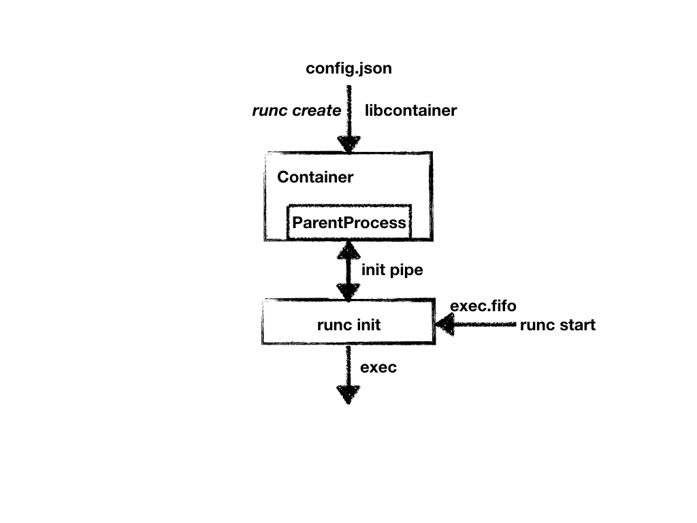

## 深入理解Docker容器引擎runC执行框架

### 1 简介

根据官方的定义：runC是一个根据OCI标准创建并运行容器的CLI tool。

Docker就是基于runC创建的，简单地说，runC是Docker中最为核心的部分，容器的创建，运行，销毁等等操作最终都将通过调用runC完成。而runC也有自己的客户端，下面我们将演示如何使用runC，以最精简的方式创建并运行一个容器。


#### 1.1 利用runC运行busybox容器

下载并编译runC

```sh
# create a 'github.com/opencontainers' in your GOPATH/src
cd github.com/opencontainers
git clone https://github.com/opencontainers/runc
cd runc

make
sudo make install
```

创建容器的根文件系统

```sh
# create the top most bundle directory
mkdir /mycontainer
cd /mycontainer

# create the rootfs directory
mkdir rootfs

# export busybox via Docker into the rootfs directory
docker export $(docker create busybox) | tar -C rootfs -xvf -
```

利用runC的spec命令创建默认的配置文件config.json，其中包含了创建一个容器所需的所有配置信息

```sh
runc spec
```

利用runC运行busybox容器

```sh
# run as root
cd /mycontainer
runc run mycontainerid
/ # ls
bin　　dev　　etc　　home　　proc　　root　　sys　　tmp　　usr　　var

```

可以看到，容器成功运行，此时我们打开另一个终端观察容器的运行状态

```sh
runc list
ID              PID         STATUS      BUNDLE         CREATED                          OWNER
mycontainerid   1070        running     /mycontainer   2017-12-20T12:26:30.159978871Z   root
```

事实上，`runc run`是一个复合命令，它包含了容器的创建`runc create`，启动`runc start`以及在退出之后对容器进行的销毁`runc delete`，从演示的角度看它是最为直观的。但是如果想要深入理解runC内部的实现机制，将容器的创建，启动，销毁三个步骤分开，显然会让整个过程的分析更为简单和易于接受

下面我们就将结合源码，对整个容器技术最为核心的部分进行探究—— 容器是如何创建并启动的


### 2 源码分析

首先，我们来对runC的整体代码结构做一个宏观的把控：

```sh
[root@VM_68_206_centos runc]# tree -L 1 -F --dirsfirst
.
|-- contrib/
|-- libcontainer/
|-- man/
|-- script/
|-- tests/
|-- vendor/
|-- checkpoint.go
|-- CONTRIBUTING.md
|-- create.go
|-- delete.go
|-- Dockerfile
|-- events.go
|-- exec.go
|-- init.go
|-- start.go
|-- run.go
......
```

可以看到在runC的顶层目录中，有着一系列形如`create.go`, `start.go`, `run.go`...的go文件，它们和runC的子命令，例如`runc create...`，`runc start...`，`runc run`是一致的。 另外，在顶层目录中还有一个名为`libcontainer`的子目录。对于Docker项目的发展历史有所了解的同学应该都知道，`libcontainer`曾经是Docker中最为核心的包，容器的创建，删除等一系列工作，最终都是交由它来完成的。

这样一来，runC的代码结构就非常清晰了。我们知道，runC是符合OCI标准的容器运行时。不难猜出，它本质上是对`libcontainer`的一层薄薄的封装。它会先读取符合OCI标准的容器配置，再将其转换成与`libcontainer`兼容的格式，最后将转换后的配置交由`libcontainer`来完成具体的工作。


#### 2.1 容器创建

```go
// runc/create.go		
...
spec, err := setupSpec(context)
...
status, err := startContainer(context, spec, CT_ACT_CREATE, nil)
...
```

create.go的工作主要分为如下两部分：

1. 将容器配置从config.json文件加载到内存中，保存在一个类型为[*specs.Spec](https://github.com/opencontainers/runtime-spec/blob/master/specs-go/config.go#L5) (Spec即为OCI标准的容器配置在内存中的表现形式)的结构体中
2. 调用`startContainer()`完成容器的创建工作，值得注意的是`runc run` , `runc create`以及`runc restore`最终都将调用该函数，只是第三个参数不同而已，对于`runc create`，该参数为`CT_ACT_CREATE`，表示首次创建容器。接下来程序的执行路径将因该参数的不同而有所不同。

```go
// runc/utils_linux.go
func startContainer(context *cli.Context, spec *specs.Spec, action CtAct, criuOpts *libcontainer.CriuOpts) (int, error) {
  	// 从参数中获取容器的id
	id := context.Args().First()
	if id == "" {
		return -1, errEmptyID
	}
  	....
	// 创建符合libcontainer格式的container数据结构
	container, err := createContainer(context, id, spec)
	if err != nil {
		return -1, err
	}
	....
	// 创建runner对象
	r := &runner{
		enableSubreaper: !context.Bool("no-subreaper"),
		shouldDestroy:   true,
		container:       container,
		listenFDs:       listenFDs,
		notifySocket:    notifySocket,
		consoleSocket:   context.String("console-socket"),
		detach:          context.Bool("detach"),
		pidFile:         context.String("pid-file"),
		preserveFDs:     context.Int("preserve-fds"),
		action:          action,
		criuOpts:        criuOpts,
	}
	return r.run(spec.Process)
}
```

`startContainer`的工作由如下三部分组成：

1. 从参数中获取容器的id，例如对于命令`runc create abc` ，则获取的id即为`abc`
2. 调用`createContainer` ，根据spec中Container相关的内容，调用`libcontainer` 创建容器对象，且容器的状态设置为`Stopped`。此时的容器仅仅只是一个内存中的数据结构，并没有与之对应的进程
3. 创建`runner`对象并调用相应的`run`方法，该对象会将spec中的Process转换成`libcontainer`兼容的模式，并对容器的IO进行配置

```go
// runc/utils_linux.go
func (r *runner) run(config *specs.Process) (int, error) {
  	...
	// 将spec的Process转换为libcontainer要求的Process配置格式
	process, err := newProcess(*config)
	if err != nil {
		r.destroy()
		return -1, err
	}
	...
	tty, err := setupIO(process, rootuid, rootgid, config.Terminal, detach, r.consoleSocket)
	...
	switch r.action {
	// 根据action，创建，恢复或者运行容器
	case CT_ACT_CREATE:
		err = r.container.Start(process)
	case CT_ACT_RESTORE:
		err = r.container.Restore(process, r.criuOpts)
	case CT_ACT_RUN:
		err = r.container.Run(process)
	default:
		panic("Unknown action")
	}
```

`run`方法的工作同样由三部分组成：

1. 将OCI标准的进程配置`specs.Process`转换为符合`libcontainer`格式的进程配置`libcontainer.Process`
2. 调用`setupIO`对进程的IO进行配置，因为IO涉及的内容较为复杂，会在另外的文章中详细叙述
3. 根据`startContainer`配置参数的不同，调用不同的方法，分别进行容器的创建，运行或者恢复，本文我们只讨论`CT_ACT_CREATE`这种情况

到此为止，我们已经将OCI格式的配置，不管是Container还是Process都转换成了`libcontainer`要求的格式。接着我们将深入`libcontainer`，真正完成容器实例的创建工作。

```go
// runc/libcontainer/container_linux.go
func (c *linuxContainer) Start(process *Process) error {
	...
	status, err := c.currentStatus()
	...
	if status == Stopped {
		// 如果容器的状态为Stopped，则先创建管道exec.fifo
		if err := c.createExecFifo(); err != nil {
			return err
		}
	}
	if err := c.start(process, status == Stopped); err != nil {
		if status == Stopped {
			// 如果从Stopped状态启动失败，则删除管道exec.fifo
			c.deleteExecFifo()
		}
		return err
	}
	return nil
}
```

`Start`方法仅仅只是对`start`的一个封装并且会在容器状态为`Stopped`时（即新建容器时），创建一个路径为`/run/runc/$ID/exec.fifo`的管道文件，它的作用我们会在后文中详细描述。

值得注意的是`start`方法的第二个参数对容器的状态进行了判断。事实上，命令`runc create`和`runc exec`的代码的执行路径是类似的，它俩共享了大部分的代码。因此，这里我们需要对容器的状态进行判断，如果容器的状态为`Stopped`说明接下来应当进行容器的创建，否则应当在已有容器中exec一个新进程。

```go
// runc/libcontainer/container_linux.go
func (c *linuxContainer) start(process *Process, isInit bool) error {
	...
	parent, err := c.newParentProcess(process, isInit)
	...
	if err := parent.start(); err != nil {
		...
	}
	...
	if isInit {
		// 设置容器的状态为created
		c.state = &createdState{
			c: c,
		}
		...
		if c.config.Hooks != nil {
			// 返回bundle以及用户定义的annotations
			bundle, annotations := utils.Annotations(c.config.Labels)
			s := configs.HookState{
				Version:     c.config.Version,
				ID:          c.id,
				Pid:         parent.pid(),
				Bundle:      bundle,
				Annotations: annotations,
			}
			for i, hook := range c.config.Hooks.Poststart {
				// 容器启动完成之后，运行PostStart hook
				if err := hook.Run(s); err != nil {
				...
				}
			}
		}
	} else {
		// 如果容器不是第一次启动，标记的状态为running
		c.state = &runningState{
			c: c,
		}
	}
	return nil
}
```

`start`方法的工作也可以分为如下三部分：

1. 调用`newParentProcess`创建`parentProcess`	对象
2. 调用`parentProcess`的`start`方法，它真正完成容器进程的创建以及初始化工作
3. 如果`isInit`参数为true，则说明执行的命令为`runc create`，更新容器状态为`Created`，并且如果定义了hooks（回调函数），则还需要执行`PostStart`类型的hook函数。否则，如果执行的命令为`runc exec`，则更新容器状态为`Running`

```go
// runc/libcontainer/container_linux.go
func (c *linuxContainer) newParentProcess(p *Process, doInit bool) (parentProcess, error) {
	parentPipe, childPipe, err := utils.NewSockPair("init")
	...
	// 创建子进程的运行模板
	cmd, err := c.commandTemplate(p, childPipe)
	...
	if !doInit {
		// 如果为exec命令，则调用c.newSetnsProcess
		return c.newSetnsProcess(p, cmd, parentPipe, childPipe)
	}
	...
	if err := c.includeExecFifo(cmd); err != nil {
		...
	}
	return c.newInitProcess(p, cmd, parentPipe, childPipe)
}
```

`newParentProcess`首先创建了一个名为`init`的管道，它一方面会在创建容器时给容器的初始化进程传输容器的配置信息，另一方面它也会用于runC和容器进程之间的同步。

之后，它会调用`commandTemplate`创建容器初始化进程的运行模板，如下所示：

```go
// runc/libcontainer/container_linux.go
func (c *linuxContainer) commandTemplate(p *Process, childPipe *os.File) (*exec.Cmd, error) {
	cmd := exec.Command(c.initPath, c.initArgs[1:]...)
	cmd.Args[0] = c.initArgs[0]
	cmd.Stdin = p.Stdin
	cmd.Stdout = p.Stdout
	cmd.Stderr = p.Stderr
	cmd.Dir = c.config.Rootfs
	...
	// 让子进程获取init pipe的信息
	cmd.Env = append(cmd.Env,
		fmt.Sprintf("_LIBCONTAINER_INITPIPE=%d", stdioFdCount+len(cmd.ExtraFiles)-1),
	)
	...
	return cmd, nil
}
```

从上面的代码中我们可以看出，环境变量也是runC进程和容器初始化进程之间进行交互的一种重要方式。上文中的`init` 管道的信息就是通过环境变量的方式从runC传递给容器初始化进程的。

到这里，我们脑海中可能会浮现出另一个问题：`c.initPath`应该就是容器初始化进程的二进制文件的路径，那么它是一个独立于runC的二进制文件么？它又是放在哪的呢？事实上，`c.initPath`在上文初始化Container对象时会被初始化为`/proc/self/exe`，而`c.initArgs`被设置为`init` ，因此我们创建子进程的过程其实相当于执行了`runc init`这条命令。

如果执行的命令为`runc create`，还需要将前文提到的`exec.fifo`这个管道同样以环境变量的形式传递到容器初始化进程中。最后，调用`newInitProcess`将所有配置都填充至结构体`initProcess`中。

```go
// runc/libcontainer/process_linux.go
func (p *initProcess) start() error {
	...
	// 启动子进程
	err := p.cmd.Start()
	...

	// 将bootstrapData的数据写入pipe
	if _, err := io.Copy(p.parentPipe, p.bootstrapData); err != nil {
		return newSystemErrorWithCause(err, "copying bootstrap data to pipe")
	}
	...
	ierr := parseSync(p.parentPipe, func(sync *syncT) error {
		switch sync.Type {
		case procReady:
			...
			// call prestart hooks
			// 调用prestart hooks
			if !p.config.Config.Namespaces.Contains(configs.NEWNS) {
				...
				if p.config.Config.Hooks != nil {
					...
					for i, hook := range p.config.Config.Hooks.Prestart {
						if err := hook.Run(s); err != nil {
							return newSystemErrorWithCausef(err, "running prestart hook %d", i)
						}
					}
				}
			}
			// Sync with child.
			if err := writeSync(p.parentPipe, procRun); err != nil {
				return newSystemErrorWithCause(err, "writing syncT 'run'")
			}
			...
		case procHooks:
			// Setup cgroup before prestart hook, so that the prestart hook could apply cgroup permissions.
			// 首先设置cgroup
			if err := p.manager.Set(p.config.Config); err != nil {
				return newSystemErrorWithCause(err, "setting cgroup config for procHooks process")
			}
			...
			if p.config.Config.Hooks != nil {
				...
				// 执行hooks
				for i, hook := range p.config.Config.Hooks.Prestart {
					if err := hook.Run(s); err != nil {
						return newSystemErrorWithCausef(err, "running prestart hook %d", i)
					}
				}
			}
			// Sync with child.
			if err := writeSync(p.parentPipe, procResume); err != nil {
				return newSystemErrorWithCause(err, "writing syncT 'resume'")
			}
			...
		}
		...
	})
	...
	// 关闭init pipe
	if err := unix.Shutdown(int(p.parentPipe.Fd()), unix.SHUT_WR); err != nil {
		return newSystemErrorWithCause(err, "shutting down init pipe")
	}
	...
}
```

`initProcess`结构的`start`方法真正完成了容器进程的创建，并通过`init`管道协助其完成初始化工作。该方法首先调用`p.cmd.Start()`创建一个独立的进程，执行命令`runc init`。接着通过`init`管道将容器配置`p.bootstrapData`写入管道中。然后再调用`parseSync()`函数，通过`init`管道与容器初始化进程进行同步，待其初始化完成之后，执行`PreStart Hook`等一些回调操作。最后，关闭`init`管道，容器创建完成。

runC端在创建容器时所做的工作我们已经基本了解了，下面我们来看看`runc init`，也就是容器初始化进程具体完成了哪些工作。

```go
// runc/libcontainer/factory_linux.go
func (l *LinuxFactory) StartInitialization() (err error) {
	var (
		pipefd, fifofd int
		consoleSocket  *os.File
		envInitPipe    = os.Getenv("_LIBCONTAINER_INITPIPE")
		envFifoFd      = os.Getenv("_LIBCONTAINER_FIFOFD")
		envConsole     = os.Getenv("_LIBCONTAINER_CONSOLE")
	)

	// Get the INITPIPE.
	pipefd, err = strconv.Atoi(envInitPipe)
	if err != nil {
		return fmt.Errorf("unable to convert _LIBCONTAINER_INITPIPE=%s to int: %s", envInitPipe, err)
	}

	var (
		pipe = os.NewFile(uintptr(pipefd), "pipe")
	    // 判断是`runc create`还是`runc exec`
		it   = initType(os.Getenv("_LIBCONTAINER_INITTYPE"))
	)
	defer pipe.Close()

	// Only init processes have FIFOFD.
	// 只有init进程有FIFOFD
	fifofd = -1
	if it == initStandard {
		if fifofd, err = strconv.Atoi(envFifoFd); err != nil {
			return fmt.Errorf("unable to convert _LIBCONTAINER_FIFOFD=%s to int: %s", envFifoFd, err)
		}
	}
	...
	i, err := newContainerInit(it, pipe, consoleSocket, fifofd)
	if err != nil {
		return err
	}
	// If Init succeeds, syscall.Exec will not return, hence none of the defers will be called.
	return i.Init()
}
```

作为容器的初始化进程，必须先通过`init`管道获取配置才能进行下一步的工作。显然，我们首先要做的就是从环境变量中获取与runC进程进行交互的管道的信息，包括`init`管道。对于`runc create`还有管道`exec.fifo`，即上方代码中的`fifofd`。紧接着，调用函数`newContainerInit`，创建用于初始化的接口对象`initer`，该函数的代码如下：

```go
// runc/libcontainer/init_linux.go
func newContainerInit(t initType, pipe *os.File, consoleSocket *os.File, fifoFd int) (initer, error) {
	var config *initConfig
	// 从管道中读取config
	if err := json.NewDecoder(pipe).Decode(&config); err != nil {
		return nil, err
	}
	...
	switch t {
	case initSetns:
		return &linuxSetnsInit{
			pipe:          pipe,
			consoleSocket: consoleSocket,
			config:        config,
		}, nil
	case initStandard:
		return &linuxStandardInit{
			pipe:          pipe,
			consoleSocket: consoleSocket,
			parentPid:     unix.Getppid(),
			config:        config,
			fifoFd:        fifoFd,
		}, nil
	}
	return nil, fmt.Errorf("unknown init type %q", t)
}
```

该函数的作用非常明显，从`init`管道中读取容器配置，解析至`initConfig`中。对于`runc create`，创建`linuxStandardInit`结构，将各种配置信息写入其中。最后，调用该结构的`Init`方法真正对容器进行初始化。

```go
// runc/libcontainer/standard_init_linux.go
func (l *linuxStandardInit) Init() error {
	...
	// 配置network, 配置路由等等
	...
  	// 准备rootfs
	if err := prepareRootfs(l.pipe, l.config); err != nil {
		return err
	}
  	// 配置console, hostname, apparmor, process label, sysctl等等
	...
	// 告诉父进程我们已经准备好Exec了
	if err := syncParentReady(l.pipe); err != nil {
		return err
	}
	// 配置seccomp
  	...
  	// 设置正确的capability，用户以及工作目录
	if err := finalizeNamespace(l.config); err != nil {
		return err
	}
	...
	// 确定用户指定的容器进程在容器文件系统中的路径
	name, err := exec.LookPath(l.config.Args[0])
	if err != nil {
		return err
	}
	// 关闭管道，告诉runC进程，我们已经完成了初始化工作
	l.pipe.Close()
	// 在exec用户进程之前等待exec.fifo管道在另一端被打开
	// 我们通过/proc/self/fd/$fd打开它
	fd, err := unix.Open(fmt.Sprintf("/proc/self/fd/%d", l.fifoFd), unix.O_WRONLY|unix.O_CLOEXEC, 0)
	...
	// 向exec.fifo管道写数据，阻塞，直到用户调用`runc start`，读取管道中的数据
	if _, err := unix.Write(fd, []byte("0")); err != nil {
		return newSystemErrorWithCause(err, "write 0 exec fifo")
	}
	...
	// 调用exec命令，执行用户进程
	if err := syscall.Exec(name, l.config.Args[0:], os.Environ()); err != nil {
		return newSystemErrorWithCause(err, "exec user process")
	}
	return nil
}
```

`Init`方法真正完成了对容器的初始化工作，它会对容器的网络，路由，hostname等一系列属性进行配置。这些工作一般都是直接通过系统调用设置完成的，因此我们就不再细述了。接下来我们将重点描述容器初始化进程和其父进程，也就是runC进程的同步过程。

我们都知道，每个容器都有自己的根文件系统，到目前为止我们依然还是宿主机文件系统的视角，那么文件系统根目录的切换是在哪里进行的呢？答案是显然的，`prepareRootfs`。

```go
// runc/libcontainer/rootfs_linux.go
func prepareRootfs(pipe io.ReadWriter, iConfig *initConfig) (err error) {
	...
	// 配置mounts, dev
	...
  	// 通知父进程运行pre-start hooks
	if err := syncParentHooks(pipe); err != nil {
		return err
	}
	...
	if config.NoPivotRoot {
		err = msMoveRoot(config.Rootfs)
	} else if config.Namespaces.Contains(configs.NEWNS) {
		err = pivotRoot(config.Rootfs)
	} else {
		err = chroot(config.Rootfs)
	}
	...
	return nil
```

`prepareRootfs`先对容器的Mounts和Dev等信息进行配置，之后再调用`syncParentHooks`，通过`init`管道向runC进程发送`procHooks`信号。runC进程接收到`procHooks`信号之后，执行容器的`PreStart Hook`回调函数，再通过`init`管道给容器初始化进程发送信号`procResume`，通知其继续执行。可见容器的`PreStart Hook`是在根目录尚未切换之前执行完成的。最终，调用`chroot`函数，切换根目录。至此，容器的文件系统切换完毕。

在文件系统准备完成之后，`Init`方法还会对Console, hostname等属性进行配置。当一切就绪之后，调用`syncParentReady`通过`init`管道通知runC进程，获取响应之后，关闭`init`管道，同步结束，准备开始执行用户指定的容器进程。

不过在找到了用户指定的容器程序在容器文件系统的执行路径之后，初始化进程又打开了我们之前多次提到的`exec.fifo`这个管道，并且往里面写入了一个字节，之后才执行`Exec`系统调用，切换到用户程序。既然`exec.fifo`是一个管道，那么我们在这一端写入之后，就必须有消费者在另外一端进行读取，否则写进程就会一直处于阻塞状态。

事实上，此处对`exec.fifo`管道的写阻塞正是`runc create`和`runc start`执行流的分界点。容器的创建工作，在容器初始化进程往`exec.fifo`管道进行写操作的那一刻，就全部结束了。


#### 2.2 容器启动

相对于容器的创建，容器的启动就非常简单了

```go
	// runc/start.go	
	container, err := getContainer(context)
	...
	status, err := container.Status()
	...
	switch status {
	case libcontainer.Created:
		return container.Exec()
	case libcontainer.Stopped:
		return errors.New("cannot start a container that has stopped")
	case libcontainer.Running:
		return errors.New("cannot start an already running container")
	default:
		return fmt.Errorf("cannot start a container in the %s state\n", status)
	}
```

当我们执行`runc start `命令时，我们首先会获取相应容器的状态。显然，只有状态为`Created`的容器才是合法的，此时需要调用容器的`Exec`方法。

```go
func (c *linuxContainer) exec() error {
	// 获取exec.fifo的路径
	path := filepath.Join(c.root, execFifoFilename)

	fifoOpen := make(chan struct{})
	select {
	// 等待fifoOpen发来信号，或者子进程变为僵尸进程
	case <-awaitProcessExit(c.initProcess.pid(), fifoOpen):
		return errors.New("container process is already dead")
	case result := <-awaitFifoOpen(path):
		close(fifoOpen)
		if result.err != nil {
			return result.err
		}
		f := result.file
		defer f.Close()
		if err := readFromExecFifo(f); err != nil {
			return err
		}
		return os.Remove(path)
	}
}
```

`Exec`方法仅仅只是对`exec`的简单封装。而`exec`方法的工作很简单，找到`exec.fifo`管道的路径，打开它，并调用`readFromExecFifo`从管道中将容器初始化进程从另一端写入的字节读出。一旦管道中的数据被读出，容器内的初始化进程将不再被阻塞，紧接着将完成`Exec`系统调用，容器初始化进程将被切换为用户指定的程序。到此为止，一个容器真正启动成功。

可是这一路分析下来，似乎并没有对容器的namespace进行配置的操作？事实上，子进程`runc init`的执行流在进入Go语言的运行时之前，会被包`/runc/libcontainer/nsenter`劫持，先去执行一段C代码。这段C代码同样会从`init`管道中读取容器的配置，主要是namespace的路径，clone flag等等，并根据这些配置，调用`setns`系统调用，将容器进程加入到合适的namespace中。之后再进入Go的运行时，完成上文所述的各种初始化操作。


### 3 总结

简而言之，runC创建容器的过程如下图所示：

1. `runc create`命令加载文件`config.json`中容器的配置并转化为与`libcontainer`兼容的模式
2. `libcontainer`根据配置创建`Container`以及`ParentProcess`对象
3. `Parentproces`创建`runc init`子进程，中间会被`/runc/libcontainer/nsenter`劫持，使`runc init`子进程位于容器配置指定的各个namespace内
4. `ParentProcess`用`init`管道将容器配置信息传输给`runc init`进程，`runc init`再据此进行容器的初始化操作。初始化完成之后，再向另一个管道`exec.fifo`进行写操作，进入阻塞状态
5. 执行`runc start`命令，从管道`exec.fifo`中读取上一个步骤写入的字节。`runc init`进程不再阻塞，执行`Exec`系统调用，切换至用户指定的容器进程，容器真正创建并启动完成


### 注：

1. 文中源码对应的runC版本为`v1.0.0-rc5`，commit：`4fc53a81fb7c994640722ac585fa9ca548971871`
2. 文中引用的代码因文章效果做了部分删减，详细的源码注释参见[我的Github](https://github.com/YaoZengzeng/runc/tree/v1.0.0-rc5.comments)


### 参考文献

* [runC源码](https://github.com/opencontainers/runc/tree/v1.0.0-rc5)

* [OCI和runc:容器标准化和docker](http://cizixs.com/2017/11/05/oci-and-runc)

