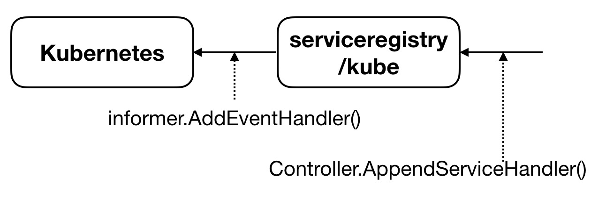
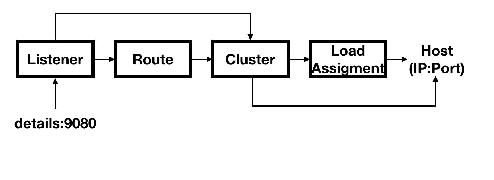

## 深入理解Istio核心组件之Pilot
Istio作为当前服务网格（Service Mesh）领域的事实标准，流量治理（Traffic Management）是其最为基础也最为重要的功能。本文将结合源码对Istio流量治理的实现主体——组件Pilot进行深入地分析。(本文参考的代码为位于Istio repo的master分支，commit为`b8e30e0`)

### 1. 架构分析
在应用从单体架构向微服务架构演进的过程中，微服务之间的服务发现、负载均衡、熔断、限流等流量治理需求是无法回避的问题。在Service Mesh出现之前，通常的做法是将此类公共的基础功能以SDK的形式嵌入业务代码中。这虽然不失为解决问题的一种方式，但这种强耦合的方案无疑会增加业务开发的难度，代码维护的成本，同时如果存在跨语言应用间的交互，对于多语言SDK的支持造成的臃肿低效也令人很难接受。

而Service Mesh的本质则是将此类通用的功能沉淀至Proxy中，由Proxy接管服务的流量并对其进行治理，从而将服务与服务间的流量治理转变为Proxy与Proxy之间的流量治理。Service Mesh对代码的零侵入性使得业务开发人员能够更为专注于业务代码的开发而无需再对底层的流量治理功能做过多的关注。

如果仅仅只是将应用与TCP/IP网络层之间的流量治理功能进行沉淀封装，那么以Envoy和Linkerd 1.0为代表的纯Proxy已经足够了。而istio所做的是在这一基础之上，增加控制平面，从而允许用户在更高的抽象维度，以更灵活的方式对服务间的流量进行管理。同时Istio对于服务模型的抽象所带来的高度扩展性，也让其对于Kubernetes等多种平台的支持变得更为简单。


如上图所示，Pilot是Istio进行流量治理的核心组件，可以看到，其架构与Istio的设计理念是一致的。Pilot支持从Kubernetes、Consul等多种平台获取服务发现功能。同时支持用户通过VirtualService,DestinationRule等API制定服务间的流量治理规则。最后，Pilot将发现的服务以及用户定义的服务间的调用规则进行融合并与底层Proxy的API进行适配后将规则下发。（底层的Proxy一般为Envoy并且Envoy已将其API抽象为Service Mesh控制平面与数据平面的标准接口——xDS，理论上任何实现了xDS协议的Proxy都能无缝接入Istio）Proxy则负责对后端服务发出的流量进行劫持并依据Pilot下发的规则对流量进行处理。


### 2. 代码结构分析

Pilot的核心代码位于目录`istio/pilot/pkg`内，其代码结构如下所示：

```sh
[root@s istio]# tree -L 1 pilot/pkg/
pilot/pkg/
├── bootstrap
├── config
├── kube
├── model
├── networking
├── proxy
├── request
└── serviceregistry
```

一个有着良好设计的项目，其代码结构必然与其设计架构的模块划分方式是一致的，因此Pilot各主要目录的功能如下：

* **bootstrap**: Pilot模块的入口，构建执行框架并对各子模块进行初始化
* **model**: 核心数据结构定义，包括对于服务发现等概念的标准化抽象
* **serviceregistry**: Kubernetes等各个服务发现平台对于model中关于服务发现抽象模型的具体实现
* **config**: VirtualService等用户定义规则在源码中统一用config进行抽象，此目录包含了对于config多种获取方式的封装
* **proxy**: 封装与下层Proxy的交互，主要包含xDS Server的实现
* **networking**: 接口转换，将发现的服务以及用户定义的规则转换为xDS协议中的Cluster, Endpoint, Listener以及Route


### 3. 服务发现

```go
// istio/pilot/pkg/model/service.go
// 仅保留核心字段
type Service struct {
	Hostname Hostname `json:"hostname"`
	Address string `json:"address,omitempty"`
	Ports PortList `json:"ports,omitempty"`
	MeshExternal bool
	...
}
```

上述`Service`结构是Istio对于一个服务的标准抽象，每一个服务都由一个完整域名（FQDN）以及一个或多个端口构成，例如`catalog.mystore.com:8080` 。事实上，Istio中的服务不仅可以通过网格内的服务发现机制获得，还可以由用户利用Istio的ServiceEntry这一API将网格外部的服务手动注入到网格中，从而允许在网格内部调用外部服务。最后，例如Kubernetes这样的平台会为其中的Service定义一个Virtual IP，DNS对于此类FQDN的解析会得到该Virtual IP。用户可直接通过该Virtual IP访问服务，平台会自动将流量负载均衡到各个服务的实例。

事实上，服务是一种动态资源，增删改查是不可避免的。同时，处于数据平面的Proxy需要根据配置对服务间的流量进行管理，因此必须确保Proxy眼中的服务视图是最新的，否则就无法正确对流量进行转发。所以一旦底层平台的服务发生变更就应该立即推送到Proxy中。Pilot中通过定义标准接口`Controller`解决了该问题。`Controller`结构如下：

```go
type Controller interface {
	AppendServiceHandler(f func(*Service, Event)) error

	AppendInstanceHandler(f func(*ServiceInstance, Event)) error

	Run(stop <-chan struct{})
}
```

将处理函数通过`Append*Handler`进行注册，一旦服务或者服务对应的实例发生变更，处理函数就会自动执行。处理函数中的操作一般即为重新计算配置并下发至Proxy。

由上文可知Istio支持Kubernetes等多种服务发现平台，各平台对于服务的定义都会有所不同，因此需要为各平台定义相应的Adapter用于和Istio的标准服务模型适配。

```sh
[root@s istio]# tree -L 1 pilot/pkg/serviceregistry/
pilot/pkg/serviceregistry/
├── aggregate
├── consul
├── external
├── kube
├── memory
└── platform.go
```

由上图可知，当前Istio支持Kubernetes，Consul，Memory(主要用于测试)以及External等多种服务发现方式。虽然Istio声称并不与Kubernetes耦合，但是对其显然是优先支持的。因此，下文将以Kubernetes平台为例，说明Istio的服务发现机制。

Kubernetes是容器编排领域的事实标准，不过由于其声明式API的存在，将其称之为分布式平台框架更为合适。通过构建一个控制器，我们可以对Kubernetes的多种资源（原生的或自定义的）资源进行监听并根据资源相关的事件（Add, Update, Delete）对资源进行处理。

显然，Kubernetes中与服务发现相关的是Service和Endpoints两个原生的资源对象。对于原生资源对象控制器的构建是非常方便的，官方提供的`client-go`已经为我们屏蔽了大量与Kubernetes API-Server交互的大量细节。我们需要做的只是编写对应资源发生变更时的处理函数即可。

```go
// istio/pilot/pkg/serviceregistry/kube/controller.go
informer.AddEventHandler(
	cache.ResourceEventHandlerFuncs{
		AddFunc: func(obj interface{}) {
			c.queue.Push(Task{handler: handler.Apply, obj: obj, event: model.EventAdd})
		},
		UpdateFunc: func(old, cur interface{}) {
			if !reflect.DeepEqual(old, cur) {
				c.queue.Push(Task{handler: handler.Apply, obj: cur, event: model.EventUpdate})
			} else {
				....
			}
		},
		DeleteFunc: func(obj interface{}) {
			c.queue.Push(Task{handler: handler.Apply, obj: obj, event: model.EventDelete})
		},
	})
```

可以看到，一旦资源发生变动，事件类型、资源实例以及资源的处理函数就会被加入一个队列中，再由队列进行异步处理，处理过程即为依次调用通过上文中的`Controller`接口注册的处理函数。



总体来说，针对Kubernetets平台的服务发现是两层订阅模式。例如对于Service对象，首先通过订阅获取Kubernetes原生的Service并加入队列，队列在处理时将Kubernetes原生的Service对象转换成Istio定义的标准Service结构。最后将转换后的Service和事件类型交由通过`Controller.AppendServiceHandler()`注册的处理函数。对于其他服务发现平台的适配，设计架构也是类似的。

不过由于Pilot有同时使用多种服务发现平台的需求，因此需要聚合多个平台的服务发现接口。上文未提及的`serviceregistry`的`aggregate`子目录即用于此目的。事实上，它只是在多个平台的接口之上做了一层封装，对于具体的某个接口则由依次调用各已注册平台的相应接口实现。

### 4. 流量管理资源对象

服务发现确保了服务间的可访问性，但是对于服务网格来说，更重要的是需要能够对服务间的访问进行控制，本质上就是需要定义服务间的访问规则。用户仅需利用Istio提供的抽象的资源对象定义服务间的访问关系，而无须关心底层复杂的流量转发过程，就能轻松实现A/B测试、金丝雀发布、熔断、故障注入等一系列复杂的流量管理操作。

Istio中与流量管理相关的资源对象主要为`VirtualService`、`DestinationRule`、`ServiceEntry`和`Gateway`：

* **VirtualService**: 本质上是一张路由表，其中定义了一系列的路由规则，发往某个host的流量会根据匹配的规则流向指定的service（通常是service的一个subset）

```yaml
apiVersion: networking.istio.io/v1alpha3
kind: VirtualService
metadata:
  name: reviews
spec:
  hosts:
  - reviews
  http:
  - match:
    - headers:
        end-user:
          exact: jason
    route:
    - destination:
        host: reviews
        subset: v2
  - route:
    - destination:
        host: reviews
        subset: v3
```
如上定义的VirtualService，发往reviews的流量，默认发往v3这个subset。对于HTTP头部指定end-user为jason的流量则发往v2这个subset。

* **DestinationRule**: 定义VirtualService中引用的subset（subset本质上是对服务实例的划分）以及对于发往目标服务或者其subset的流量的管理策略，具体包括对于负载均衡、Proxy中的连接池大小等一系列属性的配置

```yaml
apiVersion: networking.istio.io/v1alpha3
kind: DestinationRule
metadata:
  name: reviews
spec:
  host: reviews
  trafficPolicy:
    loadBalancer:
      simple: RANDOM
  subsets:
  - name: v1
    labels:
      version: v1
  - name: v2
    labels:
      version: v2
  - name: v3
    labels:
      version: v3
```
如上定义的DestinationRule将服务reviews根据label的不同划分为v1,v2,v3三个subset并且将服务层面的负载均衡策略定义为RANDOM，事实上也可以在subset层面对流量测量进行定义从而覆盖服务层面的全局定义

* **ServiceEntry**: 上文已多次提及，用于定义网格外部的服务
* **Gateway**: 位于网格边界的负载均衡器，用于接收进出网格的HTTP/TCP连接，一般会暴露一系列端口，从而允许外界访问网格内的服务

对于上述Istio中流量管理相关的各种资源对象，乃至Istio的所有其他的资源对象，经过用户配置之后，都需要进行持久化存储并且在发生变更的时候需要能够及时提送至Pilot，使其能够重新计算配置以下发至底层的各个Proxy。

与服务发现类似，Pilot同样可以对接多种资源对象的发现平台，各个平台的Adapter实现位于`istio/pilot/pkg/config`目录，如下所示：

```sh
[root@s istio]# tree -L 1 pilot/pkg/config/
pilot/pkg/config/
├── aggregate
├── clusterregistry
├── coredatamodel
├── kube
├── memory
└── monitor
```
同样，本文将针对Kubernetes平台进行说明。已知Kubernetes允许用户自定义资源对象（CRD），从而允许用户像操作`Service`,`Pod`等原生资源对象一样对自定义对象进行操作，也可以定义与上文类似的控制器对自定义资源的相关事件进行监听并做相应的处理。因此，我们完全可以将Istio的各种对象以CRD的形式注册到Kubernetes中并创建相应的控制器监听其状态。事实上，Istio也的确是这样做的。

Istio在`istio/pilot/pkg/model/config.go`中对各种资源对象进行了定义，如下所示：

```go
// VirtualService describes v1alpha3 route rules
VirtualService = ProtoSchema{
	Type:        "virtual-service",
	...
	Group:       "networking",
	Version:     "v1alpha3",
	...
}

// Gateway describes a gateway (how a proxy is exposed on the network)
Gateway = ProtoSchema{
	Type:        "gateway",
	...
	Group:       "networking",
	Version:     "v1alpha3",
	...
}
```

首先，Istio会将它们以CRD的形式注册到Kubernetes中，之后你会发现`istio/pilot/pkg/config/kube/crd`和`istio/pilot/pkg/serviceregistry/kube`是极其类似的，都是为各种资源对象创建`informer`进行监听并注册相应的处理函数。因此不再赘述。

最后，Istio将从各个平台获得的各种资源对象都被统一抽象为如下结构：

```golang
// istio/pilot/pkg/model/config.go
type Config struct {
	ConfigMeta			// 资源配置的元数据，例如资源类型，名称等等
	Spec proto.Message	// 具体的配置内容
}
```
同样，对外暴露如下的统一接口，屏蔽底层差异的同时，满足外部对于各种资源对象的操作需求：

```go
type ConfigStoreCache interface {
	ConfigStore	// 也是一个接口，包含了对于资源对象的Get, List等基本操作

	RegisterEventHandler(typ string, handler func(Config, Event))	// 对每种资源对象的变更都注册处理函数，一般就是重新计算配置并下发至Proxy

	Run(stop <-chan struct{})
	...
}
```

### 5. xDS协议

Istio通过服务发现获取了整个网格的服务视图，用户则通过Istio提供的一系列资源对象定义了服务间的访问规则，然而网格中真正进行流量转发的是底层的Proxy。因此，Pilot还需要将服务及其流量管理规则下发至Proxy，而下发过程中，两者之间交互的协议即为xDS协议。

Istio底层使用的Proxy官方默认为Envoy，Envoy作为CNCF第三个“毕业”的项目，其成熟度和稳定性都已经经历了大量实践的检验。事实上，xDS协议正是由Envoy社区提出的，在Envoy刚开源的时候，就有大量关于能否让Envoy支持Consul，Kubernetes，Marathon等服务发现平台的请求在社区提出。但是社区最后发现，与其直接对各种服务发现平台提供支持，还不如提供一套简单中立的API，明确划分控制平面和数据平面的界限，再由用户利用这套API将Envoy集成到其具体的工作流中，满足其特定需求，这一想法最终演化出了xDS协议。

可以发现对于Envoy来说，Istio只是基于其实现的控制平面中的一种，Istio和Envoy事实上拥有的是两套资源对象，Pilot通过xDS将配置下发之前还需要进行一次配置的转换。因此，首先对Envoy主要的资源对象进行简要介绍：

* **Cluster**: 一个Cluster可以简单地与上文中的一个Service或者一个Service的Subset相对应，其配置的主要字段如下所示：

```
{
	"name": "...",
	"type": "...",
	"eds_cluster_config": "{...}",
	"hosts": [],
	...
}
```

Cluster的类型由`type`字段指定，共分为如下五种：

1. Static: 直接在`hosts`字段指定Service实例的IP和端口
2. Strict DNS: `hosts`字段指定后端的Service Name和端口，通过DNS获取后端Service实例的IP地址，若返回多个IP地址，则Envoy会在之间进行负载均衡
3. Logical DNS: 与`Strict DNS`类似，但仅使用DNS返回的第一个IP
4. Original destination：直接使用HTTP header中指定的目标IP地址
5. EDS: 通过上层的控制平面获取后端的Service实例的IP和端口，Istio+Envoy模式下最常见的Cluster类型

* **ClusterLoadAssignment**: Cluster后端的具体实例集合，可以简单地与Kubernetes中的Endpoints相对应，其配置的主要字段如下：

```
{
	"cluster_name": "...",
	"endpoints": [],
	...
}
```

其中`cluster_name`指定了关联的Cluster，`endpoints`则包含了若干具体实例的IP地址和端口信息

* **Listener**: 监听并截取发往某个IP地址和端口的流量并处理，在Istio+Envoy体系下，由于基本上所有流量都会通过Iptables转发进入Envoy，因此只有一个特殊的"Virtual Listener"用于统一接收流量，再由其根据流量的目的IP和端口转发至具体的Listener进行处理。其配置的主要字段如下：

```
{
	"name": "...",
	"address": "...",
	"filter_chains": [],
	...
}
```

`address`字段指定了Listener监听的地址，而`filter_chains`字段则定义了一系列的filter用于对流量进行处理。当遍历完各个filter之后，对于`envoy.tcp_proxy`类型的filter会直接指定需要导向的Cluster，但是对于`envoy.http_connection_manager`类型的filter则会利用`rds`字段，指向特定的路由表，根据路由表决定后端的Cluster

* **RouteConfiguration**: 其配置的主要字段如下：

```
// RouteConfiguration
{
	"name": "...",
	"virtual_hosts": [],
	....
}
// VirtualHost
{
	"name": "...",
	"domains": [],
	"routes": [],
	...
}
// Route
{
	"match": "{...}",
	"route": "{...}",
	...
}
```
`RouteConfiguration`结构即表示上文所述的路由表，因为一个路由表可能包含通往多个Service的路由，因此通过`VirtualHost`对一个Service进行抽象。而`VirtualHost`中的`domains`字段用于和接收到的HTTP请求的host header进行匹配，一旦匹配成功，则该`VirtualHost`被选中。之后再进入`VirtualHost`的`routes`字段进行二级匹配，例如`match`字段指定匹配的前缀为`/`，则执行下一个字段`route`，一般其中指定了后端的Cluster。



如上图所示，当需要访问`details:9080`时，Envoy会通过Iptables截取流量并转入相应的Listener进行处理。Listener遍历各个Filter，之后通过Route或者直接指定目标Cluster。多数Cluster通过与控制平面，例如Istio进行交互获取LoadAssignment，并从中选择目标Service实例的IP和端口，对于STATIC等类型的Cluster，IP和端口则不需要通过控制平面，可以直接获取，由此与具体的实例建立连接。

上文简述了Envoy中的Listener等核心资源对象及其作用，早先Envoy将xDS协议划分为`CDS`，`EDS`，`LDS`，`RDS`四个部分，分别用于获取`Cluster`，`Cluster LoadAssignment`，`Listener`，`RouteConfiguration`四类资源对象。但是，经过仔细研究可以发现，这些资源对象之间是存在一定的依赖关系的。例如，`EDS`依赖于`CDS`，`RDS`依赖于`LDS`。若各资源对象分别建立连接从多个控制平面获取相应的对象，则资源对象间的时序关系将难以控制。因此，在Istio中，上述四类资源对象都通过单个的gRPC流从单个的控制平面实例中获取，这种聚合获取资源的方式称为ADS（Aggregated Discovery Services）。

回归到源码中，Pilot中与Envoy交互部分的代码被封装在目录`istio/pilot/pkg/proxy`，具体关于xDS协议的实现，则位于`istio/pilot/pkg/proxy/envoy/v2`中。当前，Pilot处理xDS协议的核心框架则位于`StreamAggregatedResources`方法，如下所示：

```go
// istio/pilot/pkg/proxy/envoy/v2/ads.go
func (s *DiscoveryServer) StreamAggregatedResources(stream ads.AggregatedDiscoveryService_StreamAggregatedResourcesServer) error {
	// 初始化连接
	con := newXdsConnection(peerAddr, stream)
	...
	// 接收来自Proxy的事件
	reqChannel := make(chan *xdsapi.DiscoveryRequest, 1)
	go receiveThread(con, reqChannel, &receiveError)

	for {
		select {
		case discReq, ok := <-reqChannel:
			...
			switch discReq.TypeUrl {
			case ClusterType:
				...
				err := s.pushCds(con, s.globalPushContext(), versionInfo())
			case ListenerType:
				...
			case RouteType:
				...
			case EndpointType:
				...
			}
			...
		case pushEv := <-con.pushChannel:
			...
			err := s.pushConnection(con, pushEv)
			...
		}
	}
}
```

上述方法为我们清晰地勾勒出了xDS协议的架构。首先Pilot接收并初始化来自Envoy的连接，之后则进入循环，等待相应的事件并进行处理，事件源主要包含如下两部分：

* **Envoy**：当Envoy初始化的时候会主动与Pilot建立连接并发送请求获取配置，一般发送请求的顺序为：CDS -> EDS -> LDS -> RDS，Pilot则根据请求的类型下方相应的配置
* **变更**：如前文所述，服务以及用户对其访问规则的配置并不是一成不变的，而底层Envoy所需的xDS API事实上是由发现的服务及对其的配置推导而来。因此，每当服务发现获取到的服务或者用户对Istio资源对象的配置发生变更，都会导致Envoy配置的重新计算并下发，select语句的第二个case正是用于处理此种情况。


### 6. 总结

本文结合源码对Istio的核心组件Pilot进行了深入的介绍，经过上文的分析不难发现，Pilot在整个体系中的角色其实是`适配器+API转换层+推送器`：

* **适配器**：虽然前文对于Service以及Istio资源对象进行了分别的描述，但事实上两者是一致的，都只是一种资源，Pilot对它进行了标准的定义并用它去适配Kubernetes等各个平台
* **API转换层**：Pilot从上层获取了Service以及VirtualServices等Istio资源对象，但是它们与xDS定义的Listener等Envoy要求的资源对象并不存在直接对应关系，因此需要进行一层API的转换
* **推送器**：Service以及VirtualService等Istio资源对象并非一成不变的，而Listener等xDS API对象则由前者直接推导得到，因此一旦前者发生变更，后者必须重新推导并推送

### 参考文献

* [Istio源码及我的注释](https://github.com/YaoZengzeng/istio/tree/comments)
* [xDS REST and gRPC protocol](https://github.com/envoyproxy/data-plane-api/blob/master/XDS_PROTOCOL.md)
* [The universal data plane API](https://blog.envoyproxy.io/the-universal-data-plane-api-d15cec7a)
* [Istio流量管理实现机制深入解析](https://zhaohuabing.com/post/2018-09-25-istio-traffic-management-impl-intro/)
* [Istio的数据平面Envoy Proxy配置详解](http://www.servicemesher.com/blog/envoy-proxy-config-deep-dive/)

