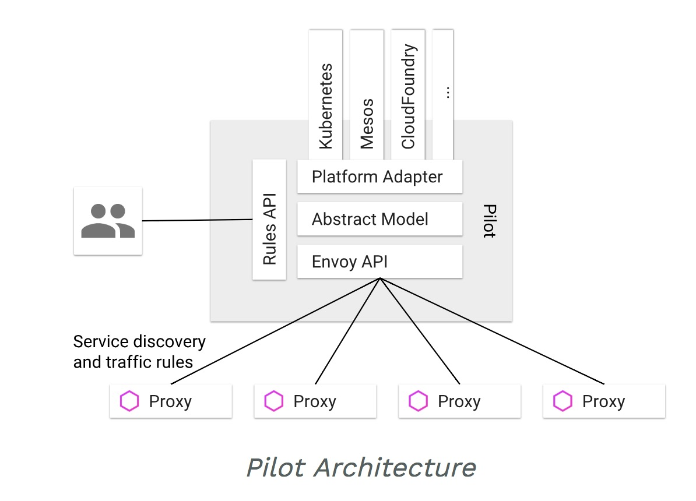

## 深入理解Istio核心组件之Pilot
Istio作为当前服务网格（Service Mesh）领域的事实标准，流量治理（Traffic Management）是其最为基础也最为重要的功能。本文将结合源码对Istio流量治理的实现主体——组件Pilot进行深入地分析。(本文参考的代码为位于Istio repo的master分支，commit为`b8e30e0`)

### 1. 架构分析
在应用从单体架构向微服务架构演进的过程中，微服务之间的服务发现、负载均衡、熔断、限流等流量治理需求是无法回避的问题。在Service Mesh出现之前，通常的做法是将此类公共的基础功能以SDK的形式嵌入业务代码中。这虽然不失为解决问题的一种方式，但这种强耦合的方案无疑会增加业务开发的难度，代码维护的成本，同时如果存在跨语言应用间的交互，对于多语言SDK的支持造成的臃肿低效也令人很难接受。

而Service Mesh的本质则是将此类通用的功能沉淀至Proxy中，由Proxy接管服务的流量并对其进行治理，从而将服务与服务间的流量治理转变为Proxy与Proxy之间的流量治理。Service Mesh对代码的零侵入性使得业务开发人员能够更为专注于业务代码的开发而无需再对底层的流量治理功能做过多的关注。

如果仅仅只是将应用与TCP/IP网络层之间的流量治理功能进行沉淀封装，那么以Envoy和Linkerd 1.0为代表的纯Proxy已经足够了。而istio所做的是在这一基础之上，增加控制平面，从而允许用户在更高的抽象维度，以更灵活的方式对服务间的流量进行管理。同时Istio对于服务模型的抽象所带来的高度扩展性，也让其对于Kubernetes等多种平台的支持变得更为简单。

如上图所示，Pilot是Istio进行流量治理的核心组件，可以看到，其架构与Istio的设计理念是一致的。Pilot支持从Kubernetes、Consul等多种平台获取服务发现功能。同时支持用户通过VirtualService,DestinationRule等API制定服务间的流量治理规则。最后，Pilot将发现的服务以及用户定义的服务间的调用规则进行融合并与底层Proxy的API进行适配后将规则下发。（底层的Proxy一般为Envoy并且Envoy已将其API抽象为Service Mesh控制平面与数据平面的标准接口——xDS，理论上任何实现了xDS协议的Proxy都能无缝接入Istio）Proxy则负责对后端服务发出的流量进行劫持并依据Pilot下发的规则对流量进行处理。

### 2. 代码结构分析

