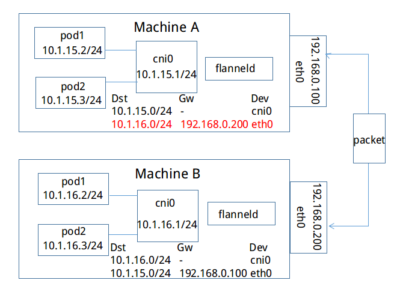
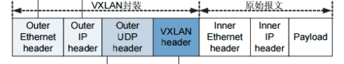
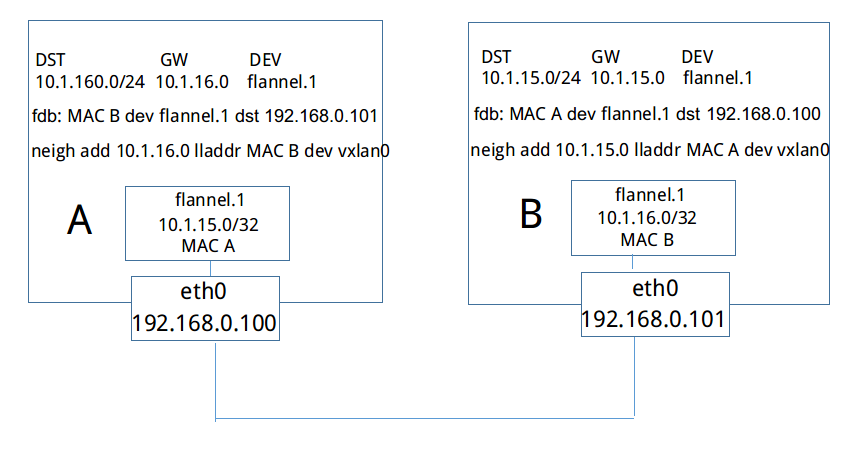

## 深入理解flannel

### 1 概述

根据官网的描述，flannel是一个专为kubernetes定制的三层网络解决方案。它主要用于解决容器的跨主机通信问题。首先我们来简单看一下，它是如何工作的。

首先，flannel会利用Kubernetes API或者etcd用于存储整个集群的网络配置，其中最主要的内容为设置集群的网络地址空间，例如，设定整个集群内所有容器的IP都取自网段“10.1.0.0/16”。接着，flannel会在每个主机中运行flanneld作为agent，它会为所在主机从集群的网络地址空间中，获取一个小的网段subnet，本主机内所有容器的IP地址都将从中分配。然后，flanneld再将本主机获取的subnet以及用于主机间通信的Public IP，同样通过kubernetes API或者etcd存储起来。最后，flannel利用各种backend mechanism，例如udp，vxlan等等，跨主机转发容器间的网络流量，完成容器间的跨主机通信。下面，我们以一个具体的例子来描述在flannel中，跨主机的容器间通信是如何进行的。

如下图所示，集群范围内的网络地址空间为10.1.0.0/16，Machine A获取的subnet为10.1.15.0/24，并且其中的两个容器的IP分别为10.1.15.2/24和10.1.15.3/24，两者都在10.1.15.0/24这一子网范围内，对于下方的Machine B同理。

现在，我们来简单看一下，如果上方Machine A中IP地址为10.1.15.2/24的容器要与下方Machine B中IP地址为10.1.16.2/24的容器进行通信，封包是如何进行转发的。从上文可知，每个主机的flanneld会将自己与所获取subnet的关联信息存入etcd中，例如，subnet 10.1.15.0/24所在主机可通过IP 192.168.0.100访问，subnet 10.1.16.0/24可通过IP 192.168.0.200访问。反之，每台主机上的flanneld通过监听etcd，也能够知道其他的subnet与哪些主机相关联。如下图，Machine A上的flanneld通过监听etcd已经知道subnet 10.1.16.0/24所在的主机可以通过Public 192.168.0.200访问，而且熟悉docker桥接模式的同学肯定知道，目的地址为10.1.16.2/24的封包一旦到达Machine B，就能通过cni0网桥转发到相应的pod，从而达到跨宿主机通信的目的。

因此，flanneld只要想办法将封包从Machine A转发到Machine B就OK了，而上文中的backend就是用于完成这一任务。不过，达到这个目的的方法是多种多样的，所以我们也就有了很多种backend。在这里我们举例介绍的是最简单的一种方式hostgw：因为Machine A和Machine B处于同一个子网内，它们原本就能直接互相访问。因此最简单的方法是：在Machine A中的容器要访问Machine B的容器时，我们可以将Machine B看成是网关，当有封包的目的地址在subnet 10.1.16.0/24范围内时，就将其直接转发至B即可。而这通过下图中那条红色标记的路由就能完成，对于Machine B同理可得。由此，在满足仍有subnet可以分配的条件下，我们可以将上述方法扩展到任意数目位于同一子网内的主机。而任意主机如果想要访问主机X中subnet为S的容器，只要在本主机上添加一条目的地址为R，网关为X的路由即可。




下面，我将以问题驱动的方式，来详细分析flannel是如何运作的


### 2 节点初始化

首先，我们最感兴趣的是，当一个新的节点加入集群时，它是如何初始化的。对此，我们可能会有以下几个疑问：

1) 若主机有多张网卡和多个IP，如何选择其中的一张网卡和一个IP用于集群主机间的通信

2) 主机如何获取属于自己的subnet并维护

3) 我们如何在集群中有新的节点加入时，获取对应的subnet和Public IP，并通过配置backend进行访问


#### 2.1 网卡及对外IP选择

对于第一个问题，事实上我们可以在flanneld的启动参数中通过"--iface"或者"--iface-regex"进行指定。其中"--iface"的内容可以是完整的网卡名或IP地址，而"--iface-regex"则是用正则表达式表示的网卡名或IP地址，并且两个参数都能指定多个实例。flannel将以如下的优先级顺序来选取：

1) 如果"--iface"和"----iface-regex"都未指定时，则直接选取默认路由所使用的输出网卡

2) 如果"--iface"参数不为空，则依次遍历其中的各个实例，直到找到和该网卡名或IP匹配的实例为止

3) 如果"--iface-regex"参数不为空，操作方式和2)相同，唯一不同的是使用正则表达式去匹配

最后，对于集群间交互的Public IP，我们同样可以通过启动参数"--public-ip"进行指定。否则，将使用上文中获取的网卡的IP作为Public IP。


#### 2.2 获取subnet

在获取subnet之前，我们首先要创建一个SubnetManager，它在具体的代码实现中，表现为一个接口，如下所示：

```go
type Manager interface {
    GetNetworkConfig(ctx context.Context) (*Config, error)
    AcquireLease(ctx context.Context, attrs *LeaseAttrs) (*Lease, error)
    RenewLease(ctx context.Context, lease *Lease) error
    WatchLease(ctx context.Context, sn ip.IP4Net, cursor interface{}) (LeaseWatchResult, error)
    WatchLeases(ctx context.Context, cursor interface{}) (LeaseWatchResult, error)
 
    Name() string
}
```

从接口中各个函数的名字，我们大概就能猜出SubnetManager的作用是什么了。但是，为什么获取subnet的函数叫AcquireLease，而不叫AcquireSubnet呢？实际上，每台主机都是租借了一个subnet，如果到了一定时间不进行更新，那么该subnet就会过期从而重新分配给其他的主机，即主机和subnet的关联信息会从etcd中消失（在本文中我们将默认选择etcd作为SubnetManager的后端存储）。因此，lease就是一条subnet和所属主机的关联信息，并且具有时效性，需要定期更新。下面我们来看看，每台主机都是如何获取lease的：

1) 首先，我们调用GetNetworkConfig()，它会访问etcd获取集群网络配置并封装在结构Config中返回，Config结构如下所示。其中的Network字段对应的集群网络地址空间是在flannel启动前，必须写入etcd中的，例如"10.1.0.0/16"。

```go
type Config struct {
    Network     ip.IP4Net
    SubnetMin   ip.IP4
    SubnetMax   ip.IP4
    SubnetLen   uint
    BackendType string          `json:"-"`
    Backend     json.RawMessage `json:",omitempty"`
}
```

对于其他字段的含义及默认值如下：

(1) SubnetLen表示每个主机分配的subnet大小，我们可以在初始化时对其指定，否则使用默认配置。在默认配置的情况下，如果集群的网络地址空间大于/24，则SubnetLen配置为24，否则它比集群网络地址空间小1，例如集群的大小为/25，则SubnetLen的大小为/26

(2) SubnetMin是集群网络地址空间中最小的可分配的subnet，可以手动指定，否则默认配置为集群网络地址空间中第一个可分配的subnet。例如对于"10.1.0.0/16"，当SubnetLen为24时，第一个可分配的subnet为"10.1.1.0/24"。

(3) SubnetMax表示最大可分配的subnet，对于"10.1.0.0/16"，当subnetLen为24时，SubnetMax为"10.1.255.0/24"

(4) BackendType为使用的backend的类型，如未指定，则默认为“udp”

(5) Backend中会包含backend的附加信息，例如backend为vxlan时，其中会存储vtep设备的mac地址


2) 在获取了集群的网络配置之后，接下来我们就调用SubnetManager中的AcquireLease()获取本主机的subnet。其中的参数类型LeaseAttrs如下所示：

```go
type LeaseAttrs struct {
    PublicIP    ip.IP4
    BackendType string          `json:",omitempty"`
    BackendData json.RawMessage `json:",omitempty"`
}
```

显然，其中最重要的字段就是PublicIP，它实质上是标识了一台主机。在获取subnet之前，我们先要从etcd中获取当前所有已经存在的lease信息----leases，以备后用。下面我们将对不同情况下lease的获取进行讨论：

(1) 事实上，这可能并不是我们第一次在这台机器上启动flannel，因此，很有可能，在此之前，这台机器已经获取了lease。已知一台主机其实是由它的Public IP标识的，所以我们可以用Public IP作为关键字匹配leases中所有lease的Public IP。若匹配成功，则检查相应的lease是否和当前的集群网络配置兼容：检查的内容包括IP是否落在SubnetMin和SubnetMax内，以及subnet大小是否和SubnetLen相等。若兼容，则用新的LeaseAttrs和ttl更新该lease，表示成功获取本机的lease，否则只能将该lease删除。

(2) 当初始化SubnetManager时，会先试图解析之前flannel获取了lease后留下的配置文件（该文件的创建，会在下文描述），从中读取出之前获取的subnet。如果读取到的subnet不为空，则同样利用该subnet去匹配leases中所有lease的subnet。若匹配成功，则同样检查lease是否和当前的集群网络配置兼容。若兼容则更新lease，表示成功获取本机的lease，否则将其删除。如果该subnet并不能从leases中找到，但是它和当前的集群网络配置兼容的话，可以直接将它和LeaseAttrs封装为lease，写入etcd。

(3) 若此时还未获取到lease，那么我们有必要自己创建一个新的了。创建的方法很简单，从SubnetMin遍历到SubnetMax，将其中和leases中已有的subnet都不重合者加入一个集合中。再从该集合随机选择一个，作为本主机的subnet即可。最后，将subnet和LeaseAttrs封装为一个lease写入etcd。由此，该主机获取了自己的subnet。

最后，我们将有关的集群网络和subnet的配置信息写入文件/run/flannel/subnet.env（可通过命令行参数"--subnet-file"手动指定）中，写入的信息如下所示，包括：集群网络地址空间FLANNEL_NETWORK，获取的子网信息FLANNEL_SUBNET等等

```go
cat /var/run/flannel/subnet.env
FLANNEL_NETWORK=10.1.0.0/16
FLANNEL_SUBNET=10.1.16.1/24
FLANNEL_MTU=1450
FLANNEL_IPMASQ=false
```


#### 2.3 维护subnet

当SubnetManager的后端存储使用的是etcd时，各个主机还需要对自己的lease进行维护，在租期即将到期时，需要对etcd中的lease进行更新，调用SubnetManager中的RenewLease()方法，防止它到期后被自动删除。另外，我们可以在flanneld的命令行启动参数中用"--subnet-lease-renew-margin"指定在租期到期前多久进行更新。默认值为1小时，即每23小时更新一次lease，重新获取一次24小时的租期。


#### 2.4 发现新节点

现在，初始化已经完成了，我们需要面对如下两个问题：

1、当本主机的flanneld启动时，如果集群中已经存在了其他主机，我们如何通过backend进行配置，使得封包能够到达它们

2、如果之后集群中又添加了新的主机，我们如何获取这一事件，并通过backend对配置进行调整，对于删除主机这类事件同理

当然上述两个问题，都是通过etcd解决的。backend会一边通过上文中的WatchLeases()方法对etcd进行监听，从中获取各类事件，另一边会启动一个事件处理引擎，不断地对监听到的事件进行处理。对于问题1，我们首先要从etcd中获取当前所有的lease信息，并将其转化为一系列的event，将它交于事件处理引擎进行处理，从而让封包能够到达这些主机。对于问题2，直接对etcd中的事件进行监听，将获取的事件转换为事件处理引擎能够处理的形式，并进行处理即可。事件的类型也很简单，总共就只有EventAdded和EventRemoved两种，分别表示新增了lease以及一个lease过期。因为不同backend的配置方式是完全不同的，下面我们就将对各种backend的基本原理进行解析，并说明它们如何处理EventAdded和EventRemoved这两类事件。


### 3 backend原理解析

在本节中，我将对hostgw，udp和vxlan三种backend进行解析


#### 3.1 hostgw

hostgw是最简单的backend，它的原理非常简单，直接添加路由，将目的主机当做网关，直接路由原始封包。例如，我们从etcd中监听到一个EventAdded事件：subnet为10.1.15.0/24被分配给主机Public IP 192.168.0.100，hostgw要做的工作非常简单，在本主机上添加一条目的地址为10.1.15.0/24，网关地址为192.168.0.100，输出设备为上文中选择的集群间交互的网卡即可。对于EventRemoved事件，删除对应的路由即可。


#### 3.2 udp

我们知道当backend为hostgw时，主机之间传输的就是原始的容器网络封包，封包中的源IP地址和目的IP地址都为容器所有。这种方法有一定的限制，就是要求所有的主机都在一个子网内，即二层可达，否则就无法将目的主机当做网关，直接路由。

而udp类型backend的基本思想是：既然主机之间是可以相互通信的（并不要求主机在一个子网中），那么我们为什么不能将容器的网络封包作为负载数据在集群的主机之间进行传输呢？这就是所谓的overlay。具体过程如下所示：


当容器10.1.15.2/24要和容器10.1.20.2/24通信时，因为该封包的目的地不在本主机是subnet内，因此封包会首先通过网桥转发到主机中。最终在主机上经过路由匹配，进入网卡flannel0。需要注意的是flannel0是一个tun设备，它是一种工作在三层的虚拟网络设备，而flanneld是一个proxy，它会监听flannel0并转发流量。当封包进入flannel0时，flanneld就可以从flannel0中将封包读出，由于flannel0是三层设备，所以读出的封包仅仅包含IP层的报头及其负载。最后flanneld会将获取的封包作为负载数据，通过udp socket发往目的主机。同时，在目的主机的flanneld会监听Public IP所在的设备，从中读取udp封包的负载，并将其放入flannel0设备内。由此，容器网络封包到达目的主机，之后就可以通过网桥转发到目的容器了。

最后和hostgw不同的是，udp backend并不会将从etcd中监听到的事件中包含的lease信息作为路由写入主机中。每当收到一个EventAdded事件，flanneld都会将其中的subnet和Public IP保存在一个数组中，用于转发封包时进行查询，找到目的主机的Public IP作为udp封包的目的地址。


#### 3.3 vxlan

首先，我们对vxlan的基本原理进行简单的叙述。从下图所示的封包结构来看，vxlan和上文提到的udp backend的封包结构是非常类似的，不同之处是多了一个vxlan header，以及原始报文中多了个二层的报头。



下面让我们来看看，当有一个EventAdded到来时，flanneld如何进行配置的，以及封包是如何在flannel网络中流动的。



如上图所示，当主机B加入flannel网络时，和其他所有backend一样，它会将自己的subnet 10.1.16.0/24和Public IP 192.168.0.101写入etcd中，和其他backend不一样的是，它还会将vtep设备flannel.1的mac地址也写入etcd中。

之后，主机A会得到EventAdded事件，并从中获取上文中B添加至etcd的各种信息。这个时候，它会在本机上添加三条信息：

1) 路由信息：所有通往目的地址10.1.16.0/24的封包都通过vtep设备flannel.1设备发出，发往的网关地址为10.1.16.0，即主机B中的flannel.1设备。

2) fdb信息：MAC地址为MAC B的封包，都将通过vxlan首先发往目的地址192.168.0.101，即主机B

3) arp信息：网关地址10.1.16.0的地址为MAC B

现在有一个容器网络封包要从A发往容器B，和其他backend中的场景一样，封包首先通过网桥转发到主机A中。此时通过，查找路由表，该封包应当通过设备flannel.1发往网关10.1.16.0。通过进一步查找arp表，我们知道目的地址10.1.16.0的mac地址为MAC B。到现在为止，vxlan负载部分的数据已经封装完成。由于flannel.1是vtep设备，会对通过它发出的数据进行vxlan封装（这一步是由内核完成的，相当于udp backend中的proxy），那么该vxlan封包外层的目的地址IP地址该如何获取呢？事实上，对于目的mac地址为MAC B的封包，通过查询fdb，我们就能知道目的主机的IP地址为192.168.0.101。

最后，封包到达主机B的eth0，通过内核的vxlan模块解包，容器数据封包将到达vxlan设备flannel.1，封包的目的以太网地址和flannel.1的以太网地址相等，三层封包最终将进入主机B并通过路由转发达到目的容器。

事实上，flannel只使用了vxlan的部分功能，由于VNI被固定为1，本质上工作方式和udp backend是类似的，区别无非是将udp的proxy换成了内核中的vxlan处理模块。而原始负载由三层扩展到了二层，但是这对三层网络方案flannel是没有意义的，这么也做仅仅只是为了适配vxlan的模型。vxlan详细的原理参见文后的参考文献，其中的分析更为具体，也更易理解。


### 4 总结

总的来说，flannel更像是经典的桥接模式的扩展。我们知道，在桥接模式中，每台主机的容器都将使用一个默认的网段，容器与容器之间，主机与容器之间都能互相通信。要是，我们能手动配置每台主机的网段，使它们互不冲突。接着再想点办法，将目的地址为非本机容器的流量送到相应主机：如果集群的主机都在一个子网内，就搞一条路由转发过去；若是不在一个子网内，就搞一条隧道转发过去。这样以来，容器的跨网络通信问题不就解决了么？而flannel做的，其实就是将这些工作自动化了而已。


### 参考文献

* [flannel源码](https://github.com/coreos/flannel)

* [vxlan协议原理解析](http://cizixs.com/2017/09/25/vxlan-protocol-introduction)

* [linux上实现vxlan网络](http://cizixs.com/2017/09/28/linux-vxlan)

* [VxLAN和VTEP](http://maoxiaomeng.com/2017/07/31/vxlan%E5%92%8Cvtep/)

